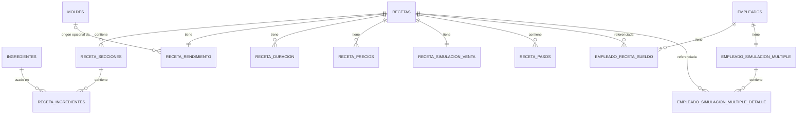

# Guía de Arquitectura — App de Gestión de Repostería (Android nativo)

**Plataforma:** Android nativo · Kotlin · Jetpack Compose · Room (SQLite) · WorkManager · Google Drive API
**Desarrollo:** Android Studio en Linux
**Objetivo:** reemplazar Trello/Excel para gestionar ingredientes, moldes, recetas (costeo, rendimiento, duración, precios, pasos) y empleados (cálculo de sueldos por venta), con respaldo dual en Google Drive. Entregable final: un **APK instalable** en tu celular.

---

## 0. Qué cambió respecto a la versión Pydroid3

El modelo de datos, las fórmulas y el plan de fases que ya construimos **no se pierden** — son independientes del lenguaje. Lo que cambia es la implementación:

| Antes (Pydroid3) | Ahora (Android nativo) |
|---|---|
| Tkinter | Jetpack Compose |
| sqlite3 + clases repositorio a mano | Room (genera el acceso a datos desde anotaciones) |
| OAuth "device flow" (workaround) | Google Sign-In real + Drive API con scope `drive.file` |
| Reintentos de sync manuales | WorkManager (reintentos y reglas de red nativas de Android) |
| Un script corriendo dentro de otra app | APK instalable, con ícono propio, notificaciones posibles a futuro |
| Pensado para verse bien en PC y celular a la vez | Pensado para celular (Android). Versión de escritorio quedaría para más adelante vía Compose Multiplatform, si algún día se quiere |

Esta versión del documento es la vigente y reciente: por eso el alcance quedó limitado a celular y la estructura original (Python/Pydroid3) fue reemplazada por completo. Confirmado como decisión final, no un supuesto.

---

## 1. Decisiones confirmadas

| # | Tema | Decisión final |
|---|---|---|
| 1 | **Stack** | Kotlin + Jetpack Compose + Room + WorkManager. Android Studio en Linux. |
| 2 | **Autenticación Google Drive** | Google Sign-In nativo (`GoogleSignInClient`), scope `drive.file` (solo archivos creados por la app — evita el proceso de verificación de scopes sensibles de Google). |
| 3 | **Precio de ingrediente en recetas antiguas** | Se recalcula siempre con el precio actual del ingrediente. |
| 4 | **Selección de precio para cálculos automáticos** | Se **elige a mano** cuál de los precios/promos guardados es el de **referencia**; de él salen todas las cifras automáticas. Los demás quedan visibles con su propia ganancia, para comparar. Mientras no se haya elegido ninguno se usa el de **menor ganancia por trozo**, que es el supuesto más prudente. **La referencia no puede perder plata**: elegir una que pierda se rechaza y se avisa (8.6). |
| 5 | **Semanas por mes** | `SEMANAS_POR_MES = 4.33` (52 ÷ 12). |
| 6 | **Sueldo de empleado: base de cálculo** | Ingreso bruto del producto completo, derivado del **precio de referencia** de la receta (decisión #4). |
| 7 | **Múltiples dispositivos** | Poco probable; advertencia best-effort si detecta apertura simultánea (sección 13.4). |
| 8 | **Alcance de plataforma** | Solo Android (celular/tablet). No se busca paridad con PC en esta etapa. |
| 9 | **Borrado de ingredientes** | Permitido solo tras advertencia si el ingrediente está en uso: se listan las recetas afectadas y se pide confirmación explícita. Al confirmar, se quita de esas recetas y el costo se reajusta solo (el costo total siempre se calcula en vivo). |
| 10 | **Borrado de recetas** | En cascada: se eliminan también las asignaciones de sueldo (`EmpleadoRecetaSueldo`) de cualquier empleado que tuviera esa receta asignada. Las simulaciones de esos empleados se recalculan solas al ya no incluir esa receta. |
| 11 | **Reescalado por molde** | Dos modos posibles: **Altura** (conserva el grosor/estructura, exige altura del molde nuevo ≥ altura del original) y **Capacidad** (conserva la proporción de volumen, sin esa restricción). Ver sección 8.3 y 9. |
| 12 | **Catálogo de Moldes** | Nuevo módulo independiente. El reescalado de una receta puede usar un molde guardado del catálogo o dimensiones ingresadas al vuelo sin guardarlas ("modo prueba", útil para reescalar una receta ajena). |
| 13 | **Notificaciones de cambios** | Botón global en la barra superior (aparte del buscador) que despliega un historial color-coded: azul = creación, verde = edición, rojo = eliminación (con el detalle de qué otras entidades resultaron afectadas, cuando aplica). |
| 14 | **Identidad visual** | Paleta propia de repostería (crema, caramelo, chocolate) sobre Material 3 — no colores dinámicos del sistema. Modo claro y oscuro automático desde la primera pantalla. Ver 12.6. |
| 15 | **Orden de construcción** | Se empieza por la Fase 1 (base de datos, código puro y verificable con tests). La Fase 0 —Google Cloud Console, SHA-1 y prueba en celular real— la hace Sandy en paralelo, porque requiere accesos y un dispositivo físico. |

---

## 2. Contexto técnico y restricciones

- **Lenguaje:** Kotlin (muy cercano a Java, que ya conoces).
- **UI:** Jetpack Compose — declarativa, similar en espíritu a pensar en "frames" de Tkinter, pero con recomposición automática en vez de actualizar widgets a mano.
- **Base de datos:** Room, capa sobre SQLite. Define las tablas como clases Kotlin (`@Entity`) y las consultas como interfaces (`@Dao`); genera el SQL por ti, pero sigue siendo SQLite real por debajo.
- **Concurrencia:** Kotlin Coroutines (todo acceso a Room y a la red es asíncrono por defecto en Android).
- **Inyección de dependencias:** manual, vía un `AppContainer` simple en la clase `Application` — evita sumar una librería nueva (Hilt) mientras el proyecto es de un solo desarrollador. Se puede migrar a Hilt después si el proyecto crece.
- **Sincronización en segundo plano:** WorkManager — reintentos automáticos, respeta si hay o no conexión, sobrevive a que cierres la app o se reinicie el celular.
- **Min SDK recomendado:** Android 8.0 (API 26) en adelante, cubre prácticamente cualquier celular Android usable hoy y da acceso a las APIs modernas de Compose/WorkManager sin librerías de compatibilidad extra.
- **Google Cloud Console:** hay que registrar un proyecto y un cliente OAuth tipo "Android", con el SHA-1 de tu firma de app. Con el scope `drive.file` (no sensible), no necesitas pasar por el proceso de verificación de Google para uso personal — basta con dejar la app en modo "Testing" y agregarte a ti mismo como *test user*.

---

## 3. Arquitectura general (capas — patrón MVVM)

```
┌───────────────────────────────────────────┐
│  UI (Jetpack Compose)                      │
│  Pantallas (Composables) · Navegación      │
└───────────────────┬─────────────────────────┘
                    │ observa estado / envía eventos
┌───────────────────▼─────────────────────────┐
│  ViewModel                                  │
│  Un ViewModel por pantalla o flujo           │
│  (IngredientesViewModel, RecetaViewModel...) │
└───────────────────┬─────────────────────────┘
                    │ llama a
┌───────────────────▼─────────────────────────┐
│  Lógica de negocio (logica/)                │
│  Formato · Rendimiento · Moldes · Precios   │
│  Simulaciones — Kotlin puro, sin Android    │
└───────────────────┬─────────────────────────┘
                    │ usa
┌───────────────────▼─────────────────────────┐
│  Repositorios (data/repositorio/)           │
│  Combinan DAOs de Room + reglas simples     │
└───────────────────┬─────────────────────────┘
                    │ lee/escribe
┌───────────────────▼─────────────────────────┐
│  Room (SQLite)                              │
└───────────────────┬─────────────────────────┘
                    │ dispara tras cada guardado
┌───────────────────▼─────────────────────────┐
│  WorkManager → SyncWorker → Drive API       │
│  Cuenta 1 (obligatoria) + Cuenta 2 (opc.)   │
└───────────────────────────────────────────┘
```

Igual que en la versión anterior: la UI nunca toca Room ni Drive directamente. Todo pasa por ViewModel → lógica → repositorio.

**La flecha "lógica → usa → repositorios" del diagrama va en un solo sentido y con una condición:** las funciones de `logica/` no consultan repositorios, **reciben los datos ya cargados** (el `DatosCalculoReceta` de 6.4). El que va a buscarlos es el ViewModel, que llama al repositorio primero y le entrega el resultado a la lógica después. Esto es lo que hace que `logica/` sea Kotlin puro de verdad —sin `suspend`, sin Room, sin Android— y por lo tanto probable con JUnit sin emulador ni celular, que es justo lo que más falta hace con lo intrincado de las fórmulas de sueldos, moldes y promociones.

---

## 4. Estructura del proyecto

```
app/
├── build.gradle.kts
├── src/main/
│   ├── AndroidManifest.xml
│   ├── java/com/tuusuario/reposteria/
│   │   ├── ReposteriaApp.kt              # Application, arma el AppContainer
│   │   ├── data/
│   │   │   ├── db/
│   │   │   │   ├── AppDatabase.kt         # Room database, versión, migraciones, @TypeConverters
│   │   │   │   ├── Convertidores.kt       # TypeConverter de todos los enums (5.5)
│   │   │   │   ├── entidades/             # una clase @Entity por tabla (sección 5)
│   │   │   │   │   ├── DimensionesMolde.kt   # data class @Embedded, reutilizada por Molde y RecetaRendimiento
│   │   │   │   │   └── DatosCalculoReceta.kt # snapshot que reciben las fórmulas (6.4)
│   │   │   │   └── dao/
│   │   │   │       ├── IngredienteDao.kt
│   │   │   │       ├── RecetaDao.kt
│   │   │   │       ├── MoldeDao.kt
│   │   │   │       ├── EmpleadoDao.kt
│   │   │   │       └── HistorialDao.kt
│   │   │   └── repositorio/
│   │   │       ├── IngredienteRepositorio.kt
│   │   │       ├── RecetaRepositorio.kt
│   │   │       ├── MoldeRepositorio.kt
│   │   │       ├── EmpleadoRepositorio.kt
│   │   │       └── HistorialRepositorio.kt
│   │   ├── logica/                        # Kotlin puro: sin Android, sin Room, sin suspend (6.5)
│   │   │   ├── Formato.kt                 # formatearNumero
│   │   │   ├── Busqueda.kt                # coincide, sinTildes
│   │   │   ├── Rendimiento.kt             # pesoPorTrozo
│   │   │   ├── Moldes.kt                  # factorEscala, ModoReescalado
│   │   │   ├── Precios.kt                 # precioDeMenorGanancia, trozoGanador, ingresoBruto…
│   │   │   ├── Simulacion.kt              # simulacion, SEMANAS_POR_MES
│   │   │   ├── Sueldos.kt                 # calcularSueldo
│   │   │   └── Validaciones.kt            # las reglas de 6.2
│   │   ├── sync/
│   │   │   ├── DriveClient.kt
│   │   │   ├── SyncWorker.kt              # Worker de WorkManager
│   │   │   └── SesionLock.kt
│   │   └── ui/
│   │       ├── MainActivity.kt
│   │       ├── navegacion/NavGraph.kt
│   │       ├── ingredientes/
│   │       │   ├── IngredientesViewModel.kt
│   │       │   ├── ListaIngredientesScreen.kt
│   │       │   └── ComboBuscable.kt
│   │       ├── recetas/
│   │       │   ├── RecetaViewModel.kt
│   │       │   ├── ListaRecetasScreen.kt
│   │       │   ├── wizard/                # un archivo por paso del wizard
│   │       │   └── DetalleRecetaScreen.kt
│   │       ├── moldes/
│   │       │   ├── MoldeViewModel.kt
│   │       │   ├── ListaMoldesScreen.kt
│   │       │   └── SelectorReescaladoMolde.kt   # elegir molde guardado o dimensiones "al vuelo"
│   │       ├── empleados/
│   │       │   ├── EmpleadosViewModel.kt
│   │       │   ├── ListaEmpleadosScreen.kt
│   │       │   └── SimulacionMultipleScreen.kt
│   │       └── componentes/
│   │           ├── SeccionColapsable.kt
│   │           ├── BarraBusqueda.kt
│   │           ├── InfoTooltip.kt          # ícono "?" con texto explicativo (usado en Modo Altura/Capacidad)
│   │           └── HistorialCambiosPanel.kt # botón campana + lista color-coded de EventoCambio
│   └── res/                                # temas, colores, strings.xml
```

---

## 5. Modelo de datos (Room)



### 5.1 Ejemplos de entidades

```kotlin
@Entity(
    tableName = "ingredientes",
    indices = [Index(value = ["nombre"], unique = true)]   // "nombre único" de 6.2, garantizado por la BD
)
data class Ingrediente(
    @PrimaryKey(autoGenerate = true) val id: Long = 0,
    // NOCASE: sin esto el índice único distingue mayúsculas y dejaría crear "Harina" y
    // "harina" como dos ingredientes distintos, que es justo lo que se quiere evitar.
    // Ojo con su límite: NOCASE solo ignora mayúsculas del alfabeto inglés, así que
    // "azucar" y "azúcar" siguen siendo distintos para la base (ver 6.2).
    @ColumnInfo(collate = ColumnInfo.NOCASE) val nombre: String,
    val valorPorGramo: Double = 0.0,
    val creadoEn: Long = System.currentTimeMillis(),
    val actualizadoEn: Long = System.currentTimeMillis()
)
// Nota: ninguna FK impide borrar un ingrediente que esté en uso. Las filas de
// RecetaIngrediente sí lo referencian, pero sin FK declarada, así que el control
// es de lógica de negocio (7.1) y no un ON DELETE RESTRICT de la base.

@Entity(tableName = "recetas")
data class Receta(
    @PrimaryKey(autoGenerate = true) val id: Long = 0,
    val titulo: String,
    val pasoPrevio: String = "No necesita",
    val creadoEn: Long = System.currentTimeMillis(),
    val actualizadoEn: Long = System.currentTimeMillis()
)

@Entity(
    tableName = "receta_precios",
    foreignKeys = [ForeignKey(
        entity = Receta::class, parentColumns = ["id"], childColumns = ["recetaId"],
        onDelete = ForeignKey.CASCADE
    )],
    indices = [Index("recetaId")]
)
enum class ModoPrecio { TROZO, PRODUCTO }

data class RecetaPrecio(
    @PrimaryKey(autoGenerate = true) val id: Long = 0,
    val recetaId: Long,
    val modo: ModoPrecio,      // enum y no String suelto, ver 5.5
    val cantidad: Int = 1,
    val precioTotal: Double,
    val etiqueta: String? = null,  // nombre de la promo, ej. "2x1.500"

    // Cuál de los precios alimenta las cifras automáticas. Solo uno por receta lo tiene
    // en true, y eso lo garantiza fijarPrecioDeReferencia() en una transacción (8.6).
    // El defaultValue tiene que calzar con el DEFAULT 0 de la migración 1->2.
    @ColumnInfo(defaultValue = "0") val esReferencia: Boolean = false
)
// Todos los precios guardados quedan visibles en la UI con su propia ganancia, para
// poder compararlos; el marcado como referencia es el que manda en los cálculos.
```

### 5.2 Entidad Molde y su reutilización en Receta (nuevo)

`DimensionesMolde` es un `data class` compartido (no es una entidad Room por sí sola, se usa vía `@Embedded`) para no duplicar los campos de geometría entre el catálogo de moldes y la copia que guarda cada receta:

```kotlin
enum class TipoFormaMolde { RECTANGULO, CIRCULO, CUADRADO, TRIANGULO, EXOTICO }

// Todos los campos son nulables por una razón técnica, no de diseño: este data class se
// embebe como nulable en RecetaRendimiento (recetas sin molde) y Room no admite subcampos
// no-nulos ahí -- ver 5.5. La obligatoriedad real la impone la validación de 6.2.
data class DimensionesMolde(
    val tipoForma: TipoFormaMolde? = null,
    val largoCm: Double? = null,           // rectángulo
    val anchoCm: Double? = null,           // rectángulo
    val ladoCm: Double? = null,            // cuadrado
    val diametroCm: Double? = null,        // círculo
    val baseTrianguloCm: Double? = null,   // triángulo (base, para el área)
    val alturaTrianguloCm: Double? = null, // triángulo (altura de la base, para el área — NO confundir con alturaMoldeCm)
    val volumenExoticoCm3: Double? = null, // exótico, medido llenando el molde con agua
    val alturaMoldeCm: Double? = null      // profundidad/alto real del molde — obligatorio en las 5 formas (6.2)
) {
    val areaCm2: Double get() = when (tipoForma) {
        TipoFormaMolde.RECTANGULO -> largoCm!! * anchoCm!!
        TipoFormaMolde.CUADRADO -> ladoCm!! * ladoCm!!
        TipoFormaMolde.CIRCULO -> Math.PI * (diametroCm!! / 2).let { it * it }
        TipoFormaMolde.TRIANGULO -> (baseTrianguloCm!! * alturaTrianguloCm!!) / 2
        TipoFormaMolde.EXOTICO -> volumenExoticoCm3!! / alturaMoldeCm!!  // área despejada del volumen medido
        null -> error("Molde sin forma definida: no debería haber pasado la validación de 6.2")
    }
    val volumenCm3: Double get() =
        if (tipoForma == TipoFormaMolde.EXOTICO) volumenExoticoCm3!! else areaCm2 * alturaMoldeCm!!
}

@Entity(tableName = "moldes")
data class Molde(
    @PrimaryKey(autoGenerate = true) val id: Long = 0,
    val nombre: String,
    @Embedded val dimensiones: DimensionesMolde,
    val creadoEn: Long = System.currentTimeMillis(),
    val actualizadoEn: Long = System.currentTimeMillis()  // se edita (9.2), así que lleva fecha igual que Ingrediente y Receta
)

@Entity(
    tableName = "receta_rendimiento",
    foreignKeys = [
        ForeignKey(entity = Receta::class, parentColumns = ["id"], childColumns = ["recetaId"], onDelete = ForeignKey.CASCADE),
        ForeignKey(entity = Molde::class, parentColumns = ["id"], childColumns = ["moldeOrigenId"], onDelete = ForeignKey.SET_NULL)
    ],
    indices = [Index("moldeOrigenId")]
)
data class RecetaRendimiento(
    @PrimaryKey val recetaId: Long,
    val usaMolde: Boolean,
    val moldeOrigenId: Long? = null,                          // referencia vigente al molde del catálogo, o null (nunca vinculado / molde borrado)
    @Embedded(prefix = "molde_") val dimensiones: DimensionesMolde? = null, // null si usaMolde = false
    val pesoFinalG: Double? = null,                           // peso real del producto, manual; opcional si usaMolde=true, obligatorio si usaMolde=false
    val trozos: Int
)
```

`dimensiones` es siempre "el molde base vigente para el próximo reescalado" de esa receta — no es un snapshot fijo desde el momento de la creación. Su comportamiento depende de `moldeOrigenId`:

- **Mientras `moldeOrigenId` apunta a un molde que existe** (vínculo vivo): `dimensiones` se mantiene sincronizada con ese `Molde` del catálogo. Si editas el molde en 9.2 (ej. corriges un diámetro mal medido), la corrección se propaga a `dimensiones` de todas las recetas que lo referencian — **sin** tocar las cantidades de ingredientes ya guardadas, porque es una corrección del dato de referencia, no un reescalado real (8.3.1).
- **Si el molde se borra del catálogo** (`moldeOrigenId` pasa a `null` vía `SET_NULL`): `dimensiones` deja de sincronizarse y queda congelada con el último valor conocido — la receta no se rompe, solo pierde el vínculo. Si más adelante quieres volver a vincularla a una referencia viva, se hace manualmente eligiendo (o creando) un molde nuevo en el paso de reescalado (9.3).
- **Si nunca se vinculó a un molde guardado** (reescalado en "modo prueba", 9.3): mismo caso que el anterior, `dimensiones` es y sigue siendo un valor fijo propio de la receta.

```kotlin
suspend fun actualizarMolde(moldeId: Long, nuevasDimensiones: DimensionesMolde) {
    val nombreMolde = moldeRepo.obtener(moldeId).nombre // se obtiene ANTES de actualizar, para el historial
    moldeRepo.actualizarDimensiones(moldeId, nuevasDimensiones)
    val recetasVinculadas = recetaRepo.obtenerRecetasConMoldeOrigen(moldeId)
    recetasVinculadas.forEach { receta ->
        recetaRepo.actualizarDimensionesMolde(receta.id, nuevasDimensiones) // solo el punto de referencia, no reescala
    }
    historialRepo.registrar(
        tipo = TipoEvento.EDICION,
        entidad = EntidadEvento.MOLDE,
        descripcion = "Se editó el molde '$nombreMolde'",
        detalleAdicional = if (recetasVinculadas.isEmpty()) null
            else "Actualizó el molde base de: ${recetasVinculadas.joinToString { it.titulo }}"
    )
}
```

### 5.3 Historial de cambios (nuevo)

```kotlin
enum class TipoEvento { CREACION, EDICION, ELIMINACION }
// color en la UI: CREACION = azul · EDICION = verde · ELIMINACION = rojo

enum class EntidadEvento { INGREDIENTE, RECETA, MOLDE, EMPLEADO }

@Entity(tableName = "eventos_cambio", indices = [Index("creadoEn")])
data class EventoCambio(
    @PrimaryKey(autoGenerate = true) val id: Long = 0,
    val tipo: TipoEvento,
    val entidad: EntidadEvento,        // enum y no String, misma razón que ModoPrecio (5.5)
    val descripcion: String,           // ej. "Se eliminó el ingrediente 'Harina'"
    val detalleAdicional: String? = null, // ej. "Afectó a: Bizcocho de vainilla, Torta de manjar"
    val creadoEn: Long = System.currentTimeMillis()
)
```

Cada repositorio (`IngredienteRepositorio`, `RecetaRepositorio`, `MoldeRepositorio`, `EmpleadoRepositorio`) escribe una fila en `HistorialRepositorio` en cada create/update/delete relevante — no requiere que el usuario haga nada aparte.

**Regla obligatoria:** `descripcion` siempre incluye el nombre/título de la entidad afectada (ej. `"Se eliminó el ingrediente 'Harina'"`), nunca un texto genérico como `"Se eliminó un ingrediente"` — de lo contrario el historial no sirve para saber *qué* cambió. Esto implica obtener el nombre **antes** de borrar la fila (no después).

### 5.4 Resto de entidades (mismo patrón)

**Regla explícita:** toda FK que apunte a `Receta` usa `onDelete = ForeignKey.CASCADE`, sin excepción. Room no asume cascada por defecto (el default real es `NO_ACTION`, que **bloquearía** el borrado de una receta con hijos pendientes) — así que cada entidad de esta tabla debe declararlo a mano, igual que ya se muestra explícito para `RecetaPrecio` (5.1), `RecetaRendimiento` (5.2) y `EmpleadoRecetaSueldo` (5.4, más abajo). Esto es lo que hace posible el flujo de borrado de receta descrito en 8.9 y la decisión #10.

| Entidad Kotlin | Campos clave | Relación |
|---|---|---|
| `RecetaSeccion` | `id, recetaId, nombreSeccion, orden` | FK a `Receta` (**CASCADE**) |
| `RecetaIngrediente` | `id, seccionId, ingredienteId, cantidadG, orden` | FK a `RecetaSeccion` (**CASCADE** — al borrar una sección se borran sus ingredientes) e `Ingrediente` (sin FK formal, ver 5.1 y 7.1) |
| `RecetaDuracion` | `recetaId, tipo (ambiente/refrigerada/congelada), apto, cantidad, unidad` | PK compuesta (`recetaId`, `tipo`), FK a `Receta` (**CASCADE**) |
| `RecetaSimulacionVenta` | `recetaId (PK), diasPorSemana, unidadesPorDia` | 1:1 con `Receta`, FK (**CASCADE**) |
| `RecetaPaso` | `id, recetaId, orden, contenido` | FK a `Receta` (**CASCADE**) |
| `Empleado` | `id, nombre, esGenerico, creadoEn, actualizadoEn` | — (el nombre se edita, así que lleva fecha como las demás entidades editables) |
| `EmpleadoRecetaSueldo` | `id, empleadoId, recetaId, gananciaEmpleado, diasPorSemana, unidadesPorDia` | FK a `Empleado` (CASCADE) y a `Receta` (**CASCADE** — ver decisión #10). **Único (`empleadoId`, `recetaId`)** — un empleado tiene un solo sueldo por receta (5.6) |
| `EmpleadoSimulacionMultiple` | `empleadoId (PK), diasPorSemana` | 1:1 con `Empleado`, FK (**CASCADE**) |
| `EmpleadoSimulacionMultipleDetalle` | `id, empleadoId, recetaId, unidadesPorDia` | FK a `EmpleadoSimulacionMultiple` (**CASCADE**) y a `Receta` (**CASCADE** — misma razón que `EmpleadoRecetaSueldo`: si la receta desaparece, su fila de detalle en la simulación múltiple también). **Único (`empleadoId`, `recetaId`)** |

```kotlin
@Entity(
    tableName = "empleado_receta_sueldo",
    foreignKeys = [
        ForeignKey(entity = Empleado::class, parentColumns = ["id"], childColumns = ["empleadoId"], onDelete = ForeignKey.CASCADE),
        ForeignKey(entity = Receta::class, parentColumns = ["id"], childColumns = ["recetaId"], onDelete = ForeignKey.CASCADE)
    ],
    // El compuesto único impide dos sueldos del mismo empleado para la misma receta (5.6)
    // y cubre además la FK de empleadoId por prefijo izquierdo. El de recetaId va aparte
    // porque el compuesto no sirve para buscar solo por receta, y la cascada lo necesita.
    indices = [
        Index(value = ["empleadoId", "recetaId"], unique = true),
        Index("recetaId")
    ]
)
data class EmpleadoRecetaSueldo(
    @PrimaryKey(autoGenerate = true) val id: Long = 0,
    val empleadoId: Long,
    val recetaId: Long,
    val gananciaEmpleado: Double,
    val diasPorSemana: Int,
    val unidadesPorDia: Int
)
```

Al borrar una `Receta`, Room elimina en cascada su fila en `EmpleadoRecetaSueldo` para todos los empleados que la tenían asignada — esos empleados simplemente dejan de listar esa receta, y sus simulaciones (10.3) se recalculan solas al ya no sumarla.

`AppDatabase.kt` declara la versión del esquema y las migraciones cuando algo cambie — a diferencia de un `schema.sql` suelto, Room **obliga** a documentar cada cambio de estructura, lo cual es una salvaguarda útil una vez que tengas datos reales guardados en el celular.

**Deliberadamente no se usa `fallbackToDestructiveMigration()`.** Con esa opción, subir la versión sin migración borra la base y la recrea vacía, en silencio. Sin ella, la app falla al abrir. Se prefiere la falla ruidosa: perder recetas y costos reales es mucho peor que un error visible durante el desarrollo. Cada cambio de esquema tiene que traer su migración.

### 5.5 Dos cosas que Room no hace solo (resolver en Fase 1)

Las entidades de arriba están escritas en Kotlin idiomático, pero hay dos puntos donde Room necesita ayuda explícita. Si no se hacen, no es que se vea feo: no compila o revienta al guardar.

**1. Los enums necesitan `TypeConverter`.** Room no sabe guardar `TipoFormaMolde` ni `TipoEvento` por sí solo — hay que darle la conversión a texto. Un solo archivo de convertidores registrado con `@TypeConverters` en `AppDatabase` cubre ambos:

Aplica a **todos** los campos que son "uno de estos valores": `TipoFormaMolde`, `TipoEvento`, `ModoPrecio` (`TROZO`/`PRODUCTO`), `RecetaDuracion.tipo` (`AMBIENTE`/`REFRIGERADA`/`CONGELADA`) y `RecetaDuracion.unidad` (`HORAS`/`DIAS`/`SEMANAS`/`MESES`). Ninguno debe quedar como `String` suelto: un typo en un texto libre no lo cacha el compilador, lo cachas tú cuando el precio salga mal. Un solo archivo de convertidores registrado con `@TypeConverters` en `AppDatabase` los cubre todos, siguiendo este patrón:

```kotlin
class Convertidores {
    @TypeConverter fun formaATexto(v: TipoFormaMolde?): String? = v?.name
    @TypeConverter fun textoAForma(v: String?): TipoFormaMolde? = v?.let { TipoFormaMolde.valueOf(it) }
    @TypeConverter fun modoATexto(v: ModoPrecio?): String? = v?.name
    @TypeConverter fun textoAModo(v: String?): ModoPrecio? = v?.let { ModoPrecio.valueOf(it) }
    // … ídem para TipoEvento, EntidadEvento, TipoDuracion y UnidadDuracion
}
```

Se guardan como texto (`.name`) y no como número ordinal a propósito: si algún día se agrega un valor al enum en medio de la lista, los ordinales de los datos ya guardados cambiarían de significado en silencio. El nombre no.

**2. `dimensiones` no puede ser un `@Embedded` nulable con subcampos no-nulos.** En `RecetaRendimiento` el campo es `DimensionesMolde? = null` (para recetas sin molde), pero dentro de `DimensionesMolde` hay dos campos no-nulos: `tipoForma` y `alturaMoldeCm`. Room los mapea a columnas `NOT NULL`, así que al guardar una receta con `usaMolde = false` intenta escribir `NULL` en ellas y falla por restricción de la base de datos.

La salida más simple, sin duplicar el `data class`: declarar **todos** los campos de `DimensionesMolde` como nulables (incluidos `tipoForma` y `alturaMoldeCm`), y que la obligatoriedad la garantice la validación de 6.2 en `logica/` — que es donde ya vive el resto de las reglas. Los `getter` de `areaCm2`/`volumenCm3` ya usan `!!`, así que fallarían ruidosamente si alguien construye un molde inválido saltándose la validación, que es el comportamiento correcto.

### 5.5.1 Lo que agrega "recetas que usan recetas" (8.11)

**Implementado en la versión 5 de la base** (`MIGRACION_4_5`). Quedó escrito acá antes de
hacerlo para que la migración se pensara entera y de una vez, en vez de a pedazos — y sirvió:
las cuatro columnas entraron juntas aunque 8.11 todavía no esté construido, así que esa mitad
no va a necesitar otra migración.

**`RecetaSeccion` gana dos columnas:**

| Columna | Para qué |
|---|---|
| `recetaOrigenId: Long?` | De qué receta se copió esta sección. `null` en las secciones propias. Clave foránea a `recetas` con `SET_NULL`: si la original se borra, el vínculo se corta pero la sección **conserva sus ingredientes** — la decisión de qué hacer es de quien la lea (8.11.4). |
| `firmaDelOrigen: String?` | La foto de la original al momento de copiar: sus contadores **y la cantidad de cada ingrediente** (8.11.5). Es de donde sale "¿Qué cambió?" y el factor con que se adapta cada cantidad. |

`firmaDelOrigen` se guarda como **texto** y no como columnas sueltas por una razón que ya se
vio: la lista de lo que se guarda cambió apenas se decidió adaptar las cantidades en
proporción, y con una columna por dato eso habría sido una migración. Lo que se compara es
un puñado de números contra otro y nunca se consulta por ellos, así que no hace falta que la
base los entienda.

**`RecetaPaso` gana el título:**

| Columna | Para qué |
|---|---|
| `tituloSeccionId: Long?` | Bajo qué título va el paso (8.8). `null` = un paso "General" de esta receta. Apunta a `receta_secciones`. |
| `esGeneralAnidado: Boolean` | Si es un "General" **traído de la receta original**, que se muestra con sangría y distinto del General propio. |

**Lo que NO cambia, a propósito:** `RecetaIngrediente` sigue igual. Un ingrediente copiado no
necesita saber de dónde vino — lo sabe su sección, y ahí está el vínculo. Ponerlo también en
cada ingrediente sería el mismo dato en dos lugares, listo para desincronizarse.

**El tope de un nivel (8.11.6) no necesita columna.** Una receta "usa otra receta" si alguna
de sus secciones tiene `recetaOrigenId`; eso ya se puede consultar, y agregar un booleano
sería una tercera copia del mismo hecho.

### 5.6 Índices

Un índice es una lista ordenada que SQLite mantiene aparte para no tener que recorrer la tabla entera cuando buscas por una columna. Acá no son opcionales por dos razones que van más allá de la velocidad:

- **Room los exige en las claves foráneas.** Si una columna es FK y no está indexada, Room tira una advertencia en compilación (*"column references a foreign key but it is not part of an index"*). Hoy faltan varias.
- **Sin ellos el `CASCADE` es lento por diseño.** Al borrar una receta, SQLite tiene que encontrar sus filas hijas en 7 tablas. Sin índice en `recetaId` recorre cada tabla completa, una por una.

| Tabla | Índice | Para qué |
|---|---|---|
| `ingredientes` | `nombre` **ÚNICO** | Hace cumplir el "nombre único" de 6.2 en la base de datos, no solo en `logica/`. Además acelera el `ComboBuscable` |
| `receta_secciones` | `recetaId` | FK + cascada al borrar la receta |
| `receta_ingredientes` | `seccionId` | FK + cascada al borrar una sección |
| `receta_ingredientes` | `ingredienteId` | El `JOIN` del costo total (8.2) y la consulta de "qué recetas usan este ingrediente" (7.1) |
| `receta_precios` | `recetaId` | Ya declarado en 5.1 |
| `receta_rendimiento` | `moldeOrigenId` | Ya declarado en 5.2. Es el que usa `obtenerRecetasConMoldeOrigen` al propagar la edición de un molde |
| `receta_pasos` | `recetaId` | FK + cascada |
| `receta_secciones` | `recetaOrigenId` | FK a `recetas` con `SET_NULL` (5.5.1). Sin él, borrar una receta recorre la tabla entera para desvincular |
| `receta_pasos` | `tituloSeccionId` | FK a `receta_secciones` (5.5.1) |
| `empleado_receta_sueldo` | (`empleadoId`, `recetaId`) **ÚNICO** | Ver nota abajo |
| `empleado_receta_sueldo` | `recetaId` | El compuesto de arriba no sirve para buscar solo por receta, y la cascada al borrar una receta lo necesita |
| `empleado_sim_multiple_detalle` | (`empleadoId`, `recetaId`) **ÚNICO** + `recetaId` | Misma lógica que la anterior |
| `eventos_cambio` | `creadoEn` | El panel ordena por fecha descendente y la limpieza a 6 meses filtra por esta columna (11) |

`receta_duracion` (PK compuesta `recetaId` + `tipo`), `receta_simulacion_venta`, `receta_rendimiento` y `empleado_simulacion_multiple` **no necesitan índice adicional**: su clave primaria ya lo es, y en las compuestas el prefijo izquierdo (`recetaId`) cubre las búsquedas por receta.

**Los dos índices ÚNICOS reparan algo que se había perdido.** Una versión anterior de este documento declaraba `EmpleadoRecetaSueldo` como *único (`empleadoId`, `recetaId`)* y esa restricción desapareció al reescribir la tabla para documentar las cascadas. Sin ella, un empleado puede terminar con dos filas de sueldo distintas para la misma receta y `obtenerSueldo` devolvería cualquiera de las dos, en silencio. El índice único lo vuelve imposible a nivel de base de datos:

```kotlin
@Entity(
    tableName = "empleado_receta_sueldo",
    foreignKeys = [ /* … las dos FK con CASCADE de 5.4 … */ ],
    indices = [
        Index(value = ["empleadoId", "recetaId"], unique = true),
        Index("recetaId")
    ]
)
```

**Dónde NO poner índices** (importa tanto como dónde sí, porque cada índice ocupa espacio y hace un poco más lenta cada escritura):

- **En `recetas.titulo` para el buscador.** El buscador hace coincidencia parcial (`%texto%`) y un índice **no sirve** para eso: SQLite solo puede aprovecharlo cuando la búsqueda empieza por el principio del texto. Además, el filtro de 12.2 corre en Kotlin —porque ignora tildes— así que ni siquiera llega a la base como consulta.
- **En columnas de datos** (`precioTotal`, `cantidadG`, `orden`, dimensiones del molde): nunca se filtra ni se ordena por ellas a nivel de base.

**Siendo honestos con la escala:** con unas decenas de recetas, la diferencia de velocidad de estos índices es imperceptible. Se ponen igual porque son gratis ahora y caros después (agregarlos con datos reales ya guardados obliga a una migración de Room), porque silencian las advertencias de compilación, y sobre todo porque los dos únicos aportan **corrección**, no rendimiento.

---

## 6. Reglas transversales

### 6.1 Formato numérico

Punto para miles, coma para decimales, **hasta 5 decimales sin rellenar con ceros**, y sin coma
cuando no hay decimales:

```
// formatearNumero(1000.0)   -> "1.000"
// formatearNumero(1.55)     -> "1,55"
// formatearNumero(1.5)      -> "1,5"        (no "1,50": no se rellena)
// formatearNumero(0.0666666)-> "0,06667"    (los ceros de la izquierda sí se conservan)
// formatearNumero(250.0)    -> "250"
// formatearNumero(-0.56)    -> "-0,56"      (no "0,56")
// formatearNumero(-1234.56) -> "-1.234,56"
```

**Eran 2 decimales y pasaron a 5.** No fue por precisión abstracta: el que se rompía era el valor
por gramo. Un saco de 25 kg a $1.700 sale a 0,068 el gramo; guardado como 0,07 y multiplicado por
los 500 g de una receta da $35 donde son $34 — un 3 % de error metido en el costo de **cada** receta
que use ese ingrediente. Y hacia abajo era peor: algo a 0,004 por gramo se guardaba como 0,00 y
salía **gratis**, sin que nada avisara.

**No se rellena con ceros a la derecha, y esa es la parte que hace soportables los 5.** Un precio
redondo se sigue leyendo "$4.520" y no "$4.520,00000"; los decimales aparecen solo donde de verdad
hay algo que decir, que es justamente el valor por gramo. Los ceros de la **izquierda** del decimal
sí se conservan, porque sin ellos 0,06667 se leería "0,6667" y sería diez veces más. El costo
aceptado es que donde antes decía "1,50" ahora dice "1,5".

Lo que **no** cambió es la regla que sostiene todo esto: *lo que se muestra es exactamente lo que se
guarda*, así que multiplicar a mano lo que se ve tiene que dar el número que la app muestra debajo.
Es lo que permite pillar un error mirando la pantalla.

`redondearParaGuardar` —que hasta este cambio se llamaba `redondearADosDecimales`— es la misma
cuenta, separada para poder aplicarla **antes de guardar** y no solo al mostrar. Lleva una guarda de
10¹³: más arriba, multiplicar por 100.000 desborda `Long` y `roundToLong` no avisa —se pega al tope
y devuelve algo sin relación con el original—, así que ahí devuelve lo que llegó y deja que el tope
del campo lo rechace. Es la misma trampa que ya costó una vez con `toInt()`.

Los negativos importan de verdad acá: `gananciaPorTrozo`, `gananciaFinal` y el resultado de la simulación pueden dar negativos cuando el precio no alcanza a cubrir el costo, y ese es justamente el caso que hay que ver bien.

Vive en `logica/Formato.kt`, sin dependencias de Android — se puede probar con JUnit puro.

**Mientras se escribe hay que usar `formatearMientrasSeEscribe`, no `formatearNumero`.** Los campos numéricos ponen el punto de mil solos, tecla por tecla, y para eso `formatearNumero` no sirve: trabaja sobre un número ya terminado, así que aplicada a lo que se está escribiendo lo arruina.

| Se escribe | `formatearNumero` | `formatearMientrasSeEscribe` |
|---|---|---|
| `1000,` | `1.000` — se come la coma, y entonces nunca se pueden escribir decimales | `1.000,` |
| `1000,50` | `1.000,5` — se come el cero que se está escribiendo | `1.000,50` |
| `1,555555` | `1,55556` — redondea antes de que la persona termine | `1,55555` |

La de escritura agrupa **solo la parte entera** y deja intacto lo que va después de la coma; descarta los puntos que reciba (los pone ella), corta en 5 decimales (los que la app guarda) y descarta el signo menos, porque los campos que la usan no aceptan negativos. Aplicarla sobre su propio resultado no cambia nada, que es lo que permite llamarla en cada tecla.

**El cursor hay que moverlo a mano, y no es opcional.** Un campo de texto guarda la posición del cursor como un número, y ese número deja de significar lo mismo cuando el texto cambia de largo: al escribir `1234` el texto pasa a `1.234` —un carácter más— y el cursor, que estaba en la posición 4 (el final), queda entre el `3` y el `4`. Lo que se escriba después entra en medio del número. Esto **pasó de verdad** en la primera versión y no es cosmético: el monto queda mal sin que se note.

La solución es no conservar la posición sino **cuántos caracteres escritos por la persona** —dígitos y coma, sin contar los puntos— hay antes del cursor, y buscar esa misma cantidad en el texto ya formateado. Lo resuelve la sobrecarga `formatearMientrasSeEscribe(texto, cursor): TextoConCursor`, que vive en `logica/` justamente para poder probarla.

Todo esto está encapsulado en **`CampoNumerico.kt`**, que es la única puerta de entrada de números de la app. Cualquier campo numérico nuevo va por ahí y no con un `OutlinedTextField` suelto: si no, hay que volver a resolver lo del cursor en cada pantalla, y basta olvidarlo una vez.

Se transforma el texto en `onValueChange` y no con un `VisualTransformation`. Ese otro camino guarda los dígitos crudos y formatea solo al dibujar, pero exige mantener un mapa de posiciones entre lo escrito y lo mostrado, y un mapa mal hecho no se ve raro: cierra la app con un `IndexOutOfBounds`.

### 6.2 Validaciones comunes

- Ingrediente: nombre no vacío y de hasta 60 caracteres, `valorPorGramo >= 0` (el 0 se permite: es cómo se dice "esto no suma al costo"). El nombre es único sin distinguir mayúsculas por el índice `NOCASE` de 5.1, pero **la comparación de tildes queda en `logica/`**: para la base "azucar" y "azúcar" son distintos y para ti son el mismo ingrediente.
  - **Las tres comprobaciones viven dentro del repositorio, no en la pantalla**, porque hay dos formas de crear un ingrediente —el catálogo y el alta rápida desde una receta— y ambas deben comportarse igual. `crear` y `actualizar` devuelven un tipo cerrado (`Guardado` / `YaExiste` / `NoValido`) en vez de un id: así el compilador obliga a la pantalla a decidir qué mostrar en cada caso. Si devolvieran solo el id, olvidar comprobar el repetido cerraría la app, porque el índice único lanza excepción al insertar.
- Las validaciones de datos que la persona escribe viven en `logica/validaciones/Validaciones.kt` y **devuelven el motivo del problema o `null`**, sin lanzar excepciones: describen algo que todavía se puede corregir. Es distinto de las comprobaciones dentro de las fórmulas (`factorEscala`, `DatosCalculoReceta`), que sí lanzan porque son la última red ante algo que nunca debió llegar hasta ahí.
- Receta: siempre al menos una `RecetaSeccion`. La primera se crea junto con la receta (8.10) y no se puede borrar la última que quede.
- Ingrediente (borrado): si `recetaRepo.obtenerRecetasQueUsan(ingredienteId)` no está vacío, la UI **debe** mostrar la advertencia con esa lista y pedir confirmación explícita antes de llamar a `confirmarEliminacionIngrediente` (7.1). Si está vacío, se borra directo (igual queda el evento en el historial).
- Rendimiento: `trozos >= 1` siempre; si `usaMolde = false`, `pesoFinalG` es obligatorio **y `> 0`** (si fuera 0, `reescalarRecetaPorPeso` divide por cero).
- Molde: los campos de `DimensionesMolde` que correspondan a `tipoForma` son obligatorios **y todos `> 0`**, incluida `alturaMoldeCm` (para `EXOTICO`, solo `volumenExoticoCm3` y `alturaMoldeCm`). No basta con "obligatorio": una medida en 0 deja el área o el volumen en 0 y hace que `factorEscala` divida por cero.
- Reescalado Modo Altura — la altura del molde nuevo tiene que caer en una **ventana**, no solo ser mayor:
  - Más bajo que el original: se rechaza, la masa no cabría a la misma altura.
  - Más de **3 cm** por encima (`MAX_DIFERENCIA_ALTURA_CM`): se rechaza con el mensaje *"Demasiado riesgo. Mejor escale con el otro método"*. Modo Altura no toca la altura al calcular el factor, así que en un molde bastante más alto la masa sube lo mismo de siempre y queda perdida al fondo: el resultado ya no se parece al que se quería repetir.
  - Entre 0 y 3 cm más alto: se permite.
  - El margen se mide en centímetros, no en proporción: de 2 a 5 cm se acepta (3 cm) aunque sea más del doble, y de 20 a 24 se rechaza (4 cm) aunque proporcionalmente sea menos.
  - Modo Capacidad **no** tiene este límite: como sí toma la altura para calcular, un molde mucho más alto es precisamente el caso que resuelve.
- Duración: si `apto = false`, se ignoran cantidad/unidad.
- Precio/promoción (`RecetaPrecio`): `precioTotal > 0` y `cantidad >= 1` siempre — sin esto, un precio en $0 o una promo con `cantidad = 0` produce división por cero en `trozoGanador` (8.5).
- Precio/promoción en modo trozo: además, `cantidad <= trozos` de la receta — es el **"tope del último trozo"**: no tiene sentido una promo de "3 trozos por $1.500" en una receta que rinde 2. En modo producto no aplica tope (sí puedes vender 2, 3 o 10 productos completos).
- Al bajar `trozos` en el paso Rendimiento: si alguna promo en modo trozo quedaría con `cantidad > trozos`, se avisa antes de guardar y se pide ajustar o eliminar esa promo — misma lógica de "avisar antes de romper algo" que el borrado de ingredientes (7.1).
- **Texto de un paso (8.8):** hasta `LARGO_MAXIMO_PASO` (1.000) caracteres, y **el vacío se
  acepta**. No es un descuido ni una regla más blanda: un paso en blanco no es un error que
  corregir sino **un paso que se borró**, exactamente como un bloque de duración vacío
  (`elBloqueDiceAlgo`). Exigir texto obligaría a llenar el campo antes de poder deshacerse
  de él. El tope es propio y no el de los nombres: un paso es un párrafo y un nombre son 60
  caracteres; compartirlos habría obligado a subir el de los nombres, o sea a dejar pasar un
  nombre de sección de 300 caracteres que no cabe en ninguna pantalla.
- `unidadesPorDia`: `>= 0`. Se permite 0 a propósito: en la simulación múltiple (10.3) significa "esta receta no se vende", que es el caso que ya estaba previsto ("si no está asignado, queda en 0").
- Sueldo empleado: `gananciaEmpleado` entre `0` y `gananciaTotal` de la receta (el tope real es "no bajar de `costoTotal` para mí" — matemáticamente equivalente, ver nota en 10.1).
- `diasPorSemana` en `RecetaSimulacionVenta`, `EmpleadoRecetaSueldo` y `EmpleadoSimulacionMultiple`: entre `1` y `7` siempre — una semana no tiene más de 7 días.

Estas validaciones viven en `logica/`, no solo en la UI, para que sean consistentes sin importar desde qué pantalla se invoquen.

### 6.2.1 Reglas nuevas de 8.11 y 8.8

- **Un solo nivel de anidamiento:** una receta con alguna sección que tenga `recetaOrigenId`
  no puede ofrecerse para copiar dentro de otra (8.11.6).
- **Nombres de sección al copiar:** siguen sin poder repetirse dentro de una receta (8.2). La
  que llega se renombra ("Crema" → "Crema 2") **antes** de copiar: dejar dos "Crema" rompería
  una regla que ya está probada, y rechazar la copia entera por un nombre sería peor.
- **Ajuste proporcional (8.2):** los atajos ×1,5 / ×1,1 / ×0,5 solo se ofrecen si el campo ya
  tiene una cantidad. Sin valor de partida no hay nada que multiplicar.
- **Títulos en los pasos:** "General" se repite; el que nombra una sección, no (8.8).
- **Borrar una receta** enumera antes las recetas que la copiaron, igual que borrar un
  ingrediente enumera las que lo usan (7.1).

### 6.3 Nada se borra de golpe

Regla única para las cuatro entidades: **ningún borrado se ejecuta sin confirmación previa, y la confirmación dice qué más se va a ver afectado.** El flujo detallado de ingredientes (7.1) es la implementación de referencia; el resto sigue el mismo patrón, cambiando solo qué se consulta antes de preguntar.

| Qué borras | Qué muestra la advertencia antes de confirmar | Qué se lleva consigo |
|---|---|---|
| **Ingrediente** | Las recetas que lo usan (7.1) | Sus filas `RecetaIngrediente`; el costo de esas recetas se reajusta solo |
| **Receta** | Los empleados que le tienen sueldo asignado, si los hay | Todo lo suyo en cascada (5.4): secciones, ingredientes, rendimiento, duración, precios, pasos, simulación, y los sueldos de esos empleados |
| **Molde** | Las recetas vinculadas a él como origen | Nada: solo se corta el vínculo y esas recetas conservan sus medidas congeladas (5.2). Igual se avisa, para que no sorprenda que dejen de sincronizarse |
| **Empleado** | Cuántas recetas tiene con sueldo asignado | Sus `EmpleadoRecetaSueldo` y su simulación múltiple. El empleado genérico no ofrece esta acción (10.2) |

En los cuatro casos, si no hay nada afectado la advertencia igual aparece pero sin listado — es una confirmación simple. Y en los cuatro queda su evento rojo en el historial, con el detalle de lo afectado (11).

### 6.4 Un solo snapshot por receta para todos los cálculos

Las fórmulas de 8.5, 8.7 y 10 se llaman entre ellas en cadena (`calcularSueldo` → `ingresoBruto` → `precioEfectivoPorTrozo` → `precioDeMenorGanancia` → `gananciaPorTrozoDe` → costo total). Si cada eslabón fuera a buscar sus datos por su cuenta, el **costo total de una receta se recalcularía siete veces seguidas con el mismo resultado**, y una simulación múltiple de 5 recetas dispararía del orden de 700 consultas a la base para pintar una sola pantalla.

La solución no cambia ninguna fórmula: se leen los datos **una vez**, y las fórmulas pasan a recibirlos ya cargados.

```kotlin
// Todo lo que las fórmulas necesitan saber de una receta. Se arma una vez y se pasa hacia abajo.
data class DatosCalculoReceta(
    val recetaId: Long,
    val titulo: String,
    val costoTotal: Double,
    val trozos: Int,
    val precios: List<RecetaPrecio>
)
```

Esto trae tres beneficios, y el de velocidad es el menos importante:

1. **Las funciones de `logica/` son puras de verdad.** Si en cambio recibieran un `recetaId` y salieran a consultar repositorios, serían `suspend` y quedarían atadas a Room, contradiciendo lo que promete la sección 3 ("Kotlin puro… se puede probar con JUnit sin emulador ni celular"). Recibiendo un `DatosCalculoReceta` ya armado, se prueban construyendo el objeto a mano en un test, sin base de datos de por medio — justamente lo que más conviene testear, que son las fórmulas de sueldos y promociones.
2. **Los números quedan consistentes entre sí.** Si cada eslabón leyera el costo por su cuenta, nada garantiza que todos leyeran lo mismo. El snapshot asegura que el ingreso bruto, la ganancia y el sueldo que se muestran juntos en pantalla salieron todos de la misma foto de los datos.
3. **Se evita un parche.** Con funciones `suspend`, `precioDeMenorGanancia` necesitaría un rodeo con `map` porque `minByOrNull` no acepta un selector `suspend`. Al no serlo, queda en una línea (8.5).

Quién arma el snapshot es el repositorio, en una sola pasada y dentro de un `@Transaction` (14):

```kotlin
@Transaction
suspend fun obtenerDatosCalculo(recetaIds: List<Long>): Map<Long, DatosCalculoReceta>
```

Recibe una **lista** de ids a propósito: la simulación múltiple (10.3) necesita varias recetas, y pedirlas en lote hace 3 consultas en total (`WHERE recetaId IN (:recetaIds)`) en vez de 3 por receta. Para una sola receta se llama con una lista de un elemento.

### 6.5 Dónde vive cada función

De lo anterior sale una regla de ubicación que hay que respetar para que `logica/` siga siendo probable sin base de datos. Cada función cae en exactamente uno de estos tres grupos:

| Grupo | Cómo se reconoce | Dónde vive | Ejemplos |
|---|---|---|---|
| **Cálculo puro** | No es `suspend`, no recibe ids, recibe los datos ya cargados | `logica/` | `formatearNumero`, `factorEscala`, `precioDeMenorGanancia`, `calcularSueldo`, `trozoGanador`, `simulacion`, `coincide` |
| **Acceso a datos** | Es una `@Query` o combina varias | `data/dao/` y `data/repositorio/` | `costoTotalReceta`, `obtenerDatosCalculo`, `obtenerRecetasQueUsan` |
| **Orquestación** | Es `suspend`, recibe ids, **lee → calcula → escribe** y suele registrar en el historial | `data/repositorio/` | `confirmarEliminacionIngrediente`, `actualizarMolde`, `reescalarRecetaPorPeso`, `reescalarRecetaPorMolde`, `simulacionMultiple` |

El tercer grupo es el que se presta a confusión: `reescalarRecetaPorMolde` *parece* lógica de negocio, pero lee la receta, aplica `factorEscala` y escribe el resultado, así que es orquestación y vive en el repositorio. **La parte que sí es lógica pura se extrae siempre**: `factorEscala` está en `logica/Moldes.kt` y se prueba sola, mientras que la función que la usa para escribir en la base vive aparte. Misma relación entre `simulacionMultiple` (repositorio: carga en lote y suma) y `calcularSueldo`/`ingresoBruto` (lógica pura: las fórmulas que aplica).

La regla práctica: **si una función tiene `suspend` en la firma, no va en `logica/`.**

### 6.6 Cómo se prueba cada cosa

Hay cuatro niveles, y cada uno cubre lo que el anterior no puede. Los tres primeros corren en el computador, sin celular, y `herramientas/probar_todo.sh` los corre en orden deteniéndose en el primer fallo:

| Nivel | Comando | Qué cubre | Qué **no** puede cubrir |
|---|---|---|---|
| **Lógica pura** | `./gradlew :logica:test` | Las fórmulas, el formato, las validaciones, la búsqueda | Nada que necesite mirar datos guardados |
| **App con base falsa** | `./gradlew :app:test` | Repositorios y ViewModel sobre DAO en memoria: nombres repetidos, orden de las operaciones al borrar, el estado de la pantalla | Que el SQL sea correcto; que Room mapee bien las tablas |
| **Recorrido completo** | `./gradlew :app:test` (`FlujoCompletoTest`) | Que los tres repositorios **sigan estando de acuerdo entre sí** después de cada cambio | Lo mismo que el nivel anterior: sigue siendo una base falsa |
| **En el celular** | `./gradlew :app:connectedAndroidTest` e `installDebug` | Las migraciones sobre SQLite de verdad, que las consultas devuelvan lo que se espera, y que la pantalla se vea y se toque bien | — |

**Al subir la versión de la base, el orden de los comandos importa:**

```bash
./gradlew :app:assembleDebug          # Room escribe app/schemas/N.json al compilar
git add app/schemas                   # ese archivo se versiona: es el registro de la migración
./gradlew :app:connectedAndroidTest   # recién ahora existe para empaquetarlo como asset
```

Al revés falla con `Cannot find the schema file in the assets folder`, que suena a archivo
perdido y significa "todavía no se generó": los assets del APK de pruebas se juntan **antes** de
que KSP escriba el esquema nuevo, así que en una sola invocación no llega. Pasó de verdad al
subir a la versión 5, y `probar_todo.sh` lo recuerda al terminar.

**Y `connectedAndroidTest` desinstala la app al terminar.** Instala, prueba y quita: es lo que
hace Gradle siempre, no un fallo. Con la app se va **su base de datos**, o sea las recetas
reales del celular — se vio así, con la app desaparecida de la pantalla de inicio después de
una corrida. Por eso la secuencia completa termina reinstalando y devolviendo el respaldo:

```bash
herramientas/respaldo_bd.sh bajar               # antes de todo
./gradlew :app:connectedAndroidTest             # esto desinstala al terminar
./gradlew :app:installDebug                     # reinstalar
herramientas/respaldo_bd.sh subir <carpeta>     # y devolver los datos
```

El respaldo no es una precaución por si acaso: en esta secuencia **es el único lugar donde los
datos existen** entre la desinstalación y la restauración.

**Por qué el nivel del recorrido completo existe aparte.** Los errores que llegaron al celular no fueron de una pieza sola: fueron de dos que dejaron de estar de acuerdo. La lista de recetas mostrando el costo de antes de borrar un ingrediente es exactamente eso, y ninguna prueba de `RecetaRepositorio` sola podía verlo, porque el ingrediente lo borra **otro** repositorio. `FlujoCompletoTest` recorre una tarde entera de uso —cargar ingredientes, armar una receta con secciones, medir un molde, ponerle precio, corregir cosas, borrar otras— y después de cada paso comprueba que **todos los caminos hacia el mismo número sigan dando lo mismo**: `costoTotal`, `observarCostos`, `costosDe` y el `DatosCalculoReceta`. Cada uno lo usa una parte distinta de la app; si se separan, la misma receta muestra cifras distintas según desde dónde se la mire.

**El nivel 2 usa el repositorio de verdad sobre DAO falsos**, no un repositorio falso. Probar contra una imitación del repositorio dejaría sin probar justamente la parte que se escribió.

**Los DAO falsos imitan lo que la base hace mal a propósito.** `IngredienteDaoFalso` lanza excepción ante un nombre repetido igual que el índice único de SQLite. Sin eso, la prueba de "no se puede crear un duplicado" pasaría aunque la comprobación no existiera — y eso es exactamente lo que cierra la app.

**Lo que un DAO falso no implementa falla ruidosamente**, con un mensaje que dice qué hacer. Devolver `emptyList()` "para salir del paso" produce pruebas que aprueban código roto, que es peor que no tener prueba.

**Al escribir una función nueva, la pregunta es en qué nivel se prueba.** Si la respuesta es "en ninguno de los dos primeros", casi siempre significa que hay lógica pura mezclada con acceso a datos y conviene separarla — la misma regla de 6.5, mirada desde las pruebas.

### 6.7 Rendimiento: lo que se observa cuesta, y hay que saber cuánto

Sandy reportó dos cosas distintas: **un pegón de uno o dos segundos al abrir la app**, y que
**moviéndose por ella se sentía un poco lenta y después se normalizaba**. Son dos causas
separadas y conviene no confundirlas, porque una es del código y la otra del tipo de compilación.

#### Las tres reglas que salieron de ahí

**1. Observar una receta no puede costar mirar todas.** `observarDatosCalculo(recetaId)` usaba
`observarCostos()`, que recorre y agrupa **la base completa**, para después quedarse con una sola
entrada del mapa. Con la receta abierta hay dos pantallas suscritas a ese snapshot —gastos y
simulación—, así que mover un gramo disparaba dos recorridos de toda la base para leer un número
de una receta. La regla: *si la pantalla mira una receta, la consulta filtra por esa receta.*
`observarCosto(recetaId)` es la versión que corresponde, y `observarCostos()` queda para la
lista, que sí las necesita todas.

**2. Nada `suspend` dentro de la transformación de un `combine`.** El paso de cantidades tenía
`costoTotal = recetas.costoTotal(recetaId)` **adentro** del `combine`: una consulta más, en
serie, en **cada** emisión de cualquiera de los otros cuatro flujos. Un `combine` transforma
datos que ya llegaron; si hace falta un dato más, es un flujo más, y ahí Room decide solo cuándo
recalcularlo. Se nota como "escribo y la pantalla va un pasito atrás".

**3. Lo que se observa tiene que poder soltarse.** Es la más importante y la que explica la
lentitud creciente. `viewModel()` sin dueño propio guarda en el de la **Activity**, así que los
seis pasos de cada receta —más el del título— quedaban vivos hasta cerrar la app. Y no dormidos:
cuatro de ellos observan la base con un `viewModelScope.launch { … .collect { } }`, que **no se
detiene** al dejar de mirarse, a diferencia del `WhileSubscribed(5s)` de los estados. Room avisa
a todos los observadores registrados, así que guardar un precio terminaba re-ejecutando esa
consulta una vez por cada receta abierta en la sesión. Por eso *se movía bien al principio*.

La solución es `ModelosDeLaReceta` (`ui/recetas/`): un ViewModel de la Activity que guarda un
`ViewModelStore` **por receta abierta** y lo vacía al cerrarla. Es un ViewModel y no un
`remember` a propósito — así sobrevive a girar el teléfono, y aun así se puede vaciar a mano,
cosa que el store de la Activity no permite (su `clear()` se lleva todo).

**La regla general:** *un observador de la base tiene que tener un dueño que lo suelte.* Al
agregar un `collect` permanente en un ViewModel, la pregunta es quién lo va a cerrar.

#### El arranque, y qué parte no es del código

Lo que sí era del código: `AppContainer` construía Room **en el constructor**, y como
`MainActivity.onCreate` pide el contenedor, eso pasaba en el hilo principal antes del primer
cuadro — cargar la clase generada, cinco DAO y los adaptadores de quince entidades. Ahora la base
es perezosa y `ReposteriaApp.onCreate` la abre desde un hilo de fondo (`precalentar`), en
paralelo con el primer dibujado en vez de antes de él.

Lo que **no** es del código, y hay que decirlo con todas sus letras: **la app que Sandy prueba es
una compilación de depuración**. Eso significa sin optimizar, con las herramientas de inspección
de Compose adentro (`debugImplementation`), y —lo que más pesa— **recién instalada, o sea sin
compilar de antemano**: Android traduce el código a medida que se ejecuta y solo después lo
compila en segundo plano. De ahí el patrón exacto que ella describe: pegón al principio, un poco
lento al recorrer, y **luego normal**. No se arregla optimizando el código; se mide y se compara.

**Cómo medirlo en vez de estimarlo** (el mismo principio que `contraste.py`):

```bash
herramientas/medir_arranque.sh        # 5 arranques en frío, y su mediana
```

**El detalle que arruina la medición si se hace a mano:** `adb shell am start -W` a secas mide
lo que haya, y si el proceso sigue vivo contesta `LaunchState: WARM` con un número bajísimo
—121 ms la primera vez que se probó acá— que es *volver* a una app que nunca se cerró. El pegón
que se siente es el arranque **frío**, y para que lo sea hay que matar el proceso antes de cada
intento (`am force-stop`). Eso, más repetirlo porque un solo número no distingue "lento" de
"justo pasó algo en el teléfono", es lo que hace el script. **Si `LaunchState` no dice `COLD`,
el número no sirve.**

La otra mitad de la respuesta es comparar contra una compilación sin depuración:

```bash
./gradlew :app:installRelease && herramientas/medir_arranque.sh
./gradlew :app:installDebug                      # y volver a la de siempre
```

Si la de release arranca notoriamente más rápido, lo que se estaba midiendo era la compilación
de depuración y no la app. Esa tarea **no existía** hasta que se le puso firma a `release`
(hasta entonces Gradle solo ofrecía `uninstallRelease`, que es lo que despista al buscarla);
ver la nota de la Fase 15, porque esa firma es provisoria.

#### Lo medido, para no volver a discutirlo de memoria

En un Samsung SM-A546E, medianas de cinco arranques en frío:

| Compilación | Mediana |
|---|---|
| Depuración | **1.092 ms** |
| Release (sin depuración) | **344 ms** |

**Tres veces.** El pegón que se sentía al abrir era la compilación de depuración, no la app: sin
optimizar, con las herramientas de inspección de Compose adentro, y recién instalada, o sea
todavía sin compilar de antemano por el sistema. Los 344 ms de release están por debajo del
umbral en que se percibe espera.

Esto **cierra la pregunta del arranque y no la de moverse por la app**, que son dos cosas
distintas y tenían causas distintas: aquella era la fuga de ViewModel de la regla 3 de más
arriba, que crecía con el uso y no se ve en un arranque.

Dos advertencias sobre este número, para que la próxima medición sea limpia:

- **La app instalada tiene que ser la de después del cambio que se quiere medir.** La primera
  vez que se corrió esto, el APK de depuración del celular era anterior a los arreglos de esta
  sección, así que la comparación mezclaba dos variables: el tipo de compilación **y** el código.
  La conclusión aguanta igual —la diferencia entre compilaciones es de ese orden— pero para
  atribuirla a una sola cosa hay que reinstalar antes de medir.
- **Después de medir hay que volver a depuración** (`./gradlew :app:installDebug`).
  `herramientas/respaldo_bd.sh` usa `run-as`, que solo funciona con una app depurable, así que
  con release instalada el respaldo falla. Los datos no se pierden al cambiar de una a otra:
  mismo `applicationId` y misma llave, así que Android lo trata como actualización.

---

## 7. Módulo Ingredientes

- CRUD (nombre + valor por gramo) vía `IngredienteRepositorio` + `IngredientesViewModel`.
- `ComboBuscable.kt`: Composable reutilizable — campo de texto que filtra la lista en tiempo real (coincidencia en cualquier parte del nombre) y un botón "+ nuevo ingrediente" que abre un `AlertDialog`/`ModalBottomSheet` para dar de alta uno sin salir de la receta. Se reutiliza en el paso "Cantidades y precios" de Recetas.
- Al lado de cada ingrediente en una receta se muestra `cantidad × valorPorGramo`, siempre pasado por `formatearNumero`.

### 7.1 Política de borrado (nuevo)

Un ingrediente solo se elimina de verdad tras pasar por este flujo:

```kotlin
// 1. Antes de mostrar cualquier botón de borrado definitivo, la UI pide la lista de
//    recetas afectadas con recetaRepo.obtenerRecetasQueUsan(ingredienteId).
//    No se envuelve en otra función con otro nombre: sería el mismo trabajo dos veces
//    y justo lo que registro_funciones.md existe para evitar.

// 2. Si la lista no está vacía, se muestra la advertencia con esos títulos + botón "Confirmar eliminación".
//    Si está vacía, se puede saltar directo al paso 3.

// 3. Confirmado (o si no había recetas afectadas):
suspend fun confirmarEliminacionIngrediente(ingredienteId: Long) {
    val nombreIngrediente = ingredienteRepo.obtener(ingredienteId).nombre // ANTES de borrar, para el historial
    val afectadas = recetaRepo.obtenerRecetasQueUsan(ingredienteId)
    recetaRepo.quitarIngredienteDeTodasLasSecciones(ingredienteId) // borra las filas RecetaIngrediente que lo referencian
    ingredienteRepo.eliminar(ingredienteId)
    historialRepo.registrar(
        tipo = TipoEvento.ELIMINACION,
        entidad = EntidadEvento.INGREDIENTE,
        descripcion = "Se eliminó el ingrediente '$nombreIngrediente'",
        detalleAdicional = if (afectadas.isEmpty()) null
            else "Afectó a: ${afectadas.joinToString { it.titulo }}"
    )
}
```

`costoTotalReceta()` (8.2) ya se calcula en vivo sumando los ingredientes vigentes de cada receta — al desaparecer la fila `RecetaIngrediente`, el costo total de cada receta afectada se reajusta solo, sin ningún paso adicional.

### 7.2 Calculadora de valor por gramo

Un botón aparte en la misma sección de Ingredientes, abajo de "+ Nuevo ingrediente". Resuelve la cuenta que hay que rehacer cada vez que sube un precio: se compró un paquete por tanto y trae tanto, y lo que la app necesita es cuánto cuesta **un gramo**.

Se hace acá y no en la calculadora del celular por una razón concreta: el paso de kilos a gramos es donde se cuela el error caro. Un cero de menos deja un ingrediente mil veces más barato, y eso no se nota mirando la receta — se nota al cobrar.

**La cuenta:** `valorPorGramo = precioPagado ÷ gramosQueTrae`, con un selector de **Kilos / Gramos** para la cantidad. Los dos botones están siempre a la vista, no en un desplegable, justamente porque cuál esté puesto cambia el resultado por mil.

**El resultado se redondea antes de guardarse**, no solo al mostrarse. Si se guardara `1,666666…` mientras la pantalla muestra el número redondeado, multiplicar por los gramos de una receta no daría lo que se vio, y esa diferencia no tendría explicación visible. Sigue habiendo un piso —lo que baje de 0,00001 por gramo queda en 0— pero con 5 decimales hay que irse a un peso por cada 100 kilos para llegar; con 2 lo alcanzaba cualquier cosa comprada a granel. Y ese 0 se ve en la calculadora **antes** de aceptar.

**"Reemplazar o crear"**, debajo del resultado:

1. Fijo en primer lugar, **"Crear un ingrediente nuevo"**: cierra la calculadora y abre el formulario de alta con el valor ya puesto. No lo filtra el buscador — no es un ingrediente que se pueda no encontrar, es la salida para cuando ninguno sirve.
2. Un buscador (mismo `BarraBusqueda` de 12.2) y debajo los ingredientes en orden alfabético.
3. Al elegir uno, su **valor actual** aparece en letra chica dentro de esa fila, y se repite en una línea de resumen al final ("«Harina» pasará de $1,55 a $1 por gramo") porque en una lista larga esa fila puede haber quedado fuera de la pantalla justo cuando se decide.

**Nada viene elegido de entrada.** Tocar "Listo" sin haber elegido **avisa** en vez de suponer algo: la calculadora no adivina a qué ingrediente iba dirigido el número. Volver a tocar lo ya elegido lo desmarca, para que un toque por error se pueda deshacer sin cerrar y empezar de nuevo.

**Reemplazar pasa siempre por una confirmación** que muestra los dos valores juntos —el que tiene y el que va a quedar— más el recordatorio de que el costo de las recetas que lo usan cambia con esto. Es la única pantalla donde los dos números se pueden comparar antes de que el viejo desaparezca; un valor por gramo pisado no se puede deshacer.

El ingrediente elegido se guarda **por id y no como copia**, y se resuelve contra la lista viva en cada lectura. Así el "valor actual" que se muestra nunca es una copia que quedó vieja, y si ese ingrediente se borró mientras la calculadora estaba abierta, la elección simplemente deja de resolverse.

Es una **pantalla completa** y no un `AlertDialog`: tiene dos partes (la cuenta y a quién aplicársela), y eso dentro de un cuadro flotante con el teclado abierto no cabe. Todo va dentro de un solo `LazyColumn` —los campos también, como elementos— para que no queden dos zonas que se desplazan por separado.

---

## 8. Módulo Recetas

### 8.1 Flujo general

**Los siete pasos, en orden:** Cantidades (8.2), Duración (8.4), Molde (8.3), Rendimiento
(8.3), Gastos y Ganancias (8.5), Ganancias simuladas (8.7) y Pasos (8.8). **Pasos va al final
y no junto a Duración**, aunque tampoco alimente ninguna cifra: es lo más largo de escribir de
toda la receta y se hace una vez, cuando ya está todo lo demás decidido. Duración se anota de
paso mirando el producto; los pasos se sientan a escribirse. Eran seis hasta que
el molde se separó de rendimiento (8.4.1, #2); están enumerados acá porque la numeración de
los títulos de abajo ya se había desfasado una vez y nadie la miraba de conjunto.

**Duración va segunda y no en medio de las cifras**, y el motivo es el que la distingue de
todas las demás: **es el único paso que no alimenta ninguna cuenta**. Cuánto dura un producto
no entra en el costo, ni en el precio, ni en la proyección. Los otros cuatro sí forman una
cadena —el molde decide el rendimiento, el rendimiento los gastos, los gastos la simulación—,
y tener duración enclavada en medio obligaba a saltarla cada vez que se recorría esa cadena,
que es lo que Sandy reportó como "molesta". Puesta al principio queda junto a cantidades, que
es lo otro que se anota mirando la receta en vez de la calculadora.

*Nota sobre la numeración: los títulos de las secciones de abajo conservan su "Paso N"
original y ya no coinciden con el orden de la fila. Se dejan así a propósito — renumerarlos
rompería todas las referencias cruzadas del documento y del código, que citan "8.5" y "8.7"
por su número de sección, no por su posición.*

Se recorren con la **fila de pasos** que va bajo el título (8.4.1, #1), en cualquier orden y
sin botón de "Siguiente"; la X sale de la receta desde cualquiera de ellos. Cada paso
**guarda solo**, sin botón (8.4.1).

Un `RecetaViewModel` con estado compartido entre los pasos del wizard (`wizard/`), y navegación entre pasos vía Navigation Compose. Al finalizar, se abre `DetalleRecetaScreen.kt` con cada paso como sección tipo acordeón (`SeccionColapsable`), editable en cualquier momento — no hay estado "bloqueado" tras terminar.

### 8.2 Paso 1 — Cantidades y precios

**Un ingrediente va una sola vez por sección, y puede repetirse entre secciones.** Almendra
en el bizcocho y almendra en la decoración son dos cosas distintas y las dos se costean; dos
"harina" dentro de la misma sección no son un dato, son una cantidad partida en dos. Eso
**se suma bien y se lee mal**: el costo total cuadra mientras la lista miente, así que el
error no aparece por ninguna parte hasta que alguien lee la receta para cocinarla.

La regla se aplica en dos capas, como el resto: la pantalla **no ofrece** el que ya está
puesto —marcado y sin poder tocarse, con el motivo al lado— y el repositorio lo rechaza igual
si llega, porque él es el que decide de verdad. **No hay índice único en la base**, por lo
mismo que las secciones repetidas: ya existen filas repetidas guardadas de antes, y un índice
obligaría a decidir cuál cantidad se conserva dentro de una migración.

Costo total = suma de `cantidad × valorPorGramo` de todos los ingredientes de todas las secciones, siempre con el precio **actual** del ingrediente (decisión #3). Es una suma, así que la hace la base de datos en una sola consulta en vez de recorrer sección por sección e ingrediente por ingrediente desde Kotlin:

```kotlin
@Query("""
    SELECT COALESCE(SUM(ri.cantidadG * i.valorPorGramo), 0)
    FROM receta_ingredientes ri
    JOIN receta_secciones rs ON rs.id = ri.seccionId
    JOIN ingredientes i      ON i.id  = ri.ingredienteId
    WHERE rs.recetaId = :recetaId
""")
suspend fun costoTotalReceta(recetaId: Long): Double
```

Detalles que importan:

- El `COALESCE(..., 0)` es obligatorio: `SUM` sobre cero filas devuelve `NULL` en SQLite, no `0`, y una receta recién creada todavía no tiene ingredientes.
- El `JOIN` con `ingredientes` lee `valorPorGramo` en el momento de la consulta, que es exactamente lo que pide la decisión #3 — no hay ningún precio congelado en ninguna parte.
- Al ser `INNER JOIN`, si por algún camino quedara un `RecetaIngrediente` apuntando a un ingrediente ya borrado (no hay FK formal que lo impida, 5.1), ese ingrediente simplemente no suma, en vez de reventar con un nulo como haría el recorrido en Kotlin. El flujo de 7.1 ya evita que eso ocurra; esto es solo la red de seguridad.

Una o más `RecetaSeccion` (recetas de un solo conjunto crean automáticamente una sección "General" invisible para el usuario).

**Cuando una receta simple pasa a tener varias secciones.** Como todo es editable después (8.1), tarde o temprano una receta de un solo conjunto necesita una segunda sección — al bizcocho le agregas la crema. En ese momento la sección "General" invisible tiene que dejar de serlo, porque ya no se entiende sola. Al tocar "+ agregar sección" en una receta que solo tiene la sección automática, la app **pide primero un nombre para la que ya existía** (proponiendo el título de la receta como sugerencia, ej. "Bizcocho") y recién después crea la nueva. Los ingredientes ya cargados no se mueven de lugar: siguen en la misma sección, que ahora simplemente tiene nombre visible. El camino inverso —quedarse con una sola sección otra vez— **conserva su nombre a la vista**. La primera versión lo ocultaba, y al usarla apareció el problema: con "Bizcocho" y "Salsa", borrar el bizcocho dejaba la salsa sola y su encabezado desaparecía. El nombre seguía guardado, pero desde la pantalla parecía haberse perdido — y era un nombre escrito a propósito. **Lo que uno escribe no se esconde solo.** La única que se oculta es la sección automática, la que todavía se llama "General" porque nadie la tocó.

**Los nombres de sección no se repiten dentro de una misma receta.** Dos "Salsa de chocolate" en la misma receta no significan nada: al leerla no hay forma de saber qué va en cada una. La comparación ignora mayúsculas, tildes y espacios sobrantes (`sonElMismoTexto`), igual que en ingredientes y en los títulos de receta. **La regla es por receta y no global**: casi toda torta tiene su "Bizcocho", y prohibir eso entre recetas distintas no tendría sentido. Como con los títulos de receta, **no hay índice único**: puede haber repetidos guardados de antes y un índice obligaría a renombrarlos durante la migración, cambiando datos reales sin que nadie lo pida. A diferencia de una receta repetida, una sección repetida que ya exista **no bloquea nada** — se sigue usando y renombrando con normalidad; lo único que no se puede es crear una nueva que choque.

**Ajustar un gramaje en proporción.** Al cambiar la cantidad de un ingrediente que **ya
tiene una**, junto al campo aparecen atajos —×1,5, ×1,1, ×0,5— que multiplican lo que hay.
Es la cuenta que uno hace en la calculadora del celular para "un poco más" o "la mitad", y
hacerla ahí evita el paso donde se equivoca uno. **Solo aparecen si ya hay un valor**: sin
una cantidad de la que partir no hay nada que multiplicar, y un ×1,5 sobre un campo vacío
solo confundiría.

**Dónde va un aviso de error.** Un mensaje sobre lo que la persona *acaba de escribir* va **junto al campo**, dentro del cuadro, y nunca en la franja de abajo (`Snackbar`). Con el teclado abierto esa franja queda tapada: el aviso de "esta receta ya tiene una sección con ese nombre" se mostraba ahí y no se veía, así que el cuadro parecía no haber hecho nada al tocar Guardar. La franja de abajo es para lo que **ya pasó** y no tiene un campo al que apuntar — "Se eliminó 'Harina'", "Se guardó 'Torta de manjar'" —, momentos en que el teclado no está estorbando.

**Costo por sección.** Desde la segunda sección en adelante, cada encabezado muestra a su derecha lo que cuesta esa sección sola. Sirve para lo que la vista total no permite: ver que la salsa cuesta el triple que el bizcocho. Va **al lado del nombre** y no en una fila propia debajo de sus ingredientes, por dos razones — aprovecha espacio que ya estaba vacío en vez de agregar una línea por sección (con cuatro secciones eso empuja el botón de agregar fuera de la pantalla), y queda donde se lee al comparar, que es recorriendo los encabezados de arriba abajo.

Ese número **se suma en memoria**, al revés que el costo total, y no es una inconsistencia sino la misma regla mirada de cerca: el total manda porque de él salen los precios y los sueldos, así que tiene que venir de la base; el de la sección no alimenta ninguna cuenta y lo que sí tiene que hacer es cuadrar con las líneas que se ven justo encima. Sumando esas mismas líneas cuadra por construcción; pedido por separado podría no cuadrar, y no habría forma de explicar la diferencia mirando la pantalla. Que la suma de las secciones dé el total de la base está cubierto por una prueba.

**Costar cero y no tener ingredientes son cosas distintas.** La lista de recetas decía "todavía sin ingredientes" cuando el costo daba 0, y eso está mal: un ingrediente puede valer 0 a propósito —es cómo se dice "esto no suma al costo" (6.2)— y una receta hecha solo de esos aparecía como vacía, mandando a buscar un problema que no existe. La distinción sale gratis de la consulta que ya existía: el `GROUP BY` **no le da fila a una receta sin ingredientes**, mientras que a una con ingredientes que valen 0 sí se la da, con costo 0. Estar en el mapa de `observarCostos` es exactamente "tiene ingredientes". Como es un `INNER JOIN`, una fila que apunte a un ingrediente ya borrado tampoco cuenta, que es lo mismo que hace la pantalla de cantidades al no dibujar esa línea.

**Con una sola sección no se muestra su costo**, aunque sí su nombre si lo tiene. Las dos reglas se parecen pero no son la misma: el nombre se muestra porque lo escribió alguien; el costo no, porque sería el total que ya está arriba en grande, y el mismo número dos veces en la misma pantalla hace dudar de si son dos cosas distintas.

**El costo que se muestra tiene que seguir vivo.** La lista de recetas pide los costos con un `Flow` (`observarCostos`) y no con una consulta de una sola vez. La primera versión colgaba la consulta del aviso de la tabla `recetas`, y eso dejó pasar un bug que se vio en el celular: borrar ingredientes del catálogo y volver a Recetas mostraba los costos de antes, porque borrar un ingrediente no toca la tabla `recetas` y nada volvía a preguntar. Con un `Flow`, Room vigila las tres tablas que aparecen en la consulta —`receta_ingredientes`, `receta_secciones` e `ingredientes`— y reemite en cuanto cambia cualquiera. **Regla general: lo que se muestra se observa; la foto de un momento (`costosDe`) es para calcular, no para mostrar.**

### 8.3 Paso 2 — Molde, y paso 3 — Rendimiento

Eran un solo paso y se separaron (8.4.1, #2). Lo de abajo vale igual: lo que cambió es dónde
se pregunta cada cosa, no qué se pregunta. **El molde va primero** porque decide lo otro —con
molde el peso final es opcional y sin molde es obligatorio—, y el reescalado, que es la
operación más delicada de la app, deja de compartir pantalla con dos campos de texto.

| Caso | Molde | Peso final (del producto) |
|---|---|---|
| Con molde | Obligatorio (se define con el módulo Moldes — 9) | Opcional → si vacío, "No especificado" |
| Sin molde (ej. salsa) | Fijo: "No utiliza molde" | Obligatorio |

```kotlin
fun pesoPorTrozo(pesoFinalG: Double?, trozos: Int): String =
    if (pesoFinalG == null) "No especificado" else formatearNumero(pesoFinalG / trozos)
```

`pesoFinalG` es siempre un campo manual — el peso real del producto ya terminado (pesado, no calculado), independiente de las dimensiones del molde: el mismo molde puede dar pesos finales distintos según la receta (una salsa vs. un queque en el mismo molde, por ejemplo). El módulo Moldes (9) solo aporta el área/volumen del molde para el reescalado (8.3.1) — nunca reemplaza ni deriva este campo. Con molde es opcional ("No especificado" si se deja vacío); sin molde es obligatorio, igual que antes.

**Reescalado — dos rutas separadas:**

- **Con molde:** ver 8.3.1 (Modo Altura / Modo Capacidad, con el módulo Moldes).
- **Sin molde (salsas, etc.):** se mantiene el reescalado directo por peso, igual que en la versión anterior:

```kotlin
suspend fun reescalarRecetaPorPeso(recetaId: Long, nuevoPesoReferencia: Double) {
    require(nuevoPesoReferencia > 0) { "El peso nuevo debe ser mayor que cero" }
    // Espejo del require de reescalarRecetaPorMolde: cada función atiende su propio caso.
    // Sin esto, llamarla sobre una receta CON molde reescalaría contra un pesoFinalG que
    // ahí es opcional, cayendo al fallback de gramos y dando un factor que no significa nada.
    require(!recetaRepo.usaMolde(recetaId)) {
        "Esta receta usa molde; usar reescalarRecetaPorMolde()"
    }
    // pesoFinalG es obligatorio y > 0 cuando usaMolde = false (6.2), así que el fallback
    // a la suma de gramos solo actúa sobre datos viejos anteriores a esa validación.
    val pesoActual = recetaRepo.obtenerPesoFinal(recetaId)
        ?: recetaRepo.sumaGramosIngredientes(recetaId)
    require(pesoActual > 0) { "La receta no tiene peso ni ingredientes: nada que reescalar" }
    val factor = nuevoPesoReferencia / pesoActual
    recetaRepo.obtenerTodosLosIngredientes(recetaId).forEach {
        recetaRepo.actualizarCantidad(it.id, Math.round(it.cantidadG * factor * 100) / 100.0)
    }
}
```

En ambos casos, `trozos` no cambia automáticamente al reescalar; se ajusta aparte si se quiere, igual que cualquier otro campo editable. También se mantiene la opción de editar molde/peso final **sin** reescalar (edición normal de un campo, como cualquier otro).

#### 8.3.1 Reescalado por molde — Modo Altura vs. Modo Capacidad (nuevo)

Todo reescalado por molde sigue 2 pasos: primero medir el molde nuevo (9.1), después elegir qué preservar.

```kotlin
enum class ModoReescalado { ALTURA, CAPACIDAD }

fun factorEscala(original: DimensionesMolde, nuevo: DimensionesMolde, modo: ModoReescalado): Double {
    if (modo == ModoReescalado.ALTURA) {
        require(nuevo.alturaMoldeCm >= original.alturaMoldeCm) {
            "En Modo Altura el molde nuevo no puede ser más bajo que el original"
        }
        return nuevo.areaCm2 / original.areaCm2
    }
    return nuevo.volumenCm3 / original.volumenCm3
}

suspend fun reescalarRecetaPorMolde(
    recetaId: Long,
    nuevo: DimensionesMolde,
    modo: ModoReescalado,
    nuevoMoldeOrigenId: Long? // id del molde elegido del catálogo (9.3, opción 1), o null si fue "modo prueba"
) {
    val original = recetaRepo.obtenerDimensionesMolde(recetaId)
        ?: error("Esta receta no usa molde; usar reescalarRecetaPorPeso()")
    val factor = factorEscala(original, nuevo, modo)
    recetaRepo.obtenerTodosLosIngredientes(recetaId).forEach {
        recetaRepo.actualizarCantidad(it.id, Math.round(it.cantidadG * factor * 100) / 100.0)
    }
    // A diferencia de actualizarDimensionesMolde() (5.2, solo dimensiones -- usada por la
    // sincronización cuando se edita un molde ya enlazado), este reescalado también decide
    // el vínculo: si se reescaló contra un molde guardado, la receta queda enlazada a él
    // (activa la sincronización de 5.2 a futuro); si fue modo prueba, se desvincula de
    // cualquier molde anterior aunque hubiese estado enlazada antes de este reescalado.
    recetaRepo.actualizarDimensionesYVinculoMolde(recetaId, nuevo, nuevoMoldeOrigenId)
}
```

- **Modo Altura (Modo Estructura):** `factor = áreaNueva / áreaOriginal`. Úsalo cuando la receta te gustó como quedó y quieres que se vea/sienta igual — mismo grosor de tajada, misma proporción de capas (queques, bizcochos, milhojas). Exige conocer la altura de ambos moldes, y solo acepta moldes nuevos **entre 0 y 3 cm más altos** que el original (6.2): ni más bajos, ni bastante más altos.
- **Modo Capacidad (Modo Volumen):** `factor = volumenNuevo / volumenOriginal`. Úsalo para rellenos o masas densas sin estructura de aire crítica, o cuando quieres que la receta rinda más/sea más grande aceptando que la altura cambie como parte de ese crecimiento. No tiene restricción de altura.
- En ambos casos: `ingredienteNuevo = ingredienteOriginal × factor`.
- La UI muestra un ícono "?" (`InfoTooltip.kt`) junto al selector de modo, con el texto de arriba, para no tener que memorizar cuál usar.
- Al elegir el molde nuevo: se puede seleccionar uno guardado del catálogo (9) o ingresar dimensiones sueltas sin guardarlas ("modo prueba" — útil para reescalar una receta ajena sin ensuciar el catálogo de moldes propios).

**El costo de cada trozo se muestra acá, junto al peso de cada trozo.** Son las dos mitades
de la misma pregunta —qué se entrega en cada trozo y qué cuesta entregarlo— y las dos salen
de dividir algo entre los mismos `trozos` que se escriben en este paso. Vuelve a aparecer en
Gastos y Ganancias (8.5) al lado del precio, y ahí no es repetir: **allá la pregunta es a
cuánto vender, y este número es contra qué se compara**. La división es una sola en toda la
app (`repartirEntreTrozos`), para que el costo por trozo que se ve acá y el que alimenta la
ganancia no puedan discrepar.

### 8.4 Paso 4 — Duración (opcional)

Banner fijo: *"Las duraciones son estimaciones no precisas"*. Tres bloques (ambiente / refrigerada / congelada) con `cantidad + unidad`, o el switch "No apto" que anula los otros dos campos de ese bloque.

### 8.4.1 Decisiones confirmadas sobre el asistente de recetas

Cinco cambios acordados sobre 8.1, en el orden en que se harán. Van acá porque cambian el
diseño del asistente, no solo su implementación.

**1. Navegar entre pasos, no un botón "Siguiente".** Una fila de pasos que se desplaza
horizontalmente, debajo del título, con el actual marcado y los demás a un toque. Gana dos
cosas: se ve cuántos pasos hay —hoy no se sabe hasta llegar— y se salta al que interesa.

Resuelve además un choque que ya se nota: hoy la X de Rendimiento cierra el paso y devuelve
a Cantidades en vez de salir de la receta. Con la fila, **la X siempre sale de la receta** y
moverse entre pasos es la fila; los dos gestos dejan de competir.

**2. El molde como paso propio.** Rendimiento hoy mezcla dos preguntas que se responden en
momentos distintos: qué molde se usa (y el reescalado, la operación más delicada de la app)
con cuántos trozos rinde y cuánto pesa. Separados, cada paso tiene una sola pregunta.

**3. Tocar la cosa la edita; el único botón que queda es el de borrar.** Vale para el
ingrediente del catálogo, la receta de la lista (el título se cambia desde adentro), el
nombre de la sección y el ingrediente dentro de la receta. Hoy cada fila tiene dos íconos y
el de editar duplica lo que el toque ya podría hacer — en recetas ya funciona así y no hizo
falta explicarlo.

**4. Al reescalar por molde, el peso final se reescala también.** Se multiplica por el mismo
factor y aparece el aviso *"El peso de este producto ha sido reescalado automáticamente. Por
favor, compruebe el peso"*, que desaparece al tocar el campo — **haya cambiado o no**,
porque lo que confirma el dato es haberlo mirado. La proporción es una estimación, no una
medición: el peso real depende de cuánta masa quede pegada al molde y de cuánta agua se
evapore, y por eso el aviso pide comprobar en vez de dar por bueno.

Sin esto la receta se contradecía: el doble de masa y el mismo peso de producto, con lo que
el peso por trozo —que sale de dividir uno por otro— quedaba a la mitad de lo que
corresponde y nada lo avisaba. Lo que **no** se mueve al reescalar es la proporción entre la
masa que entra y el producto que sale: eso es una propiedad de la receta, no del molde.

**El aviso es una columna de la base** (`receta_rendimiento.pesoReescaladoSinRevisar`,
versión 3), no un dato de la pantalla, y tenía que serlo: quien reescala hoy pesa el producto
mañana, cuando salga del horno, y para entonces la app se cerró veinte veces. Un aviso que
vive en memoria se pierde justo antes de servir. Se apaga cuando el campo **recibe el foco**
—tocarlo para mirarlo es exactamente lo que el aviso pide—, y no al editarlo: exigir una
edición obligaría a borrar y reescribir el mismo número solo para callar un aviso.

**5. Recetas que usan otras recetas.** Ver 8.11, que es donde vive el diseño completo.

**Lo que es igual en los cinco pasos se guarda donde los cinco se juntan.** Salió dos veces
seguidas y conviene tenerlo escrito: el título de la receta parpadeaba porque cada paso lo
observaba por su cuenta, y la fila de pasos volvía al inicio en cada toque porque cada paso
tenía su propio desplazamiento. Los dos son lo mismo — estado compartido guardado por
pantalla, que se pierde al cambiar de pantalla — y los dos se arreglan igual: vive en
`NavegacionPrincipal`, que es lo único que sigue existiendo mientras la receta está abierta.

**6. Lo que ya se está usando se marca y no se toca.** Salió de probar el paso del molde: al
abrir la lista para cambiarlo no había forma de saber en cuál se estaba. El molde en uso se
muestra con fondo propio, con su etiqueta al lado, y **no responde al toque** — elegirlo no
cambiaría nada, y un toque que no hace nada deja dudando. Es la misma regla que ya seguía la
ficha del paso actual, ahora escrita para que no haya que redescubrirla en cada lista.

Vale igual para el ingrediente que ya está en una sección (8.2): se ve, dice por qué no se
puede, y no se toca. **La opción no desaparece de la lista**: buscar "harina" y no
encontrarla parece que la app la perdió, mientras que verla con su motivo se explica sola y
dice dónde mirar.

**El título de la receta se observa una vez, no una por paso.** Los cuatro pasos dibujan el
mismo encabezado, y cada uno lo sacaba de su propio estado — cuatro observaciones de la misma
fila. Como un `StateFlow` empieza por su valor inicial mientras la base contesta, cada
observación nueva tiene su instante en blanco, y eso se veía como un parpadeo del nombre al
cambiar de paso, una vez por paso. Se observa desde `NavegacionPrincipal`, que es lo único
que vive mientras la receta está abierta, y baja como dato a las cuatro pantallas.

Es un caso particular de algo más general que conviene tener a mano: **la regla "lo que se
muestra se observa" no dice cuántas veces**. Observar lo mismo desde varios lados cuesta una
consulta por lado y, sobre todo, un primer instante vacío por lado. Lo que se muestra igual
en varias pantallas se observa donde esas pantallas se juntan.

**Lo que costó el guardado automático, y hay que respetar.** Guardar solo convierte la
pantalla en dos fuentes de verdad a la vez —lo que está escrito y lo que está guardado— y de
ahí salieron dos trampas que ya se pagaron:

- **La fila vuelve por el `Flow` ante *cualquier* escritura**, no solo ante la que cambia lo
  que se ve. Marcar el peso como revisado mueve un booleano, pero reemite igual; si los
  campos se re-siembran ante cada emisión, tocar el campo para corregirlo borra lo que se
  está tecleando. Por eso la re-siembra exige **dos** condiciones: que lo guardado haya
  cambiado de verdad, y que no haya un guardado esperando su turno.
- **Salir de la pantalla es salir del campo.** En Duración el guardado lo dispara perder el
  foco, y al cambiar de paso el campo puede irse sin llegar a avisarlo; hace falta guardar
  también al desmontarse, o lo recién escrito se pierde en silencio — justo lo que el
  guardado automático vino a evitar.

**Nada de guardar con botón.** Los pasos guardan **en cuanto lo escrito es válido**. Hoy
Rendimiento tiene un botón que parece innecesario porque al volver los datos siguen ahí,
pero **no están guardados**: lo que sobrevive es el ViewModel, que Android conserva mientras
la app viva. Guardando solo, el botón sobra de verdad y se va. Duración hace lo mismo, con
una salvedad: ahí un bloque a medio escribir se ve igual que uno vaciado a propósito, así
que lo que dispara el guardado es **salir del campo**, no cada tecla.

### 8.5 Paso 5 — Gastos y Ganancias

El valor que ingresas aquí (modo "trozo" o "producto" + un número) crea la primera fila de `RecetaPrecio` (`cantidad = 1`) — tu precio base. Todo lo automático de este paso se recalcula según el **precio de referencia** entre todos los guardados (base + promos, decisión #4). El primero que creas queda como referencia por ser el único; al agregar promos eliges cuál manda:

Todas estas funciones son **puras**: reciben el snapshot `DatosCalculoReceta` (6.4) ya cargado, no consultan nada, no son `suspend`, y se prueban con JUnit construyendo el objeto a mano.

```kotlin
fun trozosCubiertosPor(precio: RecetaPrecio, d: DatosCalculoReceta): Int =
    if (precio.modo == ModoPrecio.TROZO) precio.cantidad else precio.cantidad * d.trozos

fun precioPorTrozoDe(precio: RecetaPrecio, d: DatosCalculoReceta): Double =
    precio.precioTotal / trozosCubiertosPor(precio, d)

fun costoPorTrozo(d: DatosCalculoReceta): Double = d.costoTotal / d.trozos

fun gananciaPorTrozoDe(precio: RecetaPrecio, d: DatosCalculoReceta): Double =
    precioPorTrozoDe(precio, d) - costoPorTrozo(d)

// Ahora que no es suspend, minByOrNull acepta el selector directo y esto vuelve a ser una línea.
fun precioDeMenorGanancia(d: DatosCalculoReceta): RecetaPrecio =
    d.precios.minByOrNull { gananciaPorTrozoDe(it, d) }
        ?: error("La receta no tiene ningún precio guardado todavía (falta el paso Gastos y Ganancias)")

fun precioEfectivoPorTrozo(d: DatosCalculoReceta): Double =
    precioPorTrozoDe(precioDeMenorGanancia(d), d)

// El trozo ganador puede caer FUERA de la receta: si el precio no alcanza a cubrir el costo
// dentro de los trozos que existen, n > trozos y la receta pierde plata. Por eso se devuelve
// también ese dato, en vez de mostrar un "N° del trozo ganador: 11" en una receta de 8 trozos.
data class TrozoGanador(val numero: Int, val ganancia: Double, val alcanzable: Boolean)

fun trozoGanador(d: DatosCalculoReceta): TrozoGanador {
    val precioTrozo = precioEfectivoPorTrozo(d)
    val n = (d.costoTotal / precioTrozo).toInt() + 1
    val ganancia = n * precioTrozo - d.costoTotal
    return TrozoGanador(n, ganancia, alcanzable = n <= d.trozos)
}
// sin promo: costoTotal=1400, precioTrozo=500, trozos=6  -> n=3, ganancia=100, alcanzable=true
// con promo "2 trozos por $1.500": precioTrozo=750       -> n=2, ganancia=100, alcanzable=true
// caso malo: costoTotal=5000, precioTrozo=500, trozos=8  -> n=11, alcanzable=FALSE
//            (habría que vender 11 trozos de una receta que solo da 8: se vende a pérdida)

// Los cuatro campos automáticos restantes, todos de solo lectura:
fun ingresoBruto(d: DatosCalculoReceta): Double = precioEfectivoPorTrozo(d) * d.trozos
fun gananciaPorTrozo(d: DatosCalculoReceta): Double = precioEfectivoPorTrozo(d) - costoPorTrozo(d)
fun gananciaFinal(d: DatosCalculoReceta): Double = ingresoBruto(d) - d.costoTotal
// costoPorTrozo(d) ya está definido más arriba
```

Cuando `alcanzable = false`, la pantalla no muestra el número como si fuera un dato normal: muestra la advertencia *"Con este precio la receta no alcanza a cubrir su costo"*. Es justamente el caso que más importa ver.

`gananciaPorTrozo` y `gananciaFinal` pueden ser negativos, y así deben mostrarse (por eso `formatearNumero` conserva el signo, 6.1).

Con todas estas funciones recibiendo el mismo `d`, la pantalla de una receta arma **un** `DatosCalculoReceta` al abrirse y de ahí salen los siete campos automáticos, sin volver a la base ni una vez.

### 8.6 Precios y promociones

Filas de `RecetaPrecio`. Cada una = "vender `cantidad` trozos (o `cantidad` productos completos, según `modo`) por `precioTotal`", con una `etiqueta` opcional (ej. "2x1.500"). **Todas** las filas guardadas se ven en una lista dentro de la receta, cada una con su propia ganancia calculada, para poder compararlas.

**Una de ellas es la de referencia** (`esReferencia = true`), y de esa salen todos los campos automáticos de 8.5, 8.7 y del sueldo (10.1). Se elige tocándola en la lista.

Antes no se elegía: mandaba siempre la de menor ganancia. Eso servía para no prometerse de más, pero dejaba sin responder las dos preguntas por las que uno guarda varias promos: *"¿cuánto ganaría con **esta** promoción especial?"* y *"¿cuánto me daría si vendo así?"*. Con el peor caso fijo, la respuesta era siempre la misma sin importar qué se preguntara.

**Solo una fila por receta puede ser la referencia**, y lo garantiza `RecetaDao.fijarPrecioDeReferencia`: en una transacción apaga todas las de esa receta antes de encender la elegida. Escribir la columna a mano es la forma de terminar con dos referencias, y ahí las cifras pasan a depender de qué fila devuelva primero la consulta.

**Si no hay ninguna elegida** —una receta recién creada, o filas anteriores a esta versión— se usa la de menor ganancia. Es el respaldo más prudente y es exactamente el comportamiento anterior, así que nada cambia hasta que se elija.

Ese respaldo tiene una consecuencia que hay que tener presente: **puede caer en un precio que pierde plata**, precisamente porque elige el que menos deja. O sea que el estado que `errorAlElegirReferencia` impide alcanzar a mano se alcanza solo, sin que nadie haga nada. No es contradictorio ni se arregla prohibiendo: al mismo lugar se llega sin tocar los precios, con que suba el costo de un ingrediente en otra pantalla. La conclusión es que **"la referencia pierde plata" es un estado que hay que mostrar, no uno que se pueda prevenir** — y por eso el aviso de la pantalla cuelga del estado y no de la acción.

#### La referencia no puede perder plata

Elegir como referencia una promo que se vende bajo el costo **se rechaza**: la referencia queda como estaba y se muestra el aviso `MENSAJE_PROMOCION_CON_PERDIDAS` ("Esta promoción genera pérdidas").

No es un capricho: de la referencia salen el sueldo del empleado y las simulaciones, y con una base negativa esas cuentas no significan nada — `calcularSueldo` (10.1) directamente no puede repartir una ganancia que no existe y lanza excepción.

**Cubrir el costo justo sí se acepta.** No deja ganancia, pero tampoco pérdida, y hay recetas que se venden así a propósito.

**Que no pueda ser la referencia no impide guardarla ni verla.** La promo que pierde plata sigue en la lista con su ganancia en negativo y en el color de eliminación (12.6) — que es justamente la información que hace falta para descartarla. Es también donde esa regla de color sigue viva: si la referencia nunca pierde, las cifras automáticas nunca son negativas, pero las de cada precio suelto sí.

El flujo, que implementa el repositorio:

```kotlin
suspend fun elegirPrecioDeReferencia(recetaId: Long, precioId: Long): String? {
    val datos = obtenerDatosCalculo(listOf(recetaId)).getValue(recetaId)  // el snapshot de 6.4
    val elegido = recetaDao.obtenerPrecios(recetaId).first { it.id == precioId }

    // 1. Se revisa ANTES de escribir: si pierde, no se toca nada y la referencia
    //    anterior sigue siendo la que era. "Cancelar y volver al valor que tenía"
    //    es simplemente no haber escrito.
    errorAlElegirReferencia(elegido.aVigente(), datos)?.let { return it }

    // 2. Recién acá se cambia, en una sola transacción.
    recetaDao.fijarPrecioDeReferencia(recetaId, precioId)
    historialRepo.registrar(TipoEvento.EDICION, EntidadEvento.RECETA, ...)
    return null   // null = se pudo
}
```

Devolver el motivo o `null` —y no lanzar excepción— es el mismo formato de las validaciones de 6.2: describe algo que la persona puede corregir eligiendo otra promo.

#### Cambiar la referencia es instantáneo

Todas las cifras se recalculan sobre el snapshot que ya está en memoria (6.4): son divisiones y restas sobre datos ya cargados, sin volver a consultar la base. Tocar otra promo y ver todo actualizado no tiene demora perceptible.

#### 8.6.1 Los dos precios base, y el resto de una promoción

Una receta tiene **dos precios base**: el de un trozo suelto y el del producto entero. No son
una tabla aparte — son las filas de `cantidad = 1`, una por modo — pero sí un concepto propio,
porque **son los que sostienen a las promociones**.

El motivo salió probando: una receta que rinde 3 trozos, con una promoción de "2 por $3.000",
mostraba un ingreso de $4.500. Sale de dividir la promo por trozo (1.500) y multiplicar por
tres. Pero **esa promoción solo existe cuando se llevan dos**; el tercero se vende suelto, a su
propio precio. Los $4.500 no eran un error visible sino una cifra creíble y falsa, que es la
peor clase.

**La regla:** entran tantas promociones como quepan, y lo que sobra se vende al precio base.
Con 3 trozos y una promo de 2: una promoción más un trozo suelto.

**Y se avisa mientras se aplica**, no en un manual: *"Quedó 1 trozo suelto. Se usó el valor
individual."* El aviso va pegado a las cifras que corrige, porque es la explicación de por qué
ese número no es lo que daría multiplicar.

**Los dos base son obligatorios y van primero: no se puede guardar una promoción sin ellos.**
Lo pidió Sandy después de probar, y tenía razón — la app la dejaba empezar por "2 trozos por
$20.000" sin haber dicho nunca cuánto vale un trozo, y esa promoción no tiene con qué cobrar
el suelto que ella misma genera. Una promoción **es una regla que se apoya en los base**, así
que pedirlos antes no es orden por orden.

Dónde vive la regla:

- `basesQueFaltanEn(precios)` en `logica/precios` es **la única definición** de "falta una
  base". La consultan los dos lados que tienen que estar de acuerdo: la pantalla, para pedirlos
  y para no dejar teclear una cantidad mayor que 1, y `crearPrecio`, que es el que decide.
  Escrita dos veces serían dos reglas que se separan, y la pantalla habilitaría un botón que el
  repositorio rechaza.
- El cuadro de precio nuevo **se abre en la base que falta** en vez de siempre en trozos, y lo
  dice antes de que se teclee un 2 y se choque con un aviso.
- **Editar un precio ya guardado no queda bloqueado.** La regla es para el orden en que se arma
  una receta, no una traba para corregir: una promo guardada antes de esto tiene que poder
  arreglarse.
- **Tampoco se puede tener dos veces la misma base.** `precioBasePorTrozo` se queda con la
  primera que encuentra, así que la segunda quedaría guardada sin alimentar nada — y en la
  lista las dos se dibujan casi iguales.

**Si falta el precio base**, la app lo dice en vez de inventarlo: el total cuenta solo las
promociones y la pantalla avisa que falta. Ese estado ya no se puede *crear*, pero sí **existe**
—son las recetas guardadas antes de la regla—, así que la explicación se queda.

**Vender más de uno no contradice esto, y ahí estaba la duda.** Estas cifras miden **un**
producto: con 3 trozos y promos de 2 siempre va a sobrar uno. Vendiendo dos productos son 6
trozos y la promo entra tres veces justas, sin resto — pero eso no se calcula multiplicando lo
de un producto por dos (daría 10.000 en vez de 9.000). Se calcula **repartiendo el total que se
vende**, y por eso `repartir` está separado de `repartoDeUnProducto`: la simulación (8.7) lo
usa sobre su propio total.

**En modo producto es lo mismo un piso más arriba:** una promoción de dos productos completos
no se aplica al vender uno, así que ese uno se cobra a su precio base.

#### 8.6.2 Cómo se nombra un precio, y por qué importa

`descripcionDePromocion` **mira el modo**. Antes decía "trozo" pasara lo que pasara, y en el
celular eso se veía así: una receta de 5 trozos con el trozo a $6.000 y el producto entero a
$40.000 mostraba dos filas base tituladas **"1 trozo"**, una encima de la otra, distinguibles
solo por el monto. La segunda parecía un error de tipeo.

No es un detalle de redacción: es la confusión que hace vender una torta entera al precio de
una porción. El nombre sale de `nombreDeLaCantidad(modo, cantidad)`, que resuelve además el
singular ("1 producto" / "2 productos"), y la etiqueta escrita a mano sigue mandando sobre las
dos cosas.

### 8.7 Paso 6 — Ganancias simuladas

```kotlin
const val SEMANAS_POR_MES = 4.33

data class SimulacionResultado(
    val ingresoSemanal: Double, val costoSemanal: Double, val gananciaSemanal: Double,
    val ingresoMensual: Double, val costoMensual: Double, val gananciaMensual: Double
)

fun simulacion(ingresoBase: Double, costoBase: Double, dias: Int, unidades: Int): SimulacionResultado {
    val ingresoSemanal = ingresoBase * dias * unidades
    val costoSemanal = costoBase * dias * unidades
    val gananciaSemanal = ingresoSemanal - costoSemanal
    return SimulacionResultado(
        ingresoSemanal, costoSemanal, gananciaSemanal,
        ingresoMensual = ingresoSemanal * SEMANAS_POR_MES,
        costoMensual = costoSemanal * SEMANAS_POR_MES,
        gananciaMensual = gananciaSemanal * SEMANAS_POR_MES
    )
}
```

**`simulacion()` sola no alcanza, y ahí se paga la deuda de 8.6.1.** Multiplicar
`ingresoBruto(d)` por los días y las unidades arrastra el resto de cada producto: una receta de
3 trozos con una promo de 2 deja siempre uno suelto mirando producto por producto, pero
vendiendo dos productos son 6 trozos y la promo entra tres veces justas. Multiplicando daría
10.000 donde entran 9.000 — mil pesos que no existen.

Por eso la pantalla usa `simulacionDeVenta(d, dias, unidades)`, que **reparte el total de la
semana**: tantas promociones como quepan en todo lo que se vende, y el resto al precio
individual. `simulacion()` se queda como la aritmética pura, que es lo que necesita la
simulación de varias recetas de un empleado (10.2), donde el ingreso de cada una ya viene
calculado.

**El costo sí se multiplica y no se reparte.** Producir dos tortas cuesta el doble que producir
una, sin promociones que valgan. Esa asimetría es real y conviene tenerla presente al leer las
cifras.

#### 8.7.1 La cifra tiene que poder comprobarse

Sandy reportó que "la cantidad que entra es incorrecta" en la simulación. **No lo era**, y ese
es justamente el problema: era correcta y no había forma de verificarlo. Sus números en el
celular, con la receta "Mil hojas":

| | |
|---|---|
| Rinde | 5 trozos, cuesta $12.167,45 |
| Precios base | $6.000 el trozo · $40.000 el producto |
| Referencia | promoción de 2 trozos a $20.000 |
| Gastos dice | **$46.000** por producto (2 promos + 1 suelto) |
| Simulación de 6 productos | **$300.000**, no $276.000 |

Los $24.000 de diferencia son los **seis trozos sueltos** —uno por producto— que, juntos, arman
tres promociones más. Las dos cifras están bien y contestan preguntas distintas: una es "qué
pasa si vendo esta torta sola", la otra "qué pasa si vendo seis". Pero vistas en dos pantallas
sin nada que las una, la segunda parece un error de la app.

**La regla que deja esto:** una cifra que sale de una regla de negocio tiene que mostrar de qué
está hecha. No basta con que sea correcta. Concretamente, la simulación dice ahora dos cosas
bajo el "Entra":

1. **De qué se compone**, siempre: *"En la semana vendes 30 trozos: «2 trozos» entra 15 veces."*
2. **Por qué no es multiplicar**, solo cuando difiere: *"Juntando lo que sobra de cada producto
   se arman 3 promociones más, así que entra más que multiplicar lo de una sola."*

Lo segundo se dice **en promociones y no en pesos** a propósito: "se arman 3 promociones más" se
comprueba contando; "entran $24.000 más" hay que creerlo. `promocionesQueSeGananAlJuntar` es la
que calcula esa diferencia, y `ingresoSiSeMultiplicaraElProducto` existe **solo para
contrastar** — no alimenta ninguna cifra.

`diasPorSemana` / `unidadesPorDia` quedan visibles y editables, y guardan solos como el resto
de los pasos (8.4.1). Cualquier cambio recalcula todo en el momento — es aritmética sobre datos
ya en memoria, sin volver a la base.

**Los dos campos van arriba y las cifras debajo**, al revés que en gastos: acá lo que se viene a
hacer es *mover* los números y mirar qué pasa, así que tenerlos a mano importa más que ver el
resultado primero.

### 8.8 Paso 7 — Pasos

*Construido: la mitad de los títulos (este apartado). Falta la de traer recetas (8.11).*

Los pasos no son una lista plana: van **agrupados bajo títulos**, y los títulos son las
secciones de la receta más "General".

```
Bizcocho          ← título (una sección de la receta)
  1. …            ← pasos copiados de la receta Bizcocho
  2. …
General           ← título repetible
  3. …            ← algo que no pertenece a ninguna parte
Crema
  4. …
Decoración
  5. …
```

**Cómo se pone un título.** Escribiendo `:titulo:` aparece la lista para elegir cuál, igual
que `:ingredientes:` muestra los ingredientes de la receta. Los dos van con **dos puntos
adelante y atrás**: equivocarse escribiendo eso es raro, y así el atajo no se dispara solo
al escribir la palabra en medio de una frase. El título elegido se resalta como encabezado,
no como un paso más.

**El General no es un nombre, es la ausencia de sección.** En los datos, el título de un paso
es el id de su sección y `null` es el General (5.5.1). Parece un detalle y no lo es:
**bautizar una sección "General" se puede** (8.2), y si el General fuera un nombre reservado
los dos serían el mismo. Con `null` se distinguen siempre.

**La colisión de los dos "General" no es un caso raro: es el estado inicial.** Toda receta
nace con una sección llamada exactamente "General" (`crearReceta`, 8.10), así que el menú de
títulos de cualquier receta recién creada ofrecería dos veces la misma palabra — la sección
que la app creó sola y el bloque sin sección. La salida ya estaba escrita en otra parte de la
app: esa sección **no se muestra** mientras siga sola y sin renombrar (8.2,
`debenMostrarseLosNombresDeSeccion`), y lo que no se muestra tampoco se ofrece como título.
`titulosDisponibles` usa esa misma función y no una regla propia. Con eso, una receta de una
sola parte ofrece solo el General, que además es lo correcto: no hace falta decir a cuál parte
pertenece cada paso cuando hay una sola.

Lo que queda después de eso sí es raro: una receta con **dos o más** secciones, una de ellas
bautizada a mano "General". Ahí se muestran dos encabezados iguales y es una colisión
puramente visual. Lo más simple es que el bloque sin sección se dibuje distinto de todos modos
—ya lo tiene que hacer para el general anidado—, no prohibir el nombre.

Por la misma razón, el encabezado "General" **no se dibuja cuando es el único bloque**: repite
lo que ya dice el título de la receta. Es el mismo criterio que esconde el nombre de la sección
automática, aplicado a los pasos.

**Qué títulos se pueden repetir.** Solo "General". Los que nombran una sección de la receta
—propia o traída de otra— **se usan una sola vez**: dos bloques "Crema" en el mismo listado
no dicen en cuál va cada cosa.

**El "General" de una receta traída.** Si el bizcocho tenía sus propios pasos generales, al
copiarlo esos pasos quedan como un **general anidado**: con sangría y en un tamaño distinto,
para distinguirlo del General de la receta actual. Son cosas diferentes — uno habla del
bizcocho, el otro de la torta entera— y aplanarlos los volvería indistinguibles.

**Cuando la receta original cambia sus pasos**, entra por el mismo camino de 8.11.3: aviso,
y actualizar reemplaza los pasos de ese título. Si la original se borró y se elige "Borrar",
se van la sección **y sus pasos**.

**"Paso previo"** (opcional, `"No necesita"` por defecto) sigue igual, arriba de todo: es lo
que hay que tener hecho *antes* de empezar, no un paso de la preparación.

#### 8.8.1 De la lista plana a los bloques que se ven

Los pasos se **guardan planos** —una fila por paso, con su orden y el id de su sección— y se
**ven en bloques** con encabezado. Esa traducción la hace `bloquesDePasos` y tiene cuatro
reglas que se equivocan solas si se escriben entre medio del dibujo:

1. **Un bloque por tanda seguida del mismo título.** Una sección puede volver más adelante:
   "Crema" al principio y "Crema" al final son dos momentos de la preparación, no un error.
2. **Dos generales pegados se juntan** (`seJuntanLosBloques`) — son el mismo bloque partido
   en dos. Pero **un general anidado no se junta con uno normal** aunque los dos tengan el
   título en `null`: esa es justamente la distinción que esta sección pide conservar.
3. **La numeración es corrida**, 1, 2, 3… a lo largo de toda la receta. Reiniciarla en cada
   bloque daría tres "paso 1" y haría imposible decir "me quedé en el 7".
4. **El encabezado del General no se dibuja si es el único bloque**, porque repite el título
   de la receta. Una sección sola sí lleva el suyo: alguien la nombró a propósito.

Un paso cuya sección ya no existe se dibuja **como General** en vez de desaparecer. No
debería pasar —borrar una sección se lleva sus pasos— pero una fila puede quedar suelta, y
hacer desaparecer texto que alguien escribió es peor que mostrarlo sin su encabezado.

### 8.9 Vista final y lista de recetas

- `DetalleRecetaScreen.kt`: cada paso como sección `SeccionColapsable`, con acceso a edición inline por sección.
- `ListaRecetasScreen.kt`: botón "+ Nueva receta" fijo arriba (fuera del scroll, vía `Scaffold` + contenido fijo sobre un `LazyColumn`), `BarraBusqueda` arriba (coincidencia parcial en título), lista debajo.
- Al eliminar una receta: primero la confirmación de 6.3, listando qué empleados le tienen sueldo asignado. Recién al confirmar se dispara la cascada de la sección 5.4 (borra sus `EmpleadoRecetaSueldo`), se registra un evento rojo en el historial (11) mencionando qué empleados quedaron sin esa receta si corresponde, y las simulaciones de esos empleados se recalculan solas.

### 8.10 Recetas a medio crear (el caso que más puede reventar)

El wizard tiene 7 pasos —el molde se separó de rendimiento en 8.4.1— y **guarda en cuanto lo escrito es válido**, no solo al final — si no, cerrar la app o que suene el teléfono a mitad de camino te haría perder todo lo escrito. La consecuencia es que existen recetas incompletas, y casi todas las fórmulas de este documento dividen por algo que en ese estado podría no existir todavía:

| División | Explota si… | Cuándo puede pasar |
|---|---|---|
| `costoTotal / trozos` | `trozos` es 0 o no hay fila de rendimiento | Receta guardada en el paso 1, aún sin pasar por Rendimiento |
| `precioTotal / trozosCubiertos` | `cantidad` es 0 | Cubierto por la validación de 6.2 |
| `precioDeMenorGanancia` | no hay ningún precio | Receta que no llegó al paso 4 |
| `pesoFinalG / trozos` | `trozos` es 0 | Igual que el primero |

**Regla que lo cierra: al crear la receta se insertan sus filas 1:1 en la misma transacción, con valores por defecto seguros.**

```kotlin
@Transaction
suspend fun crearReceta(titulo: String): Long {
    val recetaId = recetaDao.insertar(Receta(titulo = titulo))
    // trozos = 1 y no 0: así NINGUNA división por trozos puede reventar, en ningún momento
    rendimientoDao.insertar(RecetaRendimiento(recetaId = recetaId, usaMolde = false, trozos = 1))
    simulacionDao.insertar(RecetaSimulacionVenta(recetaId = recetaId, diasPorSemana = 1, unidadesPorDia = 1))
    seccionDao.insertar(RecetaSeccion(recetaId = recetaId, nombreSeccion = "General", orden = 0))
    return recetaId
}
```

Esto respeta las validaciones de 6.2 (`trozos >= 1`, `diasPorSemana` entre 1 y 7, `unidadesPorDia >= 0`) desde el primer instante, en vez de dejar un hueco entre "la receta existe" y "la receta tiene rendimiento".

**Los precios son la excepción y no se inventan.** Un precio en 0 sería mentira y además rompería la validación `precioTotal > 0`. En su lugar, el snapshot expone la pregunta directamente:

```kotlin
// en DatosCalculoReceta (6.4)
val tienePrecio: Boolean get() = precios.isNotEmpty()
```

Quien muestre campos automáticos **debe** consultarlo primero. Si es `false`, la pantalla muestra un guion (`—`) en ingreso bruto, ganancias y trozo ganador, con el texto *"Falta definir el precio"*, en vez de llamar a `precioDeMenorGanancia` y llevarse la excepción. La excepción sigue existiendo a propósito: es la red de seguridad para el caso en que alguien se salte este chequeo, no el camino normal.

En la lista de recetas (8.9), las que no tienen precio se marcan con la misma etiqueta, para que se note que están a medias sin tener que abrirlas.

---

### 8.11 Recetas que usan otras recetas

Una torta se compone de bizcocho, crema y decoración; el bizcocho y la crema también se
venden solos y ya existen como recetas. Poder traerlas ahorra volver a cargar ingredientes y
volver a escribir pasos.

#### 8.11.1 La regla que ordena todo: copia con referencia, sin unión

Al traer una receta **se copian sus datos** a la receta nueva. La copia es **independiente**:
cambiar una cantidad acá no toca la original, y cambiar la original no cambia esto. Lo único
que queda es un **vínculo de referencia**, que sirve para dos cosas y nada más:

1. mostrar de dónde vino ("esta sección viene de la receta *Bizcocho*");
2. **avisar** cuando la original cambió.

No es una unión viva. La alternativa —que los cambios bajen solos— se descartó porque
**las cantidades acá pueden ser distintas a propósito**: la crema de la torta puede llevar
la mitad que la crema que se vende sola, y una sincronización automática las pisaría.

#### 8.11.2 Qué se copia, y qué no

| Se copia | No se copia |
|---|---|
| **Todas** las secciones de la receta original, cada una con sus ingredientes y cantidades | El rendimiento (molde, trozos, peso final) |
| Los pasos, bajo su título (8.8) | Los precios y promociones |
| | Las duraciones |

**Llegan todas las secciones, no una sola.** Si Bizcocho tiene tres partes, la Torta recibe
tres secciones, no una llamada "Bizcocho" con todo adentro. Aplastarlas perdería la división
que la receta original tenía por algo. Lo que las mantiene juntas es que **todas quedan
marcadas "vienen de Bizcocho"**, se muestran seguidas y en el mismo orden que allá, bajo un
encabezado que las agrupa.

**Si un nombre choca**, la que llega se renombra: "Crema" → **"Crema 2"**. Los nombres de
sección no se pueden repetir dentro de una receta (8.2) y esa regla no se toca; renombrar es
mejor que rechazar la copia entera por una coincidencia de nombre.

El rendimiento, los precios y las duraciones son de la receta terminada, no de la parte: la
torta tiene su molde y su precio, y el hecho de que su bizcocho también se venda solo no le
aporta nada de eso.

#### 8.11.3 Cuando la original cambia

**No pasa nada solo.** Aparece un aviso, en dos lugares:

- **Afuera**, en la lista de recetas: *"La receta X cambió. Entre para interactuar con el
  elemento: ya sea para cambiarlo o mantenerlo"*.
- **Adentro**, un símbolo de advertencia sobre la sección afectada.

**El aviso es del grupo, no de cada sección.** La firma guardada es la foto de la receta
original **entera** —tiene que serlo, porque *"se agregó una sección"* es uno de los avisos que
8.11.5 pide y desde una sección sola no se ve—, así que el "¿Qué cambió?" de cada copia diría
exactamente lo mismo, repetido tantas veces como partes se hayan traído. Va una vez, en el
encabezado que ya las agrupa (8.11.2), y las tres salidas se aplican a todas juntas: son
decisiones sobre la receta que se trajo, no sobre un pedazo de ella.

**"Mantener" no es no hacer nada.** Vuelve a tomar la foto, sin tocar ningún ingrediente. Sin
eso, el mismo aviso quedaría encendido para siempre y no habría forma de distinguir *"todavía
no lo miré"* de *"lo miré y lo dejo así"* — y el próximo cambio no podría preguntar, porque
nunca dejó de estar preguntando.

Al tocar el símbolo se ofrece: *"¿Desea mantenerla igual? De lo contrario, se copiarán los
datos nuevos, sin afectar las cantidades"*.

**Actualizar no pisa las cantidades: las adapta en proporción.** Es la diferencia entre las
dos razones por las que una cantidad puede cambiar:

- **Acá cambió porque usas menos.** La salsa original rinde para un frasco; en el pastel usas
  la mitad. Eso es tuyo y no se toca nunca.
- **En la original cambió porque cambió la receta.** Bajaste la harina de 550 a 500 g por
  calidad o por ahorro: la proporción del bizcocho es otra ahora, y tu copia debería seguirla.

Las dos cosas conviven aplicando **el factor de ese ingrediente**, no una cantidad fija: si
la original pasó de 550 a 500 y vos usabas 275, quedás en **250** — la mitad de la nueva,
igual que antes eras la mitad de la vieja. Tu decisión de usar la mitad se conserva; el
cambio de la receta llega igual.

Es por ingrediente y no global, porque en la original puede haber cambiado solo uno.

Los ingredientes **nuevos** llegan con la cantidad de la original: no hay una "tuya" que
conservar. Los que la original eliminó se van.

Debajo del aviso va **"¿Qué cambió?"**, que al tocarlo despliega un resumen (8.11.5).

**Y una tercera salida: "Desvincular".** Mantener y actualizar son decisiones sobre *este*
cambio; las dos dejan el vínculo vivo y el próximo cambio vuelve a preguntar. Eso está bien
mientras la copia siga pareciéndose a la original, pero deja de estarlo cuando ya no: la
sección de bizcocho que empezó copiada terminó con menos azúcar, otra harina y un ingrediente
que la original no tiene. A esa altura cada aviso es ruido —"cambió algo allá" ya no dice
nada sobre lo de acá— y el ruido termina enseñando a ignorar todos los avisos, incluidos los
que sí importan.

Desvincular corta la referencia para siempre: `recetaOrigenId` y `firmaDelOrigen` pasan a
`null` y la sección queda como cualquier sección propia. **No toca los ingredientes** —lo que
está escrito se queda escrito—, solo deja de mirar hacia la original. Se pierde el "vino de
Bizcocho" y se pierde el "¿Qué cambió?"; es exactamente lo que se está pidiendo.

**No se deshace.** Volver a vincular sería volver a copiar, y eso ya existe: se agrega la
sección desde la receta original de nuevo. Por eso el diálogo lo dice antes de confirmar, con
el mismo tono que el resto de la app: *"La sección se queda con lo que tiene. Deja de avisarte
cuando cambie Bizcocho, y no se puede volver a enlazar"*.

Es la misma salida que ya toma sola el caso de 8.11.4 cuando la original desaparece —ahí
"Mantener" desvincula—, ofrecida acá a propósito y con la original todavía viva.

#### 8.11.4 Si la original fue borrada

Sale el mismo aviso. Al tocarlo se explica que la receta fue eliminada, y quedan dos salidas:

- **Mantener** — la sección se queda tal cual, y el vínculo se corta. Deja de avisar.
- **Borrar** — se elimina la sección **y también sus pasos**.

**Acá el aviso sí es por sección y no por grupo**, al revés que en 8.11.3, y no es una
inconsistencia: al borrarse la original, SQLite pone `recetaOrigenId` en `null` en todas sus
copias a la vez, así que ya no queda con qué saber cuáles venían de la misma receta. Cada una
decide sola — que es además como está escrito arriba, en singular. Los pasos hay que borrarlos
a mano: la clave foránea es `SET_NULL` y sin eso quedarían como generales de esta receta.

Borrar una receta, entonces, tiene que decir **a qué otras recetas afecta** antes de
confirmar, igual que borrar un ingrediente (7.1). La diferencia es el tono: borrar un
ingrediente saca filas de recetas que quedan más baratas sin avisar; borrar una receta usada
por otras no rompe nada de inmediato —las copias siguen ahí— pero deja avisos pendientes en
cada una.

#### 8.11.5 "¿Qué cambió?", con contadores

Un diff de verdad —qué línea cambió, qué palabra— es caro de calcular y más caro de leer. En
vez de eso se guardan **contadores** de la receta original al momento de copiarla, y se
comparan con los de ahora:

- cuántos ingredientes tiene cada sección,
- **la cantidad de cada ingrediente**,
- cuántas secciones hay,
- cuántos títulos hay en los pasos,
- cuántos pasos hay bajo cada título,
- cuántos pasos generales hay.

La cantidad de cada ingrediente entró en la lista por lo de arriba: si un cambio de gramaje
tiene que adaptar la copia en proporción, entonces **hay que detectarlo**, y contar
ingredientes no alcanza. Es lo que convierte a la firma en algo más que contadores.

De la diferencia salen frases directas: *"Se eliminó un ingrediente"*, *"Se agregó un paso en
la sección Crema"*, *"Se agregó un paso general"*, *"Se eliminó una sección de ingredientes"*.

De la diferencia de cantidades salen frases del mismo tipo: *"La harina pasó de 550 a 500 g"*.

**Lo que esto no detecta, y está aceptado:** reescribir el texto de un paso sin cambiar
cuántos hay, y renombrar una sección. Es el precio de no hacer un diff de verdad — caro de
calcular y más caro de leer. El aviso dice qué se movió de estructura y de cantidades, no qué
se corrigió de redacción.

#### 8.11.6 Un solo nivel de anidamiento

**Una receta que ya usa otra receta no se puede usar dentro de una tercera.** Si Torta usa
Bizcocho, entonces Torta no aparece en la lista al crear una receta nueva.

Es una limitación puesta a propósito, no una que falte resolver. Sin ella, actualizar el
bizcocho tendría que propagarse en cadena por todo lo que lo usa indirectamente, los avisos
se multiplicarían y la copia dejaría de ser algo que uno pueda seguir con la cabeza. Un
nivel cubre el caso real —una receta hecha de partes— sin abrir el problema del árbol.

#### 8.11.7 Lo que encontró la revisión antes de implementar

La lógica pura de esta sección se escribió y se probó antes que las pantallas (ver Fase 9), y
revisarla contra el resto de la app destapó cosas. Las tres primeras ya están arregladas y
con prueba; las demás son decisiones que hay que tomar **durante** la implementación, y están
acá para que no se descubran con datos reales adentro.

**Arreglado: la firma se identifica por id, no por nombre.** La primera versión guardaba
`nombre → gramos`. Con eso, renombrar "Azúcar" en el catálogo —algo que no toca ninguna
receta— habría hecho que cada copia avisara *"Se eliminó 'Azúcar'"* y *"Se agregó 'Azúcar
flor'"*, y peor: la adaptación en proporción habría tratado el ingrediente como nuevo y
**pisado la cantidad ajustada a mano**, que es exactamente lo que 8.11.3 promete no hacer.

**Arreglado: el mismo ingrediente dos veces en una sección.** No hay índice único en
`(seccionId, ingredienteId)` ni comprobación en `agregarIngrediente`, así que pasa. Con el
nombre de clave, las dos filas se aplastaban en una y **una cantidad desaparecía en
silencio**. Con el id de la fila, cada una es una.

**Arreglado: "Crema 2" podía pasarse del tope de nombre.** El mismo `errorEnNombreSeccion`
que exige nombres únicos exige que quepan en 60 caracteres; a un nombre ya al límite,
pegarle " 2" lo dejaba en 62 y la copia se rechazaba **por el nombre que la propia app acababa
de proponer**.

**Resuelto: borrar la original borra la evidencia.** `recetaOrigenId` es `SET_NULL`, así
que cuando la original se borra el vínculo lo corta SQLite sola — antes de que nadie elija
nada. Pero 8.11.4 necesita que la copia **sepa** que la original desapareció para ofrecer
"Mantener" o "Borrar", y una sección con el id en `null` se ve igual que una desvinculada a
mano (8.11.3). Lo que las distingue tiene que quedar escrito y respetado:

| `recetaOrigenId` | `firmaDelOrigen` | Qué significa |
|---|---|---|
| tiene id | tiene firma | vínculo vivo: avisa cuando la original cambia |
| `null` | **tiene firma** | la original se borró: hay que preguntar (8.11.4) |
| `null` | `null` | desvinculada a mano: no avisa nunca más (8.11.3) |

De ahí que "Desvincular" tenga que limpiar **las dos** columnas, no solo el id. Está escrito
como función y no como comentario: `estadoDelVinculo` devuelve esos tres estados y es la única
que los decide.

**Resuelto: borrar una receta ahora dice a qué otras afecta.** `recetasQueUsanEstaReceta` las
enumera y el cuadro las lista antes de confirmar, con el tono que corresponde: no pierden nada
—las copias son independientes y siguen enteras— pero les queda un aviso preguntando qué hacer
con esa parte. Mientras la consulta no vuelve, el botón de eliminar está apagado: confirmar ahí
sería confirmar media advertencia.

**Resuelto: los dos índices.** `receta_secciones.recetaOrigenId` y `receta_pasos.tituloSeccionId`
entraron con `MIGRACION_4_5`, creados a mano y con el nombre que Room genera (`ALTER TABLE` no
los crea).

**Resuelto: reescalar la original produce una frase por ingrediente.** `frasesDeCantidades`
resume en una sola —*"La receta se reescaló: todas las cantidades quedaron multiplicadas por
1,50"*— cuando el reescalado es la única explicación posible: todas las líneas que siguen
existiendo cambiaron, todas por el mismo factor, y son al menos tres. Con dos, las frases
sueltas ya son la información completa y la coincidencia todavía puede ser casualidad. Con una
sola línea sin tocar se vuelve al detalle: ahí no hubo cambio de molde, y decir "se reescaló
todo" sería falso sobre la que no se movió.

**Resuelto: una receta de título repetido no se ofrece como parte.** Se filtra al armar la
lista, con `marcarRepetidos` sobre las recetas ordenadas por antigüedad —igual que en la
lista— y sale con `MOTIVO_TITULO_REPETIDO` al lado en vez de desaparecer.

**Resuelto: la sección "General" que se siembra al crear la receta.** Se **elimina**, y solo
cuando se puede demostrar que está vacía: es la única, todavía tiene el nombre automático, no
tiene ingredientes y ningún paso la usa de título. Con cualquiera de esas cuatro cosas
distinta hay trabajo adentro o un nombre que alguien escribió, así que se conserva y se la
bautiza igual que al agregar una sección a mano.

**Y su espejo, que apareció al implementarlo: la sección invisible de la *original*.** Una
receta de una sola parte tiene su sección todavía llamada "General", y ese nombre nunca se ve
allá porque es la única (8.2). Copiada tal cual, aparecería un encabezado "General" al lado de
"Crema" — un nombre que nadie escribió y que no dice de qué parte habla. Entra con **el título
de la receta de la que salió**, que es lo que uno diría en voz alta: el bizcocho de la torta se
llama "Bizcocho". Solo cuando es la única de allá; con dos o más, los nombres ya se ven y los
eligió alguien.

#### 8.11.8 Cómo se empareja la copia con la original

Adaptar una cantidad en proporción (8.11.3) exige saber **a qué fila de allá corresponde cada
fila de acá**, y eso no es gratis: la copia tiene ids propios, y 5.5.1 decide a propósito que
un ingrediente copiado no guarde de dónde vino —lo sabe su sección—. Quedan dos emparejamientos
que resolver, y los dos se pagan caro si se hacen "por lo que se ve":

- **Qué sección de la original es esta copia.** Lo guarda el vínculo (`VinculoConLaOriginal`),
  junto a la firma y en la misma columna. No sirve el nombre —pudo renombrarse al chocar, o a
  mano después— ni el orden, que aguanta hasta que alguien borre o mueva una sección; ahí las
  cantidades se adaptarían contra la sección equivocada, y eso se ve mucho después y ya con los
  datos pisados.
- **Qué fila de ingrediente es cuál.** Por el **ingrediente del catálogo**
  (`emparejarPorIngrediente`). Por posición no, porque agregar una fila a mano corre todas las
  de abajo. Por nombre tampoco: renombrar un ingrediente del catálogo no toca ninguna receta, y
  es el mismo agujero que ya obligó a rehacer la firma. Por eso la firma guarda también el
  `ingredienteId`, que es distinto del id de la fila y no lo reemplaza: aquel identifica la fila
  *de la original* para comparar dos fotos de ella, este permite cruzarla con la copia.

De ahí sale la única decisión destructiva del actualizado y su límite: **un ingrediente se
borra de la copia solo si la firma dice que había venido de la original**. Lo agregado a mano se
queda. Sin el `ingredienteId` en la firma, la única alternativa habría sido borrar de la copia
todo lo que la original no tenga — y eso se lleva por delante el trabajo propio.

**Lo que esto no distingue, y está aceptado:** que la original borre un ingrediente y después
alguien lo agregue a mano en la copia. Al actualizar se va, porque por los datos es
indistinguible del que vino de allá. Es raro y la salida existe: volver a agregarlo.

**Aceptado: lo que inserta `:ingredientes:` queda congelado.** Es texto dentro del paso, así
que si después se renombra o se quita ese ingrediente, el paso sigue diciendo lo de antes. Es
lo mismo que ya pasa con cualquier cosa escrita a mano en un paso, y arreglarlo obligaría a
que los pasos dejaran de ser texto libre.

## 9. Módulo Moldes (nuevo)

### 9.1 Medir el molde (paso 1 de cualquier reescalado)

- **Formas regulares** (`RECTANGULO`, `CIRCULO`, `CUADRADO`, `TRIANGULO`): se piden las medidas necesarias para el área según la forma, más `alturaMoldeCm` (siempre obligatoria) para llegar al volumen.
  - Rectángulo: `área = largo × ancho`
  - Cuadrado: `área = lado²`
  - Círculo: `área = π × (diámetro / 2)²`
  - Triángulo: `área = (base × alturaTriángulo) / 2` — el "alturaTriángulo" es propio de la fórmula del área, no confundir con `alturaMoldeCm` (la profundidad real del molde).
  - `volumen = área × alturaMoldeCm`
- **Exótico** (formas irregulares — estrella, corazón, etc.): se mide llenando el molde con agua y midiéndola en una jarra medidora; se ingresa `volumenExoticoCm3` directamente, más `alturaMoldeCm` por separado — igual de obligatoria que en las otras 4 formas (6.2), aunque para un molde exótico solo se "aprovecha" si más adelante se usa Modo Altura, para poder despejar `área = volumen / alturaMoldeCm`.

### 9.2 Catálogo de Moldes (CRUD)

- `ListaMoldesScreen.kt`: botón "+ Crear molde" fijo primero (mismo patrón que Ingredientes/Recetas), moldes creados debajo.
- Al crear uno, se completa `nombre` + los campos de `DimensionesMolde` que correspondan según `tipoForma` elegido (el formulario solo muestra los campos relevantes a esa forma).
- Cada molde en la lista muestra: nombre, tipo de forma, área calculada, volumen calculado y altura — todo derivado de `DimensionesMolde` (5.2), no hay que guardar área/volumen a mano.
- Buscador arriba, mismo componente `BarraBusqueda.kt` reutilizado (coincidencia parcial por nombre).
- Eliminar un molde del catálogo no rompe las recetas que ya lo usaron como origen: `moldeOrigenId` pasa a `null` (`SET_NULL`) y el campo `dimensiones` de cada receta vinculada simplemente deja de sincronizarse, congelado en su último valor conocido (5.2). Solo se pierde el vínculo, nunca los datos. Aun así pide confirmación y lista esas recetas (6.3), para que no sorprenda después que dejaron de actualizarse.
- Editar un molde existente (corregir una medida) **sí** se propaga a toda receta cuyo `moldeOrigenId` siga apuntando a él (5.2, `actualizarMolde`) — pensado para corregir errores de medición, no para reescalar; las cantidades de ingredientes de esas recetas no cambian solas.

### 9.3 Uso en el reescalado de recetas

En el paso "Rendimiento" de una receta (8.3.1), al reescalar se elige el molde nuevo de dos formas:

1. **Molde guardado:** selector tipo `ComboBuscable` sobre el catálogo de moldes (9.2). Deja la receta **enlazada** a ese molde (`moldeOrigenId` apunta a él), activando la sincronización de 5.2: si más adelante corriges una medida de ese molde en el catálogo, se propaga solo a esta receta.
2. **Modo prueba:** se ingresan las dimensiones directamente en el mismo formulario de 9.2, sin persistirlas como `Molde` — pensado para cuando reescalas una receta ajena y no necesariamente quieres guardar ese molde en tu catálogo. Deja la receta **sin vínculo** (`moldeOrigenId = null`), incluso si antes estaba enlazada a otro molde — sus dimensiones quedan fijas hasta el próximo reescalado.

Con el molde nuevo (guardado o de prueba) ya definido, se elige el modo (Altura o Capacidad, 8.3.1) y se aplica `factorEscala()`.

**Volver a poner molde después de quitarlo tampoco reescala, y es una decisión tomada.** La
receta conserva las medidas del molde viejo (5.2), así que técnicamente habría contra qué
comparar — pero el caso real es equivocarse de molde y querer corregirlo, y ahí reescalar
sería multiplicar las cantidades por un error. Quitar el molde y poner otro **solo asigna
medidas**; para reescalar de verdad está el cambio de molde sin quitarlo antes.

**Primera vez ≠ reescalado.** El mismo selector (guardado vs. prueba) se reutiliza al definir el molde por primera vez en una receta nueva (8.3), pero ahí **no se reescala nada**: no hay molde original contra el cual comparar, así que no hay factor, no se elige modo, y las cantidades de ingredientes quedan tal como las escribiste. Solo se guardan `dimensiones` + `moldeOrigenId`. Por eso `reescalarRecetaPorMolde()` (8.3.1) corta con un error si la receta todavía no tiene molde: esa función es exclusivamente para el segundo molde en adelante.

---

### 9.4 Cómo se corta un molde

**El corte no es la forma, y esa distinción es todo el punto.** La forma decide el área y el
volumen, o sea el reescalado — la operación que multiplica todas las cantidades de una receta.
El corte no toca ninguno de esos números: solo dice de qué tamaño queda cada trozo.

Salió de una pregunta que apuntaba a lo correcto con la palabra equivocada: *"¿a qué figura se
parece este molde?"*. Un molde de rosca **no se parece** a un círculo — le falta el centro y su
volumen es otro, medido con agua justamente porque no hay fórmula. Pero **se corta** como un
círculo, en cuñas, y eso sí es cierto. Preguntando por el parecido quedaba abierta la puerta a
recalcular ese volumen como si fuera un cilindro, y ahí las cantidades se van al tacho en
silencio. Preguntando por el corte, no.

**Tres formas de cortar:** en cuñas (como una torta redonda), en cuadros o tiras, y no se
corta — que es el caso de las galletas con forma, donde cada pieza **es** un trozo. La tercera
no es "no sé": es un dato.

**Solo se pregunta donde no es obvio.** Rectángulo y cuadrado se cortan en cuadros; el círculo
en cuñas. Esas tres las deduce `corteSugerido` y no hace falta contestarlas — y de paso, los
moldes que ya existían quedan con corte sin que nadie los edite. El triángulo y el exótico sí
se preguntan: en el primero depende de por dónde se corte, y el segundo puede ser cualquier
cosa.

**En cuñas la respuesta son grados, no centímetros.** Un trozo de torta redonda es una porción,
y sus lados no miden lo mismo cerca del centro que en el borde: decir "4 × 6 cm" ahí sería
falso, decir "porciones de 45°" es exacto. En cuadros se corta el lado largo y se conservan el
corto y la altura, que es como se corta de verdad.

**Las medidas del corte son opcionales y van aparte de las del molde.** Un triángulo o un
exótico cortados en cuadros no tienen de dónde sacar los lados, así que se escriben a mano; y
si no se escriben, la app **no dice nada** en vez de inventar un número. Van en campos propios
(`largoDeCorteCm`, `anchoDeCorteCm`) y no reusando los del molde, para que quede en el código
lo mismo que dice esta sección: describir un corte no puede cambiar un área.

#### 9.4.2 Cortar el lado largo es una suposición, no una regla

Lo preguntó Sandy con un molde de 8 × 4: *"¿eligió 8 porque es más grande? ¿y si yo quisiera que
fuera el 4?"*. La respuesta era que **no se podía** — y lo peor no era que la app supusiera, sino
que **reordenaba también lo que se escribía a mano**: anotar `4` y `8` como medidas de corte daba
lo mismo que anotar `8` y `4`, porque el orden se rehacía por tamaño justo antes de calcular.

Cómo queda, y el orden importa:

1. **Anotados a mano, se respetan tal cual, incluido cuál va primero.** El primero es el que se
   parte y el segundo el que se conserva. Es su molde y su torta: si dice que corta el 4, se
   corta el 4.
2. **Deducidos de la forma, se parte el más largo.** Sigue siendo la suposición razonable para
   quien no dice nada — cortar el corto deja tiras.

**La regla que deja: una instrucción explícita no se corrige en silencio.** Suponer está bien
mientras nadie haya dicho lo contrario; pisar lo que alguien escribió, no — y encima sin avisar,
que es lo que hacía imposible descubrirlo salvo comparando números.

De ahí sale también que los dos campos se ofrezcan **en cualquier forma que se corte en
cuadrícula** y no solo donde hacen falta. En el triángulo y el exótico son la única manera de
saber el tamaño; en el rectángulo y el cuadrado son opcionales, pero tienen que estar igual,
porque son el único lugar donde se puede mandar sobre la suposición. El texto de ayuda cambia
según el caso — "de qué tamaño es la parte que se corta" contra "se corta el lado más largo; si
cortas el otro, escríbelos acá" — porque son dos cosas distintas pidiendo los mismos dos números.

**Dónde se ve:** el tamaño de cada trozo aparece en Rendimiento, pegado al peso de cada trozo.
Son la misma pregunta partida en dos — aquel dice cuánto pesa lo que se entrega y este de qué
porte es — y los dos salen de los mismos trozos. **Cómo se corta**, en palabras, aparece en el
paso del Molde: es del molde y se contesta al definirlo, mientras que el tamaño necesita saber
cuántos trozos son. Sin esa línea, quien contestó "en cuñas" al medir un molde exótico no tenía
dónde comprobar que había quedado anotado.

#### 9.4.1 Los dos caminos que definen un molde tienen que preguntar lo mismo

Un molde se define por **dos caminos** (9.3): el catálogo, y el "modo prueba" de una receta.
Al implementar el corte solo se conectó el primero, y el segundo quedó perdiéndolo entero —
Sandy lo encontró midiendo un molde exótico dentro de una receta: la app no preguntaba nada y
después no había forma de saber de qué porte quedaba el trozo, que es justo el caso para el que
se inventó todo esto (un exótico es uno de los dos que **hay** que preguntar).

Lo que evita que vuelva a pasar:

- **`conElCorte(dimensiones, corte, largo, ancho)`** es el único lugar que le pega el corte a
  unas medidas escritas, y lo usan los dos caminos. Sigue **fuera de `dimensionesDesde` y con un
  `copy`**, a propósito: así queda a la vista que el corte no participa del área ni del volumen.
- **`corteEfectivoDe(dimensiones)`** es la única forma de leer el corte de un molde ya guardado
  — el anotado, o el que sugiere la forma. La regla ya existía escondida dentro de
  `medidaDelTrozo`; se le puso nombre al aparecer un segundo lector, porque dos copias de una
  regla se separan.
- **Eligiendo del catálogo no se vuelve a preguntar.** El corte viene con el molde, y
  preguntarlo otra vez dejaría dos respuestas para el mismo molde.
- Los textos de la pregunta son **los mismos en los dos cuadros**: es la misma pregunta, y
  contestarla en dos lugares no puede sentirse distinto.

**La regla general que deja:** *cuando algo se puede definir por dos caminos, lo que se pregunta
y lo que se guarda tiene que salir de una función compartida.* Es la misma lección que ya habían
dejado `camposDe` (que la pantalla y la validación no puedan discrepar sobre qué medidas se
piden) y `basesQueFaltanEn` (6.7 y 8.6.1).

## 10. Módulo Empleados

### 10.1 Cálculo de sueldo por receta

El ingreso bruto del producto completo es el `ingresoBruto(d)` ya definido en 8.5 — no hay una segunda fórmula para lo mismo. `calcularSueldo` también es pura y recibe el snapshot (6.4):

```kotlin
data class Sueldo(val ingresoBruto: Double, val yoMeLlevo: Double, val gananciaEmpleado: Double)

fun calcularSueldo(d: DatosCalculoReceta, gananciaEmpleado: Double): Sueldo {
    val ingresoBruto = ingresoBruto(d)
    val gananciaTotal = ingresoBruto - d.costoTotal
    // OJO: si gananciaTotal es negativa (la receta se vende bajo su costo), el rango
    // 0.0..gananciaTotal queda VACÍO en Kotlin y `in` devuelve false incluso para 0.0 --
    // el require de abajo fallaría siempre, con un mensaje que no explica el problema real.
    // Por eso ese caso se valida aparte y primero.
    require(gananciaTotal >= 0) {
        "La receta no cubre su costo con el precio actual: no hay ganancia que repartir"
    }
    require(gananciaEmpleado in 0.0..gananciaTotal) { "Excede la ganancia total de la receta" }
    val yoMeLlevo = d.costoTotal + (gananciaTotal - gananciaEmpleado)
    return Sueldo(ingresoBruto, yoMeLlevo, gananciaEmpleado)
}
// ejemplo: ingresoBruto=10.000, costoTotal=3.000, gananciaTotal=7.000
// gananciaEmpleado=3.000 -> yoMeLlevo = 3.000 + 4.000 = 7.000
```

El tope real de `gananciaEmpleado` (`0..gananciaTotal`, 6.2) es la traducción matemática de "el empleado puede llevarse toda la ganancia, pero yo nunca bajo del costo total": `yoMeLlevo = costoTotal + (gananciaTotal - gananciaEmpleado) ≥ costoTotal` se cumple exactamente cuando `gananciaEmpleado ≤ gananciaTotal`. Son la misma regla, solo que la validación se expresa en términos de `gananciaEmpleado` en vez de `yoMeLlevo`.

Simulación día/semana/mes idéntica a 8.7, usando `diasPorSemana`/`unidadesPorDia` propios de cada combinación empleado-receta — un **`diasPorSemana` independiente por cada receta asignada**, no compartido entre recetas. Si la receta se elimina, la fila `EmpleadoRecetaSueldo` correspondiente desaparece en cascada (5.4) y esta simulación deja de incluirla automáticamente.

### 10.2 Empleado genérico vs. específicos

- Registro `esGenerico = true` sembrado una sola vez, con un `RoomDatabase.Callback` que corre al crearse la base (`AppDatabase.SembrarDatosIniciales`). Va fijo en segundo lugar de la lista, después del botón "+ nuevo empleado". **Sin este sembrado la garantía de "siempre presente" sería falsa**, porque la sección arrancaría vacía.
- **El empleado genérico no se puede eliminar ni renombrar** — es el modelo estándar y el glosario lo define como "siempre presente", así que la UI no le ofrece esas acciones. Sí se le editan libremente los sueldos por receta, que es su función. Los sueldos que tenga asignados sí se pueden borrar uno por uno.
- Empleados específicos: título editable, se agregan y se eliminan libremente.
- Desplegable de recetas por empleado para ir asignando `gananciaEmpleado`. Solo lista recetas que aún existen (las eliminadas ya no aparecen, por la cascada de 5.4).

### 10.3 Simulación múltiple

Este es el caso donde más se nota el snapshot de 6.4: **toda la lectura ocurre en las tres primeras líneas**, y el bucle no vuelve a tocar la base de datos.

```kotlin
// Se guardan las cifras DIARIAS y se derivan la semanal y la mensual, en vez de guardar
// las tres: así no puede pasar que queden desincronizadas entre sí.
data class SimulacionMultipleResultado(
    val ingresoDiario: Double, val yoMeLlevoDiario: Double, val empleadoDiario: Double,
    val diasPorSemana: Int,
    val omitidas: List<String>   // títulos de recetas sin precio que quedaron fuera del total
) {
    val ingresoSemanal: Double   get() = ingresoDiario * diasPorSemana
    val yoMeLlevoSemanal: Double get() = yoMeLlevoDiario * diasPorSemana
    val empleadoSemanal: Double  get() = empleadoDiario * diasPorSemana

    val ingresoMensual: Double   get() = ingresoSemanal * SEMANAS_POR_MES
    val yoMeLlevoMensual: Double get() = yoMeLlevoSemanal * SEMANAS_POR_MES
    val empleadoMensual: Double  get() = empleadoSemanal * SEMANAS_POR_MES
}

suspend fun simulacionMultiple(empleadoId: Long): SimulacionMultipleResultado {
    val dias = empleadoRepo.obtenerDiasCompartidos(empleadoId)
    val detalles = empleadoRepo.obtenerDetalle(empleadoId)
    val sueldos = empleadoRepo.obtenerSueldos(empleadoId)                       // todos de una vez
    val datos = recetaRepo.obtenerDatosCalculo(detalles.map { it.recetaId })    // en lote (6.4)

    var ingresoDia = 0.0; var yoMeLlevoDia = 0.0; var empleadoDia = 0.0
    val omitidas = mutableListOf<String>()
    detalles.forEach { detalle ->
        val d = datos[detalle.recetaId] ?: return@forEach
        val gananciaEmpleado = sueldos[detalle.recetaId]?.gananciaEmpleado ?: 0.0
        if (d.precios.isEmpty()) { omitidas += d.titulo; return@forEach }       // ver nota abajo
        val porDia = detalle.unidadesPorDia                                     // solo unidades: los días los aplica el data class
        ingresoDia   += ingresoBruto(d) * porDia
        yoMeLlevoDia += calcularSueldo(d, gananciaEmpleado).yoMeLlevo * porDia
        empleadoDia  += gananciaEmpleado * porDia
    }
    return SimulacionMultipleResultado(ingresoDia, yoMeLlevoDia, empleadoDia, dias, omitidas)
}
```

No se reasigna sueldo aquí — solo se lee lo ya configurado en 10.1, agregado por día/semana/mes.

**Una receta a medio configurar no puede voltear la simulación completa.** `precioDeMenorGanancia` (8.5) lanza error si la receta no tiene ningún precio guardado. Eso está bien en la pantalla de esa receta —ahí quieres saberlo—, pero acá haría fallar el total de las 10 recetas por culpa de una. Por eso el bucle revisa `d.precios.isEmpty()` **antes** de calcular: esas recetas se saltan y se devuelven en `omitidas`, para que la pantalla las liste aparte como *"sin precio definido, no se incluyeron"*. Es un chequeo barato precisamente porque los precios ya vienen dentro del snapshot.

**Ojo, son dos "días" independientes:** el `diasPorSemana` de `EmpleadoRecetaSueldo` (10.1) es propio de cada receta individual y no tiene relación con `EmpleadoSimulacionMultiple.diasPorSemana` (`obtenerDiasCompartidos`) usado acá — este último es **uno solo, compartido entre todas las recetas** de ese empleado, tal como en el ejemplo original ("venderé 4 días, y esos 4 días serán 2 bizcochos, 1 torta, 5 chocolates por día"). Cambiar uno no afecta al otro.

---

## 11. Historial de cambios / notificaciones globales (nuevo)

- Botón campana en la barra superior, junto a `BarraBusqueda` pero independiente de ella — no reemplaza al buscador, convive con él.
- Al tocarlo, `HistorialCambiosPanel.kt` despliega la lista de `EventoCambio` (5.3) ordenada por fecha descendente, cada fila con una franja de color según `tipo`: azul (creación), verde (edición), rojo (eliminación).
- Cuando una eliminación tuvo efectos en cascada (ingrediente que afectó recetas, receta que afectó empleados), el `detalleAdicional` del evento lo deja explícito como comentario, sin que el usuario tenga que ir a buscarlo por su cuenta.
- Se alimenta solo: cada repositorio llama a `HistorialRepositorio.registrar(...)` en sus operaciones de create/update/delete, no es algo que el usuario configure.
- **Se limpia solo: 6 meses de retención.** Los eventos más viejos que eso se borran, porque el historial sirve para "qué toqué últimamente", no como archivo permanente — y sin límite crecería para siempre dentro del mismo archivo `.db` que se sube completo a Drive en cada guardado (13.3). La limpieza corre al registrar un evento nuevo, con un simple `DELETE FROM eventos_cambio WHERE creadoEn < :hace6Meses`; no necesita su propio proceso en segundo plano.

```kotlin
// en data/repositorio/HistorialRepositorio.kt
const val RETENCION_HISTORIAL_MS = 180L * 24 * 60 * 60 * 1000  // ~6 meses
```

### 11.1 Qué cuenta como "edición" (campos importantes)

Las creaciones y eliminaciones siempre generan evento. Para ediciones, solo estos campos por entidad — tocar cualquier otro (reordenar pasos, ajustar `orden`, etc.) no genera ruido en el historial:

| Entidad | Campos que generan evento verde |
|---|---|
| Ingrediente | `nombre`, `valorPorGramo` |
| Receta | `titulo`; crear/editar/eliminar una fila de `RecetaPrecio` (precio base o promo); `dimensiones`/`pesoFinalG`/reescalado del Rendimiento; `trozos` |
| Molde | `nombre`; cualquier campo de `DimensionesMolde` (siempre relevante — dispara además la propagación de 5.2) |
| Empleado | `nombre`; `gananciaEmpleado` asignada por receta |

**Deliberadamente fuera de esta tabla:** `RecetaDuracion` (ya lleva su propio banner de "estimación no precisa" — no es un dato financiero ni estructural) y `RecetaPaso`/`pasoPrevio` (texto instructivo, no algo que valga la pena notificar). Editarlos no genera evento.

---

## 12. Navegación y UI transversal

### 12.1 Navegación

`ModalNavigationDrawer` para el menú de 3 líneas, con **4 secciones** al terminar: Ingredientes / Moldes / Recetas / Empleados. Se abre/cierra con el mismo botón, patrón estándar de Compose — no hay que construirlo a mano como en Tkinter.

**El orden es el de lo que hay que tener antes, no el de lo que más se usa.** Una receta no se
puede costear sin ingredientes cargados, y no se le puede poner molde sin moldes en el
catálogo; recetas va después de las dos porque depende de las dos. Recetas es lo que más se
abre, y aun así no va primero: el menú se lee una vez para entender la app y se usa mil veces
sin leerlo, así que conviene que enseñe la dependencia.

Las secciones viven en un `enum Seccion` y **solo se agregan cuando existe su pantalla**. Nada de dejarlas puestas en gris a la espera: una opción deshabilitada se toca igual y parece que la app se rompió.

Cada sección conserva su ViewModel al cambiar de una a otra —`viewModel()` los guarda en la Activity, no en el Composable—, así que ir a Recetas y volver a Ingredientes no borra lo que había escrito en el buscador. La sección elegida va en `rememberSaveable` para que girar el teléfono no devuelva al principio.

### 12.2 Buscador

`BarraBusqueda.kt`, un solo Composable reutilizado en las 4 secciones. Filtro por coincidencia parcial, insensible a mayúsculas **y a tildes** — en español hace falta: escribiendo `limon` tiene que aparecer "Mousse de limón", y escribiendo `platano` tiene que aparecer "Plátano".

```kotlin
private fun sinTildes(texto: String): String =
    java.text.Normalizer.normalize(texto, java.text.Normalizer.Form.NFD)
        .replace(Regex("\\p{Mn}+"), "")   // saca los acentos, deja la letra base

fun coincide(textoBusqueda: String, campo: String) =
    sinTildes(campo).contains(sinTildes(textoBusqueda), ignoreCase = true)
```

Vive en `logica/`, no en el Composable, para que las 4 pantallas busquen igual y se pueda probar con JUnit.

### 12.2.1 El estado de un campo de texto no puede viajar lento

Un `TextField` de Compose recibe su valor desde afuera y avisa hacia afuera lo que se
escribe. Si ese viaje de ida y vuelta pasa por algo asíncrono —un `combine` que consulta la
base, por ejemplo— **el campo se rompe**: alcanza a redibujarse con el valor viejo antes de
que llegue el nuevo, y el cursor vuelve al principio. Escribiendo "Torta" queda "ortaT".

Pasó de verdad en el paso de cantidades, cuyo `combine` hace cuatro consultas por emisión.

La regla que queda: **lo que se escribe va por su propio canal, no dentro del estado que se
arma con consultas.** En la práctica, los ViewModel exponen dos cosas —`estado` (los datos,
que pueden tardar) y `dialogo` (lo que se está escribiendo, que cambia en el momento)— y la
pantalla lee las dos por separado.

`CampoNumerico` es inmune por otro motivo: guarda su propio `TextFieldValue` y solo avisa
hacia afuera. Cualquier campo que no haga eso depende de esta regla.

---

### 12.3 Responsividad

Compose maneja la mayor parte de la adaptación de forma nativa (a diferencia de Tkinter, no hay que calcular factores de escala a mano):

- `LazyColumn`/`LazyVerticalGrid` con `Modifier.fillMaxWidth()` en vez de tamaños fijos en `dp` para contenedores.
- Tipografía definida en `Theme.kt` con `sp` (escala con la configuración de accesibilidad del sistema, no con píxeles fijos).
- Si en el futuro se agrega soporte para tablets, `WindowSizeClass` permite adaptar el layout (una o dos columnas) sin rehacer las pantallas.

### 12.4 Secciones colapsables

`SeccionColapsable.kt`: Composable con un `remember { mutableStateOf(false) }` para expandido/colapsado, header con título + ícono de flecha (`AnimatedVisibility` para la animación de apertura/cierre). Reutilizado en recetas (8.9) y empleados.

### 12.5 Ícono de información ("?")

`InfoTooltip.kt`: Composable pequeño y reutilizable — un ícono "?" que al presionarlo despliega un `Popup`/`AlertDialog` acotado con texto explicativo. Usado en el selector de Modo Altura/Capacidad (8.3.1), reutilizable a futuro donde haga falta aclarar una opción sin saturar la pantalla.

### 12.6 Identidad visual

Paleta propia de repostería sobre Material 3, **no** colores dinámicos del sistema: la app se ve igual en cualquier celular y tiene identidad propia. Con soporte de **modo claro y oscuro automático** desde el principio, siguiendo lo que tenga configurado el teléfono — agregarlo después obligaría a repasar todas las pantallas una por una.

Todo vive en `res/` + `ui/theme/` (`Color.kt`, `Theme.kt`, `Type.kt`), nunca como colores sueltos escritos dentro de un Composable.

| Rol | Claro | Oscuro | Dónde se usa |
|---|---|---|---|
| Fondo | Crema `#FFF8F0` | Chocolate muy oscuro `#1C1512` | Fondo de pantalla |
| Superficie | Blanco cálido `#FFFCF8` | `#2A211C` | Cuadros de diálogo, campos de texto |
| Superficie elevada | Crema tostada `#F1E7DA` | `#40342C` | Tarjetas de la lista (`surfaceContainerHighest`) |
| Primario | Caramelo `#996729` | Caramelo claro `#E0A96D` | Botones principales, "+ Nueva receta", barra superior |
| Texto | Chocolate `#3E2A22` | Crema `#F2E4D6` | Títulos y cuerpo |
| Texto tenue | Chocolate tenue `#6E5E58` | Crema tenue `#ACA095` | Subtítulos, "$12.400 · 8 trozos" (`onSurfaceVariant`) |

**Dos correcciones a esta tabla, medidas y no estimadas** (`herramientas/contraste.py`):

- El primario era `#B0762F`. Con el texto blanco que lleva encima el botón principal daba **3,83:1**, por debajo del 4,5:1 que exige la regla de más abajo. Se oscureció a `#996729`, que da 4,85:1 — es el mismo caramelo, un punto más tostado.
- El texto tenue era "Chocolate 60%". Daba 3,84:1 sobre la superficie y 4,30:1 sobre una tarjeta, las dos por debajo del mínimo. Ahora es un color sólido equivalente al 75%: 6,03:1 y 5,05:1. Es sólido y no una transparencia justamente para que el contraste no cambie según sobre qué fondo caiga.

**Los dos esquemas definen todos los roles de Material, no solo los de la tabla.** Material tiene unos 30 roles de color y usa el valor de fábrica —gris violáceo— para los que uno no define. Eso no falla al compilar ni se ve en el código: aparece cuando algún componente lo pide. Pasó con las tarjetas de la lista de ingredientes, que usan `surfaceContainerHighest`.

**Los tres colores del historial (11) son parte del sistema, no decorativos**, y por eso ninguno de los colores base compite con ellos: la paleta es cálida (cremas y marrones) justamente para dejar libres el azul, el verde y el rojo:

| Evento | Claro | Oscuro |
|---|---|---|
| Creación (azul) | `#2E6FA8` | `#7FB6E3` |
| Edición (verde) | `#3E7D4F` | `#87C99A` |
| Eliminación (frambuesa) | `#B03A5B` | `#E8899F` |

El frambuesa cumple **a la vez** de color de eliminación y de `error` de Material 3. Es deliberado: si fuera un acento decorativo aparte, un rojo de adorno se confundiría con un aviso de borrado.

**Los pasteles son superficie, nunca señal.** La paleta suma un rosa pastel (`#F9DDE3` en claro, `#4A3038` en oscuro) que pinta las tarjetas de receta, expuesto por el rol `tertiaryContainer`. Convive con el frambuesa —que también es un rosa— porque juegan en planos distintos: el pastel es un fondo grande y lavado, el frambuesa es texto o ícono saturado **encima** de él. Está medido: el ícono de eliminar mantiene 4,57:1 sobre el rosa claro y 4,81:1 sobre el oscuro, así que sigue leyéndose como aviso.

De ahí la regla para los pasteles que se agreguen: **pueden pintar un fondo; ninguno puede pintar un texto, un ícono ni un borde que signifique algo.** Un pastel en oscuro tampoco se aclara —brillaría—: se traduce al mismo tono hundido, con el texto claro de siempre encima.

**Reglas que valen para todas las pantallas:**

- **Nada de colores fijos en los Composables.** Siempre `MaterialTheme.colorScheme.*`, para que el modo oscuro salga solo. Un `Color(0xFF...)` dentro de una pantalla es un error a corregir, no un atajo.
- **Contraste mínimo 4.5:1** entre texto y su fondo, en los dos modos (3:1 para bordes e íconos). La app se usa en la cocina, muchas veces con las manos ocupadas y sin mirar de cerca. **Esto se mide, no se estima**: al agregar un color a `Color.kt` va también su par a `herramientas/contraste.py`, que se corre con `python3 herramientas/contraste.py` y falla si alguno queda por debajo.
- **Objetivos táctiles de al menos 48dp.** Se usa con las manos sucias o apuradas; los botones chicos se fallan.
- **Espaciado en múltiplos de 8dp** (4dp para ajustes finos), para que todo quede alineado sin decidirlo pantalla por pantalla.
- **El dinero siempre pasa por `formatearNumero`** (6.1) y nunca se concatena a mano.
- **Las cifras negativas se muestran en el color de eliminación**, no en el color de texto normal: una ganancia negativa tiene que saltar a la vista (8.5).

### 12.7 Configuración (pendiente — Fase 13)

Una **rueda de configuración en la barra superior del menú principal**, y no opciones sueltas
repartidas por las pantallas. Lo pidió Sandy anticipándose: hoy hay dos cosas que configurar y
más adelante habrá otras, y sin un lugar donde ponerlas cada una termina en la pantalla que la
necesitaba, que es como se llega a tener el respaldo en un sitio y el tema en otro.

Lo que va adentro cuando se implemente:

1. **Google Drive** — cuenta conectada, respaldo manual, cuándo fue el último (13).
2. **Modo de pantalla** — tres opciones: *Modo claro* / *Modo oscuro* / *Predeterminado por el
   sistema*, y **la app arranca siempre en el predeterminado**. No es lo mismo que "arranca en
   claro": seguir al sistema significa que si el teléfono se pone oscuro de noche, la app
   también, sin que nadie lo toque. Elegir claro u oscuro a mano es fijarlo contra eso.

La elección se guarda en `DataStore` y **no en la base de datos**: es una preferencia del
teléfono, no un dato del negocio, y no tiene por qué viajar en el respaldo a Drive — restaurar
un respaldo no debería cambiarle el tema a nadie. `ReposteriaTheme` ya recibe si va en oscuro
como parámetro (hoy con `isSystemInDarkTheme()` por defecto), así que el cambio es de dónde sale
ese booleano y no de cómo funciona el tema.

### 12.8 Exportar una receta a PDF (pendiente — Fase 13)

Sandy quiso **copiar** las cifras de gastos y ganancias para usarlas fuera y no pudo. Copiar
texto de una pantalla de Compose resuelve el síntoma y no el problema: lo que hace falta es
sacar la información completa de la app, no un número suelto.

**Dos alcances, y la diferencia es real:**

- **La receta entera** — todas sus secciones, con ingredientes, cantidades, molde, rendimiento,
  duración y las cifras de gastos.
- **Una sección** — solo lo que esa sección tiene.

Lo que Sandy pidió expresamente que **no** se pierda: el PDF de gastos y ganancias tiene que
llevar también **los campos con los que ella interactúa** —los precios cargados, cuál es la
referencia, los días y unidades de la simulación— y no solo los resultados. Un PDF con puras
cifras finales no sirve para explicarle a nadie de dónde salieron, que es justamente para lo
que se imprime.

Va a Fase 13 y no antes por una razón de orden: **imprimir congela un formato**. Mientras las
pantallas todavía cambian —los precios base acaban de cambiar en esta ronda— el PDF habría que
rehacerlo cada vez.

---

## 13. Sincronización con la nube (Google Drive ×2)

### 13.1 Autenticación

Google Sign-In nativo (`GoogleSignInClient`), scope `Drive.SCOPE_FILE` (`drive.file` — la app solo ve/edita los archivos que ella misma crea, no todo tu Drive). Esto evita el proceso de verificación de scopes sensibles de Google: para uso personal, basta con dejar el proyecto en Google Cloud Console en modo "Testing" y agregar tu(s) propio(s) correo(s) como *test users*.

- **Cuenta 1 (obligatoria):** se autoriza la primera vez que abres la app, con el flujo estándar de selección de cuenta de Android.
- **Cuenta 2 (opcional):** un botón "+ Agregar respaldo secundario" dispara el mismo flujo de `GoogleSignInClient`, pero pidiendo elegir una cuenta distinta a la 1. Android permite tener varias cuentas Google en el mismo dispositivo, así que esto es soporte nativo, no un truco.
- Los tokens de cada cuenta los administra el SDK de Google Sign-In (se refrescan solos); no hay que guardarlos a mano.

### 13.2 Subida/descarga

Cliente Drive vía `com.google.api.services.drive.Drive` (con `GoogleAccountCredential`), o alternativamente llamadas REST directas con Retrofit si se prefiere una app más liviana — a evaluar en la Fase 0 según cuál sea más simple de integrar en la práctica.

### 13.3 Flujo de respaldo — `SyncWorker` (WorkManager)

```
al guardar cualquier cambio (Room):
  1. encolar el trabajo como ÚNICO, con enqueueUniqueWork(REPLACE) y un retraso corto
     (~30 s) + restricción NetworkType.CONNECTED
  2. SyncWorker: copia del archivo .db (Room expone el archivo físico de SQLite)
  3. subir/actualizar en Drive cuenta 1 (usar el fileId guardado, no crear duplicados)
  4. si cuenta 2 está activa -> repetir con cuenta 2
  5. si falla -> WorkManager reintenta solo con backoff exponencial, sin código adicional
```

**Por qué el trabajo va como "único" y con retraso — es la mejora de rendimiento más grande del diseño.** Cada respaldo sube la base de datos **completa**, y a dos cuentas. Si se encolara un trabajo suelto por cada guardado, escribir una receta larga (título, 15 ingredientes, 6 pasos, precios…) dispararía decenas de subidas de todo el archivo, la mayoría de ellas ya obsoletas antes de terminar — gastando batería y datos móviles para nada.

Con `enqueueUniqueWork` + `ExistingWorkPolicy.REPLACE` y un nombre fijo (`"sync_drive"`), cada guardado nuevo **reemplaza** al anterior que aún no ha corrido. El resultado: rellenas una receta entera y se sube **una vez**, al final. No se pierde nada, porque lo que se sube siempre es el estado completo y actual de la base; la subida que se descarta iba a subir una versión vieja de todos modos.

Esto encaja con la regla de "última escritura gana" de más abajo: no hay respaldos incrementales que puedan quedar incompletos, solo la foto más reciente.

**Y por eso también importa la limpieza del historial (11).** El archivo que se sube crece con cada evento registrado; los 6 meses de retención evitan que la subida engorde para siempre por una tabla que casi no se consulta.

✅ Confirmado: se asume un solo dispositivo en uso normal. Drive es respaldo/restauración, no edición simultánea — última escritura gana, sin resolución de conflictos.

Restauración: si Room detecta que no hay base de datos local, la app ofrece "Restaurar desde la nube", trayendo el archivo desde la cuenta 1 (o la 2 si la 1 falla).

### 13.4 Detección de uso simultáneo (best-effort)

- `deviceId`: UUID generado una sola vez, guardado en `SharedPreferences` (no en Room, para que no viaje al restaurar en otro dispositivo).
- Cada `SyncWorker` exitoso también sube `sesion.json` con `{deviceId, actualizadoEn}` a la cuenta 1.
- Al iniciar la app, se descarga `sesion.json`: si el `deviceId` no es el propio y `actualizadoEn` es reciente (últimos ~15 min), se muestra un aviso no bloqueante: *"El programa parece estar abierto en otro dispositivo"*. Si el timestamp ya es antiguo, se asume que se cerró sin limpiar y no se avisa.

---

## 14. Manejo de errores y modo offline

- Toda escritura relevante en Room dentro de una transacción (`@Transaction` en el DAO), para que una app cerrada a la fuerza no deje datos a medias.
- Sin conexión: la app funciona 100% local; WorkManager mantiene el trabajo de sync encolado y lo ejecuta solo apenas vuelve la red — no hay que programar el reintento a mano.
- Errores de Drive (token expirado, cuota, etc.) se capturan en `SyncWorker.doWork()` devolviendo `Result.retry()`, que WorkManager reintenta automáticamente.
- Validaciones (sección 6.2) en `logica/`, no solo en Compose, para que sean iguales sin importar la pantalla.

---

## 15. Plan de implementación por fases

16 fases (0 a 15), cada una con algo concreto y probable al final. Se prueba en Android Studio, emulador y celular real; la Fase 15 termina en un **APK firmado**.

**Condición de cierre que aplica a todas las fases:** ninguna fase se da por terminada sin haber actualizado `registro_funciones.md` con las funciones y variables de módulo que esa fase agregó, en el formato exacto de `CLAUDE.md`. Este documento ya nombra ~20 funciones (`formatearNumero`, `factorEscala`, `precioDeMenorGanancia`, `calcularSueldo`, `trozoGanador`, `SEMANAS_POR_MES`…) y el registro está vacío, así que el desfase parte en cero y solo crece si no se cierra fase por fase. Es la única forma de que la regla de "revisar el registro antes de escribir algo nuevo" sirva de algo: un registro incompleto es peor que no tenerlo, porque da falsa confianza de que algo no existe.

### Fase 0 — Validar Google Sign-In + Drive API en un proyecto vacío

- **Construyes:** un proyecto Android nuevo y mínimo, con un botón de inicio de sesión de Google y una llamada a la Drive API para subir/bajar un archivo de prueba.
- **Hecho cuando:** logras subir y descargar un archivo desde tu celular real, con al menos 1 de las 2 cuentas, usando el scope `drive.file`.
- **Cómo probarlo:** correrlo en tu celular (no solo el emulador, ya que el flujo de cuentas Google se prueba mejor con cuentas reales) y confirmar que el archivo aparece en Drive.

### Fase 1 — Cimientos de datos

- **Construyes:** `AppDatabase`, todas las entidades `@Entity` (incluye `Molde` y `EventoCambio`), los `TypeConverter` de los enums (5.5), **todos los índices de 5.6**, los DAOs, los repositorios, y `obtenerDatosCalculo` (6.4).
- **Hecho cuando:** un test JUnit (con Room en modo in-memory) inserta un ingrediente y una receta con 2 secciones y los recupera correctamente; guardar una receta **sin** molde no falla por columnas `NOT NULL` (5.5); `obtenerDatosCalculo` con 3 ids devuelve los 3 snapshots; intentar guardar dos ingredientes con el mismo nombre, o dos sueldos del mismo empleado para la misma receta, **falla** por los índices únicos; y la compilación no arroja ninguna advertencia de Room sobre claves foráneas sin índice.

### Fase 2 — Ingredientes (módulo completo)

- **Construyes:** `Formato.kt`, CRUD con Compose, `ComboBuscable` con alta rápida, la política de borrado con advertencia (7.1) y la calculadora de valor por gramo (7.2).
- **Hecho cuando:** desde el celular agregas/editas/eliminas ingredientes, los buscas por coincidencia parcial (incluso escribiendo sin tildes), los montos respetan tu formato exacto —negativos incluidos, con su signo—, borrar uno en uso muestra la advertencia con las recetas afectadas antes de confirmar, y la calculadora saca el valor por gramo de una compra y lo aplica a un ingrediente existente (con confirmación mostrando los dos valores) o a uno nuevo.
- **Nota:** el `ComboBuscable` queda construido y con vista previa, pero **sin usar hasta la Fase 3** — su primer consumidor real es el paso "Cantidades y precios" de una receta. Que la vista previa se vea bien no garantiza que la forma de sus parámetros sea la correcta; si al conectarlo en la Fase 3 hace falta ajustarla, es esperable y no un error de esta fase.

### Fase 3 — Receta: Cantidades y precios

- **Construyes:** wizard de nueva receta (primer paso), secciones múltiples, `costoTotalReceta`.
- **Hecho cuando:** creas una receta de un conjunto y otra con 2+ secciones, el costo total de cada una coincide con tu cálculo a mano, y agregarle una segunda sección a una receta simple te pide el nombre de la primera sin mover ningún ingrediente de lugar (8.2).

> **Pendientes anotados durante la Fase 3, para resolver antes de cerrarla:**
>
> 1. ~~**Títulos de receta repetidos.**~~ **Resuelto.** El repositorio compara con
>    `sonElMismoTexto`, así que rechaza los que solo cambian mayúsculas o tildes.
>    **No se agregó índice único**, a diferencia de ingredientes: al poner la regla ya
>    había repetidos guardados, y el índice habría obligado a renombrarlos o borrarlos
>    durante la migración — datos reales cambiando sin que nadie lo pida. En vez de eso los
>    que ya estaban conviven, `marcarRepetidos` los señala, y la pantalla los deja **solo
>    borrar**: abrirlos o renombrarlos muestra un aviso explicando por qué. La
>    contrapartida aceptada es que la base ya no es la última barrera; la regla vive en el
>    repositorio y está cubierta por pruebas.
> 2. ~~**Conservar los datos de prueba entre instalaciones.**~~ **Resuelto.** Room no borra
>    nada por su cuenta —no se usa `fallbackToDestructiveMigration()`—, así que si los datos
>    desaparecen es porque hubo una reinstalación de por medio. Se agregó (a) la prueba
>    instrumentada `MigracionTest`, que corre la migración 1→2 sobre SQLite de verdad y
>    comprueba **las dos mitades**: que el esquema resultante calce con `2.json` y que las
>    filas que ya estaban sigan ahí — validar solo el esquema dejaría pasar un `DROP TABLE`
>    seguido de un `CREATE TABLE`; y (b) `herramientas/respaldo_bd.sh`, que baja y sube el
>    archivo de la base con `adb run-as`, **incluidos el `-wal` y el `-shm`**: con el modo
>    WAL activado, copiar solo el `.db` deja afuera lo último escrito y la copia queda vieja
>    sin que nada lo avise.
>
>    **Lo que esto destapó:** `app/schemas/` solo tenía `1.json`. El de la versión 2 lo
>    genera KSP al compilar y nunca se versionó, así que `MigrationTestHelper` no tenía
>    contra qué validar y la migración 2→3 habría quedado sin red. `revisar_kotlin.py` ahora
>    compara la versión declarada en `AppDatabase` contra los esquemas presentes y avisa.

### Fase 4 — Módulo Moldes

- **Construyes:** `DimensionesMolde`, entidad `Molde`, `ListaMoldesScreen`, formularios condicionales según `tipoForma`, cálculo de área/volumen.
- **Hecho cuando:** creas un molde de cada una de las 5 formas y el área/volumen/altura mostrados coinciden con tu cálculo a mano (incluido el caso exótico, con volumen medido con agua).

> **Completa.** La parte pura vive en `logica/validaciones/Moldes.kt` (18 pruebas):
> `CampoDeMolde` y `camposDe` dicen qué medidas pide cada forma, `revisarMolde` las valida y
> `dimensionesDesde` las convierte en `DimensionesMolde`. Que el formulario pregunte a
> `camposDe` en vez de decidir por su cuenta es lo que evita el fallo silencioso de agregar
> una forma y tocar solo uno de los dos lados. Encima van `MoldeRepositorio`,
> `MoldesViewModel` y `ListaMoldesScreen`, con 28 pruebas más sobre la base de mentira.
>
> **Dos decisiones que quedaron tomadas acá:**
>
> - El nombre de un molde **no se puede repetir**, ignorando mayúsculas y tildes, igual que
>   en ingredientes, recetas y secciones. Sin índice único en la tabla, por lo mismo que en
>   las otras dos: la regla vive en el repositorio y está cubierta por pruebas.
> - `MoldeRepositorio` depende de `RecetaRepositorio` y no del DAO de recetas. Acá hay que
>   **escribir** en las recetas —propagarles una corrección de medidas—, y quién puede
>   escribir en el rendimiento de una receta es cosa de ese repositorio. Leer prestado un DAO
>   ajeno para escribir es cómo terminan existiendo dos lugares que modifican la misma tabla
>   con reglas distintas.

### Fase 5 — Receta: Rendimiento y reescalado

> **En curso.** Ya están la parte pura (`validaciones/Rendimiento.kt`, 15 pruebas), el
> repositorio (`definirMolde`, `reescalarPorMolde`, `reescalarPorPeso`, `guardarRendimiento`,
> `quitarMolde`, 20 pruebas) y la pantalla con su ViewModel (16 pruebas). Falta el
> `InfoTooltip` de 12.5, que se comparte con las fases siguientes.
>
> **La decisión que ordena toda la fase:** definir el molde por primera vez y reescalar son
> **dos operaciones distintas**, con funciones distintas del repositorio. Podría ser una sola
> que "haga lo que corresponda", pero entonces un error en la condición reescalaría una
> receta que solo quería estrenar molde — y eso no se ve hasta que las cantidades ya están
> mal. El cuadro además lo dice en una línea antes de que se toque nada: "solo se guardan las
> medidas" o "las cantidades se van a recalcular".

- **Construyes:** paso "Rendimiento" (con/sin molde), `reescalarRecetaPorPeso` (sin molde) y `reescalarRecetaPorMolde` + Modo Altura/Capacidad (con molde), selector de molde guardado o "modo prueba", `InfoTooltip`, y la sincronización `actualizarMolde` (5.2) que propaga ediciones del catálogo a las recetas vinculadas sin reescalar ingredientes.
- **Hecho cuando:** las reglas de obligatoriedad funcionan, Modo Altura rechaza un molde nuevo más bajo, Modo Capacidad no tiene esa restricción, reescalar con cada modo produce el factor esperado sobre un caso de prueba a mano, y editar un molde vinculado actualiza el `dimensiones` de la receta sin tocar sus ingredientes (mientras que borrarlo la deja congelada en el último valor).

### Fase 6 — Receta: Duración

> **En curso.** Están la parte pura (`logica/duracion/` y `validaciones/Duracion.kt`, 17
> pruebas), el repositorio (11 pruebas) y la pantalla con su ViewModel (14 pruebas).
>
> **Es el único paso que puede quedar completamente vacío**, y eso ordena sus reglas: acá no
> se valida que esté completo sino que lo escrito **signifique algo**. Un bloque en blanco es
> "no lo sé", que es una respuesta legítima y la más común; un 0 no lo es, porque para eso
> está el switch de "no apto".
>
> **Un bloque marcado "no apto" sí tiene algo que guardar**, aunque no tenga números: que
> algo no se pueda congelar es justamente el dato que uno busca meses después. Ese es el caso
> que se pierde si la condición se escribe como "tiene cantidad". Al revés, un bloque apto y
> vacío **se borra** en vez de guardarse: una fila con `cantidad = null` es indistinguible de
> "todavía no lo sé" y solo lograría que el paso pareciera llenado.
>
> **Los `enum` se movieron a `:logica`.** `TipoDuracion` y `UnidadDuracion` estaban junto a
> la tabla, pero las validaciones y el texto que se muestra son lógica pura; ahora viven
> donde ya estaban `ModoPrecio` y `TipoFormaMolde`, y la entidad de Room los importa.
>
> **Conexión con el resto: ninguna, y está probado.** La duración no entra en el costo, ni en
> los precios, ni en los sueldos, ni en las simulaciones — es el único paso puramente
> descriptivo. Lo único que comparte con las otras fases es la cascada al borrar la receta.
> `FlujoCompletoTest` lo comprueba en las dos direcciones: anotar duraciones no mueve ninguna
> cifra, y reescalar la receta no toca lo anotado. Esa independencia es fácil de romper sin
> darse cuenta el día que alguien la meta en el snapshot "por si acaso".

- **Construyes:** los 3 bloques, el switch "no apto", el banner de advertencia.
- **Hecho cuando:** el paso completo puede quedar vacío, o con solo 1–2 bloques rellenos, respetando "no apto".

### Fase 6.5 — Pulido del asistente (8.4.1)

- **Construyes:** la fila de pasos que se desplaza (y con ella la X que sí sale de la
  receta), el molde como paso propio, "tocar edita / solo queda borrar" en las cuatro
  pantallas, el peso final reescalado con su aviso, y el guardado automático que se lleva
  puesto el botón de "Guardar".
- **Hecho cuando:** se puede saltar de Cantidades a Duración sin pasar por el medio; ninguna
  fila de ninguna lista tiene ícono de editar; reescalar por molde deja el peso multiplicado
  y avisando hasta que se toque el campo; y salir de la app en cualquier paso no pierde nada.
- **Por qué antes de la 7:** son cambios sobre pantallas que ya existen, y cada fase nueva
  que se agregue encima los hace más caros. La 7 además estrena la fila de pasos con un paso
  más, así que conviene que la fila ya esté.
- **Va en tres tandas, por lo que se pisa entre sí:** la fila de pasos y "tocar edita" juntas
  (las dos tocan el encabezado y los botones de las mismas cuatro pantallas), después el
  molde como paso propio con el reescalado del peso final (los dos viven en Rendimiento y el
  segundo depende de dónde termine quedando el primero), y el guardado automático al final,
  que es lo único que toca cómo se escribe en la base.
  - **Lo que costó separar los pasos, y quedó arreglado:** partir una pantalla en cuatro
    dejó a la vista algo que antes no molestaba — cada ViewModel leía la base **una vez** y
    la refrescaba con un contador propio. Mientras una sola pantalla escribía y mostraba lo
    mismo, funcionaba; con cuatro pasos, quien escribe casi nunca es quien muestra, y cada
    uno se quedaba con su copia vieja. De ahí salieron el peso reescalado que no aparecía,
    la opción de "reescalar por peso" que no se iba al poner el molde, la advertencia de
    "falta el peso" que seguía después de anotarlo, y el "a veces funciona si insisto".
    Ahora los cuatro pasos **observan** receta, secciones, ingredientes y rendimiento, que
    es la regla que ya había dejado escrita `observarCostos`: *lo que se muestra se observa;
    la foto de un momento es para calcular*.
  - **Tanda 3 — hecha:** los dos pasos guardan solos y se fueron los botones de "Guardar
    rendimiento" y "Guardar duraciones". Rendimiento espera medio segundo de silencio —con
    lo escrito a medias no escribe, y el rechazo de las promociones sale bajo el campo de los
    trozos—; Duración guarda **al salir del campo**, y al instante en el switch y la unidad.
  - **Tanda 2 — hecha:** el molde es un paso propio, con su `MoldeDeRecetaViewModel` y su
    `PasoMoldeScreen` salidos de Rendimiento; reescalar por molde arrastra el peso del
    producto y lo deja marcado hasta que se toque el campo. **Necesitó migración de base**
    (versión 3): una columna en `receta_rendimiento`.
  - **Tanda 1 — hecha:** `FilaDePasos` en las tres pantallas, sin botones de "Siguiente"; la
    X y el botón de atrás salen de la receta desde cualquier paso; ni el catálogo de
    ingredientes, ni la lista de recetas, ni los encabezados de sección, ni las filas de
    ingrediente tienen ya ícono de editar — se toca la cosa —, y el título de la receta se
    cambia desde adentro.

### Fase 7 — Receta: Gastos y Ganancias + Precios/Promociones

- **Hecha.** La lógica pura estaba desde antes (`precioDeReferencia`, `trozoGanador`,
  `ingresoBruto`…) y se le sumó la validación del formulario (`revisarPrecio`); encima de eso
  se construyeron el repositorio —`crearPrecio`, `editarPrecio`, `eliminarPrecio`,
  `observarPrecios` y `observarDatosCalculo`— y el **quinto paso** de la receta, con su
  `GastosViewModel` y su `PasoGastosScreen`.
- **Lo que apareció al construirla:** el respaldo automático **puede caer en un precio que
  pierde plata**, y no es un descuido de ninguno de los dos lados. `precioDeMenorGanancia`
  elige a propósito el que menos deja —o sea el más probable de estar en pérdida— mientras que
  `errorAlElegirReferencia` prohíbe elegir ese mismo a mano. Con varios precios y ninguno
  elegido, manda el malo. **No se tapa prohibiendo**, porque al mismo estado se llega sin
  tocar los precios: basta que suba el costo de un ingrediente en otra pantalla. Lo que
  corresponde es decirlo, y por eso la pantalla lleva el aviso "Con este precio la receta no
  alcanza a cubrir su costo" ligado al estado y no a la acción que lo produjo. Por lo mismo
  `editarPrecio` **no** bloquea dejar la referencia en pérdida.
- **Construyes:** precio base (primera fila de `RecetaPrecio`, sin campo `activo`), `precioDeMenorGanancia`, `precioEfectivoPorTrozo`, `trozoGanador`, lista visual de todos los precios guardados.
- **Hecho cuando:** el ejemplo base (costo 1.400, precio 500 → trozo 3, ganancia 100) y el ejemplo con promo (2×1.500 → trozo 2, ganancia 100) dan esos resultados exactos; agregar una segunda promo con más ganancia no cambia los campos automáticos mientras no la elijas como referencia, y elegirla los cambia en el momento; elegir como referencia una promo que se vende bajo el costo se rechaza con el aviso "Esta promoción genera pérdidas" y deja la anterior intacta; una receta que se vende bajo su costo muestra la advertencia de "no alcanza a cubrir su costo" en vez de un trozo ganador imposible; y el tope del último trozo rechaza una promo de más trozos de los que rinde la receta.

### Fase 8 — Receta: Ganancias simuladas

- **Ya está construida y probada la lógica pura**: `simulacion()` y `SEMANAS_POR_MES` estaban
  desde antes, y se les sumó la **validación de los dos campos**
  (`logica/validaciones/Simulacion.kt`), que era el hueco. Lo raro de este paso es que **nada
  explota** con un número absurdo —se multiplica y ya—, así que sin reglas un 200 escrito en
  vez de un 20 sale como una proyección creíble y diez veces falsa.
- **Hecha.** Se construyeron el sexto paso con su `SimulacionViewModel` y su
  `PasoSimulacionScreen`, el guardado automático de los dos campos, y sobre todo
  `simulacionDeVenta`, que **reparte el total de la semana** en vez de multiplicar el ingreso
  de un producto — la deuda que había quedado escrita en 8.6.1. El ejemplo de arriba funciona,
  y la asimetría queda a la vista: el ingreso se reparte y el costo se multiplica.

### Fase 9 — Receta: Pasos con títulos + recetas que usan recetas (8.8 y 8.11)

- **Construyes:** los pasos agrupados bajo títulos, el atajo `:titulo:` y `:ingredientes:`,
  el general anidado; y encima de eso, copiar una receta dentro de otra con su vínculo de
  referencia, los avisos de "la original cambió", el "¿Qué cambió?" por contadores, el tope
  de un nivel, y el aviso de a qué recetas afecta borrar una.
- **Hecho cuando:** creas Torta trayendo Bizcocho y Crema, cambias una cantidad en la Torta
  sin que se mueva el Bizcocho, agregas un ingrediente al Bizcocho y la Torta avisa diciendo
  qué cambió, aceptas la actualización y la cantidad que habías ajustado **sigue como la
  dejaste**; borras el Bizcocho y la Torta te deja elegir entre mantener y borrar.
- **Va junto y no en dos fases** porque los pasos con título son la mitad de lo que se copia:
  hacer primero las recetas anidadas obligaría a copiar pasos que todavía no tienen dónde ir.
- **Necesita migración de base** (5.5.1): dos columnas en `receta_secciones` y dos en
  `receta_pasos`. **Será la versión 5, no la 4**: la 4 se la llevó el corte de los moldes
  (9.4), que llegó antes. Es justo el número que se copia mal al escribir la migración.
- **Ya está construida y probada la lógica pura**, en `logica/partes/` (36 pruebas):
  - `FirmaDeReceta`, `textoDeFirma` y `firmaDesdeTexto` — la foto que va en `firmaDelOrigen`,
    con su escapado y su descarte silencioso de una firma ilegible.
  - `compararFirmas` — las frases de "¿Qué cambió?" (8.11.5).
  - `cantidadAdaptada` — la adaptación en proporción de 8.11.3.
  - `nombreSinChocar` — "Crema" → "Crema 2" de 8.11.2.
  - `sePuedeUsarComoParte` — el tope de un nivel de 8.11.6.
  - `AtajoDePaso`, `atajoAntesDelCursor` y `reemplazarAtajo` — los `:titulo:` e
    `:ingredientes:` de 8.8.
  - `bloquesDePasos` — la traducción de la lista plana guardada a los bloques con
    encabezado que se dibujan (8.8), con sus cuatro reglas: una tanda por título seguido,
    los generales pegados que se juntan, la numeración corrida y el encabezado que no se
    dibuja cuando el General es el único bloque.
  - `errorEnTextoDePaso` y `elPasoDiceAlgo` — las reglas del texto de un paso, con su
    propio tope (`LARGO_MAXIMO_PASO`), separado del de los nombres.
  Se hizo primero **porque es lo único de esta fase que se puede verificar sin el celular**:
  son funciones puras y corren con `./gradlew :logica:test`. Lo que queda —la migración, las
  consultas y las pantallas— se apoya encima y solo se comprueba compilando.
- **La migración se deja para el mismo cambio que las pantallas**, a propósito: adelantarla
  obligaría a instalar una versión de base nueva en el celular para una funcionalidad que
  todavía no existe, y a versionar un `4.json` que nadie usa.
- **Lo que la segunda mitad agregó a la lógica pura**, además del repositorio y las pantallas:
  `estadoDelVinculo` y el `VinculoConLaOriginal` que se guarda en la columna,
  `emparejarPorIngrediente`, y el resumen del reescalado en `compararFirmas`. Las tres salieron
  de implementar y no de diseñar: la firma sola no alcanzaba para saber **a qué fila de allá
  corresponde cada fila de acá** (8.11.8), y sin eso la adaptación en proporción no se puede
  escribir sin adivinar. La firma pasó a `v2` por lo mismo; una `v1` guardada se descarta entera.

### Fase 10 — Vista final de receta + lista

- **Construyes:** `DetalleRecetaScreen` (acordeón editable) + `ListaRecetasScreen` (botón fijo, buscador, listado), borrado de receta con confirmación (6.3) y cascada a empleados.
- **Hecho cuando:** cualquier receta de fases 3–9 se ve y edita sección por sección sin perder datos, aparece bien en la lista con buscador funcional, y borrar una receta con sueldos de empleado asignados avisa a cuáles afecta antes de confirmar y luego los quita sin dejar datos huérfanos.

### Fase 11 — Módulo Empleados completo

- **Construyes:** genérico + específicos, `calcularSueldo`, simulación individual y múltiple (con la carga en lote de 6.4).
- **Hecho cuando:** el ejemplo de sueldo (10.000/3.000/7.000/3.000 → 7.000) funciona **en un test JUnit puro, armando el `DatosCalculoReceta` a mano y sin base de datos**; el tope se respeta; la simulación múltiple con 3+ recetas suma bien; y una receta sin precio queda listada en `omitidas` en vez de voltear el total.

### Fase 12 — Historial de cambios / notificaciones

- **Construyes:** `EventoCambio`, `HistorialRepositorio`, `HistorialCambiosPanel` (botón campana + lista color-coded), y la limpieza automática a 6 meses.
- **Hecho cuando:** crear, editar o eliminar cualquier ingrediente/receta/molde/empleado deja su rastro en el historial con el color correcto, cada evento nombra la entidad afectada (no un texto genérico), una eliminación con efectos en cascada muestra el detalle de qué se vio afectado, y un evento con fecha falseada a 7 meses atrás desaparece solo.

### Fase 13 — Navegación general y pulido de UI

- **Construyes:** drawer de navegación con las 4 secciones, buscador global, ajustes de Compose para verse bien en distintos tamaños de celular, la **pantalla de configuración** (12.7) y la **exportación a PDF** (12.8).
- **Hecho cuando:** la app completa se usa cómodamente en tu celular real, sin elementos cortados ni ilegibles; la rueda de configuración cambia el tema y la app arranca siguiendo al sistema; y una receta y una sección se pueden bajar en PDF con sus campos, no solo con sus resultados.

### Fase 14 — Sincronización real con Google Drive

- **Construyes:** `DriveClient`, `SyncWorker` (encolado como trabajo único, 13.3), integración con Room, respaldo dual, restauración, `SesionLock` (13.4).
- **Hecho cuando:** guardar cualquier cambio sube el respaldo a ambas cuentas configuradas, **rellenar una receta completa dispara una sola subida y no una por campo**, poner el celular en modo avión no bloquea el uso (y sincroniza solo al volver la red), restaurar en una instalación limpia trae todo de vuelta, y probar con dos `deviceId` distintos dispara la advertencia.

### Fase 15 — QA final y APK firmado (última fase)

- **Construyes:** nada nuevo — checklist completo contra tu especificación original, prueba de estrés (recetas grandes), revisión de formatos numéricos, manejo de errores en cada formulario, y la generación de un **APK de release firmado** (`./gradlew assembleRelease` con tu keystore).
- **Hecho cuando:** instalas el APK directo en tu celular (sin Android Studio conectado), usas la app de principio a fin — ingredientes, moldes, receta completa con sus 7 pasos, sueldos de empleados, historial de cambios — y todo respalda solo en Drive. Este es el ejecutable final.

**Dos cosas de esta fase que ya están anotadas en `app/build.gradle.kts` y no se pueden olvidar:**

1. **La firma de release es provisoria.** Hoy apunta a la llave de depuración, que se puso para
   que `:app:installRelease` existiera y se pudiera medir el arranque (6.7). Esa llave es
   pública y la misma para todo el mundo. Antes de repartir el APK —por WhatsApp o por donde
   sea— hay que crear una propia y apuntar ahí; `.gitignore` ya ignora `*.jks`, `*.keystore` y
   `keystore.properties`, así que la llave **nunca** entra al repositorio.
2. **`isMinifyEnabled` está en `false`.** Activarlo achica el APK y lo acelera, pero puede
   romper cosas que solo se ven en el celular, así que se activa acá y se prueba la app entera
   con él puesto, no antes.

---

## 16. Riesgos y mitigaciones

| Riesgo | Mitigación |
|---|---|
| Curva de aprendizaje de Compose | Menor de lo que parece viniendo de Java/Kotlin — es un cambio de paradigma (declarativo) pero no de lenguaje. La Fase 0 y 1 ya sirven como rodaje antes de tocar pantallas complejas |
| Verificación de OAuth de Google | Se evita usando el scope no sensible `drive.file` + modo "Testing" con tu correo como test user — no se necesita publicar en Play Store para uso personal |
| Gradle/Android Studio | Linux es el sistema más fluido para esto (mejor rendimiento del emulador con KVM); en la práctica menos fricción que compilar Kivy con Buildozer en Windows |
| Migraciones de Room | A diferencia de un `schema.sql` suelto, Room obliga a declarar migraciones cuando cambia el esquema — más disciplina inicial, pero evita perder datos reales una vez que la app esté en uso diario |
| Tamaño del APK con librerías de Google | Evaluar en Fase 0 si conviene el cliente oficial de Drive o llamadas REST directas más livianas |
| Geometría de moldes triangulares/exóticos mal medida | El formulario de Moldes (9.2) muestra área/volumen calculados al instante para que el error de medición se note antes de guardar, no después de reescalar una receta completa |

---

## 17. Glosario

- **Precio de referencia**: el precio/promo de una receta que alimenta todos los cálculos automáticos — sueldos, simulaciones, ganancia final, trozo ganador. Se elige a mano entre los guardados (decisión #4) y no puede ser uno que pierda plata. Los demás siguen visibles, cada uno con su propia ganancia.

- **Precio de menor ganancia**: entre todos los precios/promos guardados, el que da la menor ganancia por trozo. Ya no manda por sí solo: es el respaldo que se usa mientras no se haya elegido una referencia.
- **Snapshot de cálculo (`DatosCalculoReceta`)**: la foto de una receta —costo total, trozos y precios— leída de la base una sola vez y pasada a todas las fórmulas (6.4). Es lo que permite que las funciones de `logica/` sean puras y probables sin base de datos, y que los números mostrados juntos en pantalla vengan todos de la misma lectura.
- **Trozo ganador**: primer trozo cuya venta acumulada, al precio de referencia, supera el costo total de la receta.
- **Rendimiento**: sección que define molde/peso final y cantidad de trozos.
- **Molde**: objeto reutilizable del catálogo (9) con forma, dimensiones, área y volumen calculados. Una receta puede usar uno guardado o dimensiones sueltas sin guardar ("modo prueba").
- **Modo Altura (Modo Estructura)**: reescalado que conserva el grosor/proporción de capas, comparando áreas; exige que el molde nuevo no sea más bajo que el original.
- **Modo Capacidad (Modo Volumen)**: reescalado que conserva la proporción de volumen, comparando volúmenes; sin restricción de altura.
- **Reescalar**: ajustar cantidades de ingredientes proporcionalmente a un nuevo molde (Modo Altura/Capacidad) o a un nuevo peso de referencia (recetas sin molde).
- **Evento de cambio**: registro en el historial global (11) de una creación, edición o eliminación relevante, con color asociado (azul/verde/rojo) y detalle de efectos en cascada si los hubo.
- **Empleado genérico**: perfil de sueldo estándar, siempre presente.
- **Índice**: lista ordenada que SQLite mantiene aparte para no recorrer una tabla entera al buscar por una columna (5.6). Si además es **único**, impide guardar dos filas repetidas — ahí deja de ser una optimización y pasa a ser una regla de datos.
- **Room**: capa de Android sobre SQLite; genera acceso a datos desde clases Kotlin anotadas.
- **WorkManager**: sistema de Android para trabajo diferido y confiable en segundo plano (usado aquí para el respaldo a Drive).
- **Scope `drive.file`**: permiso de Google Drive limitado a los archivos creados por la propia app, sin acceso al resto del Drive del usuario.
