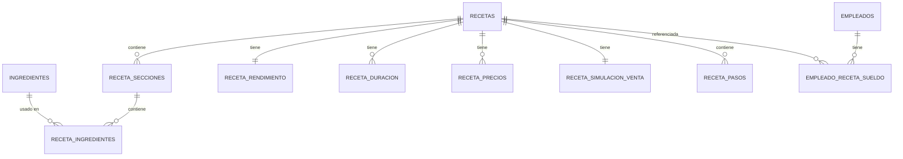

# Guía de Arquitectura — App de Gestión de Repostería (Android nativo)

**Plataforma:** Android nativo · Kotlin · Jetpack Compose · Room (SQLite) · WorkManager · Google Drive API
**Desarrollo:** Android Studio en Linux
**Objetivo:** reemplazar Trello/Excel para gestionar ingredientes, recetas (costeo, rendimiento, duración, precios, pasos) y empleados (cálculo de sueldos por venta), con respaldo dual en Google Drive. Entregable final: un **APK instalable** en tu celular.

---

## 0. Qué cambió respecto a la versión Pydroid3

El modelo de datos, las fórmulas y el plan de fases que ya construimos **no se pierden** — son independientes del lenguaje. Lo que cambia es la implementación:

| Antes (Pydroid3) | Ahora (Android nativo) |
|---|---|
| Tkinter | Jetpack Compose |
| sqlite3 + clases repositorio a mano | Room (genera el acceso a datos desde anotaciones) |
| OAuth "device flow" (workaround) | Google Sign-In real + Drive API con scope `drive.file` |
| Reintentos de sync manuales | WorkManager (reintentos y reglas de red nativas de Android) |
| Un script corriendo dentro de otra app | APK instalable, con ícono propio, notificaciones posibles a futuro |
| Pensado para verse bien en PC y celular a la vez | Pensado para celular (Android). Versión de escritorio quedaría para más adelante vía Compose Multiplatform, si algún día se quiere |

---

## 1. Decisiones confirmadas

| # | Tema | Decisión final |
|---|---|---|
| 1 | **Stack** | Kotlin + Jetpack Compose + Room + WorkManager. Android Studio en Linux. |
| 2 | **Autenticación Google Drive** | Google Sign-In nativo (`GoogleSignInClient`), scope `drive.file` (solo archivos creados por la app — evita el proceso de verificación de scopes sensibles de Google). |
| 3 | **Precio de ingrediente en recetas antiguas** | Se recalcula siempre con el precio actual del ingrediente. |
| 4 | **Trozo ganador con promoción activa** | Se calcula automáticamente según el precio que esté "activo" en ese momento — base o promo. |
| 5 | **Semanas por mes** | `SEMANAS_POR_MES = 4.33` (52 ÷ 12). |
| 6 | **Sueldo de empleado: base de cálculo** | Ingreso bruto del producto completo, derivado del precio activo de la receta. |
| 7 | **Múltiples dispositivos** | Poco probable; advertencia best-effort si detecta apertura simultánea (sección 11.4). |
| 8 | **Alcance de plataforma** | Solo Android (celular/tablet). No se busca paridad con PC en esta etapa. |

---

## 2. Contexto técnico y restricciones

- **Lenguaje:** Kotlin (muy cercano a Java, que ya conoces).
- **UI:** Jetpack Compose — declarativa, similar en espíritu a pensar en "frames" de Tkinter, pero con recomposición automática en vez de actualizar widgets a mano.
- **Base de datos:** Room, capa sobre SQLite. Define las tablas como clases Kotlin (`@Entity`) y las consultas como interfaces (`@Dao`); genera el SQL por ti, pero sigue siendo SQLite real por debajo.
- **Concurrencia:** Kotlin Coroutines (todo acceso a Room y a la red es asíncrono por defecto en Android).
- **Inyección de dependencias:** manual, vía un `AppContainer` simple en la clase `Application` — evita sumar una librería nueva (Hilt) mientras el proyecto es de un solo desarrollador. Se puede migrar a Hilt después si el proyecto crece.
- **Sincronización en segundo plano:** WorkManager — reintentos automáticos, respeta si hay o no conexión, sobrevive a que cierres la app o se reinicie el celular.
- **Min SDK recomendado:** Android 8.0 (API 26) en adelante, cubre prácticamente cualquier celular Android usable hoy y da acceso a las APIs modernas de Compose/WorkManager sin librerías de compatibilidad extra.
- **Google Cloud Console:** hay que registrar un proyecto y un cliente OAuth tipo "Android", con el SHA-1 de tu firma de app. Con el scope `drive.file` (no sensible), no necesitas pasar por el proceso de verificación de Google para uso personal — basta con dejar la app en modo "Testing" y agregarte a ti mismo como *test user*.

---

## 3. Arquitectura general (capas — patrón MVVM)

```
┌───────────────────────────────────────────┐
│  UI (Jetpack Compose)                      │
│  Pantallas (Composables) · Navegación      │
└───────────────────┬─────────────────────────┘
                    │ observa estado / envía eventos
┌───────────────────▼─────────────────────────┐
│  ViewModel                                  │
│  Un ViewModel por pantalla o flujo           │
│  (IngredientesViewModel, RecetaViewModel...) │
└───────────────────┬─────────────────────────┘
                    │ llama a
┌───────────────────▼─────────────────────────┐
│  Lógica de negocio (logica/)                │
│  Formato · Rendimiento · Precios · Sueldos  │
│  Simulaciones — Kotlin puro, sin Android    │
└───────────────────┬─────────────────────────┘
                    │ usa
┌───────────────────▼─────────────────────────┐
│  Repositorios (data/repositorio/)           │
│  Combinan DAOs de Room + reglas simples     │
└───────────────────┬─────────────────────────┘
                    │ lee/escribe
┌───────────────────▼─────────────────────────┐
│  Room (SQLite)                              │
└───────────────────┬─────────────────────────┘
                    │ dispara tras cada guardado
┌───────────────────▼─────────────────────────┐
│  WorkManager → SyncWorker → Drive API       │
│  Cuenta 1 (obligatoria) + Cuenta 2 (opc.)   │
└───────────────────────────────────────────┘
```

Igual que en la versión anterior: la UI nunca toca Room ni Drive directamente. Todo pasa por ViewModel → lógica → repositorio. La carpeta `logica/` es Kotlin puro (sin imports de Android), así que se puede probar con JUnit sin emulador ni celular — muy útil dado lo intrincado de las fórmulas de sueldos y promociones.

---

## 4. Estructura del proyecto

```
app/
├── build.gradle.kts
├── src/main/
│   ├── AndroidManifest.xml
│   ├── java/com/tuusuario/reposteria/
│   │   ├── ReposteriaApp.kt              # Application, arma el AppContainer
│   │   ├── data/
│   │   │   ├── db/
│   │   │   │   ├── AppDatabase.kt         # Room database, versión, migraciones
│   │   │   │   ├── entidades/             # una clase @Entity por tabla (sección 5)
│   │   │   │   └── dao/
│   │   │   │       ├── IngredienteDao.kt
│   │   │   │       ├── RecetaDao.kt
│   │   │   │       └── EmpleadoDao.kt
│   │   │   └── repositorio/
│   │   │       ├── IngredienteRepositorio.kt
│   │   │       ├── RecetaRepositorio.kt
│   │   │       └── EmpleadoRepositorio.kt
│   │   ├── logica/                        # Kotlin puro, sin Android
│   │   │   ├── Formato.kt
│   │   │   ├── Rendimiento.kt
│   │   │   ├── Precios.kt
│   │   │   ├── Simulacion.kt
│   │   │   └── Sueldos.kt
│   │   ├── sync/
│   │   │   ├── DriveClient.kt
│   │   │   ├── SyncWorker.kt              # Worker de WorkManager
│   │   │   └── SesionLock.kt
│   │   └── ui/
│   │       ├── MainActivity.kt
│   │       ├── navegacion/NavGraph.kt
│   │       ├── ingredientes/
│   │       │   ├── IngredientesViewModel.kt
│   │       │   ├── ListaIngredientesScreen.kt
│   │       │   └── ComboBuscable.kt
│   │       ├── recetas/
│   │       │   ├── RecetaViewModel.kt
│   │       │   ├── ListaRecetasScreen.kt
│   │       │   ├── wizard/                # un archivo por paso del wizard
│   │       │   └── DetalleRecetaScreen.kt
│   │       ├── empleados/
│   │       │   ├── EmpleadosViewModel.kt
│   │       │   ├── ListaEmpleadosScreen.kt
│   │       │   └── SimulacionMultipleScreen.kt
│   │       └── componentes/
│   │           ├── SeccionColapsable.kt
│   │           └── BarraBusqueda.kt
│   └── res/                                # temas, colores, strings.xml
```

---

## 5. Modelo de datos (Room)

El diseño de tablas es el mismo que ya validamos; solo cambia la sintaxis. Diagrama de relaciones sin cambios:



### 5.1 Ejemplos de entidades

```kotlin
@Entity(tableName = "ingredientes")
data class Ingrediente(
    @PrimaryKey(autoGenerate = true) val id: Long = 0,
    val nombre: String,
    val valorPorGramo: Double = 0.0,
    val activo: Boolean = true,
    val creadoEn: Long = System.currentTimeMillis(),
    val actualizadoEn: Long = System.currentTimeMillis()
)

@Entity(tableName = "recetas")
data class Receta(
    @PrimaryKey(autoGenerate = true) val id: Long = 0,
    val titulo: String,
    val pasoPrevio: String = "No necesita",
    val creadoEn: Long = System.currentTimeMillis(),
    val actualizadoEn: Long = System.currentTimeMillis()
)

@Entity(
    tableName = "receta_precios",
    foreignKeys = [ForeignKey(
        entity = Receta::class, parentColumns = ["id"], childColumns = ["recetaId"],
        onDelete = ForeignKey.CASCADE
    )],
    indices = [Index("recetaId")]
)
data class RecetaPrecio(
    @PrimaryKey(autoGenerate = true) val id: Long = 0,
    val recetaId: Long,
    val modo: String,          // "trozo" | "producto"
    val cantidad: Int = 1,
    val precioTotal: Double,
    val activo: Boolean = false,
    val etiqueta: String? = null
)
```

### 5.2 Resto de entidades (mismo patrón)

| Entidad Kotlin | Campos clave | Relación |
|---|---|---|
| `RecetaSeccion` | `id, recetaId, nombreSeccion, orden` | FK a `Receta` |
| `RecetaIngrediente` | `id, seccionId, ingredienteId, cantidadG, orden` | FK a `RecetaSeccion` e `Ingrediente` |
| `RecetaRendimiento` | `recetaId (PK), usaMolde, moldeDesc, pesoFinalG, trozos` | 1:1 con `Receta` |
| `RecetaDuracion` | `recetaId, tipo (ambiente/refrigerada/congelada), apto, cantidad, unidad` | PK compuesta (`recetaId`, `tipo`) |
| `RecetaSimulacionVenta` | `recetaId (PK), diasPorSemana, unidadesPorDia` | 1:1 con `Receta` |
| `RecetaPaso` | `id, recetaId, orden, contenido` | FK a `Receta` |
| `Empleado` | `id, nombre, esGenerico, creadoEn` | — |
| `EmpleadoRecetaSueldo` | `id, empleadoId, recetaId, gananciaEmpleado, diasPorSemana, unidadesPorDia` | único (`empleadoId`, `recetaId`) |
| `EmpleadoSimulacionMultiple` / `Detalle` | `empleadoId (PK), diasPorSemana` + tabla detalle por receta | ver sección 9.3 |

`AppDatabase.kt` declara la versión del esquema y las migraciones cuando algo cambie — a diferencia de un `schema.sql` suelto, Room **obliga** a documentar cada cambio de estructura, lo cual es una salvaguarda útil una vez que tengas datos reales guardados en el celular.

---

## 6. Reglas transversales

### 6.1 Formato numérico

Punto para miles, coma para decimales, redondeo a 2 decimales, se omite la coma si el decimal es ",00":

```kotlin
fun formatearNumero(valor: Double): String {
    val redondeado = Math.round(valor * 100) / 100.0
    val entero = redondeado.toInt()
    val decimal = Math.round(Math.abs(redondeado - entero) * 100).toInt()
    val enteroFmt = "%,d".format(entero).replace(",", ".")
    return if (decimal == 0) enteroFmt else "$enteroFmt,${decimal.toString().padStart(2, '0')}"
}
// formatearNumero(1000.0) -> "1.000"
// formatearNumero(1.55)   -> "1,55"
// formatearNumero(250.0)  -> "250"
```

Vive en `logica/Formato.kt`, sin dependencias de Android — se puede probar con JUnit puro.

### 6.2 Validaciones comunes

- Ingrediente: nombre único, `valorPorGramo >= 0`.
- Rendimiento: `trozos >= 1` siempre; si `usaMolde = false`, `pesoFinalG` es obligatorio.
- Duración: si `apto = false`, se ignoran cantidad/unidad.
- Sueldo empleado: `gananciaEmpleado` entre `0` y `gananciaTotal` de la receta.

Estas validaciones viven en `logica/`, no solo en la UI, para que sean consistentes sin importar desde qué pantalla se invoquen.

---

## 7. Módulo Ingredientes

- CRUD (nombre + valor por gramo) vía `IngredienteRepositorio` + `IngredientesViewModel`.
- `ComboBuscable.kt`: Composable reutilizable — campo de texto que filtra la lista en tiempo real (coincidencia en cualquier parte del nombre) y un botón "+ nuevo ingrediente" que abre un `AlertDialog`/`ModalBottomSheet` para dar de alta uno sin salir de la receta. Se reutiliza en el paso "Cantidades y precios" de Recetas.
- Al lado de cada ingrediente en una receta se muestra `cantidad × valorPorGramo`, siempre pasado por `formatearNumero`.

---

## 8. Módulo Recetas

### 8.1 Flujo general

Un `RecetaViewModel` con estado compartido entre los pasos del wizard (`wizard/`), y navegación entre pasos vía Navigation Compose. Al finalizar, se abre `DetalleRecetaScreen.kt` con cada paso como sección tipo acordeón (`SeccionColapsable`), editable en cualquier momento — no hay estado "bloqueado" tras terminar.

### 8.2 Paso 1 — Cantidades y precios

```kotlin
suspend fun costoTotalReceta(recetaId: Long): Double {
    var total = 0.0
    recetaRepo.obtenerSecciones(recetaId).forEach { seccion ->
        recetaRepo.obtenerIngredientes(seccion.id).forEach { item ->
            total += item.cantidadG * ingredienteRepo.obtener(item.ingredienteId).valorPorGramo
        }
    }
    return total
}
```

Una o más `RecetaSeccion` (recetas de un solo conjunto crean automáticamente una sección "General" invisible para el usuario). Costo total = suma de todos los ingredientes de todas las secciones, siempre con el precio **actual** del ingrediente.

### 8.3 Paso 2 — Rendimiento

| Caso | Molde | Peso final |
|---|---|---|
| Con molde | Obligatorio (descripción) | Opcional → si vacío, "No especificado" |
| Sin molde (ej. salsa) | Fijo: "No utiliza molde" | Obligatorio |

```kotlin
fun pesoPorTrozo(pesoFinalG: Double?, trozos: Int): String =
    if (pesoFinalG == null) "No especificado" else formatearNumero(pesoFinalG / trozos)

suspend fun reescalarReceta(recetaId: Long, nuevoPesoReferencia: Double) {
    val pesoActual = recetaRepo.obtenerPesoFinal(recetaId)
        ?: recetaRepo.sumaGramosIngredientes(recetaId)   // si no había peso final definido
    val factor = nuevoPesoReferencia / pesoActual
    recetaRepo.obtenerTodosLosIngredientes(recetaId).forEach {
        recetaRepo.actualizarCantidad(it.id, Math.round(it.cantidadG * factor * 100) / 100.0)
    }
}
```

`trozos` no cambia automáticamente al reescalar; se ajusta aparte si se quiere, igual que cualquier otro campo editable.

### 8.4 Paso 3 — Duración (opcional)

Banner fijo: *"Las duraciones son estimaciones no precisas"*. Tres bloques (ambiente / refrigerada / congelada) con `cantidad + unidad`, o el switch "No apto" que anula los otros dos campos de ese bloque.

### 8.5 Paso 4 — Gastos y Ganancias

El valor que ingresas aquí (modo "trozo" o "producto" + un número) crea la primera fila de `RecetaPrecio` (`cantidad = 1`, `activo = true`) — tu precio base. Todo lo automático de este paso se recalcula según el precio que esté **activo** en cada momento (base o promo):

```kotlin
suspend fun precioEfectivoPorTrozo(recetaId: Long): Double {
    val activo = recetaRepo.obtenerPrecioActivo(recetaId)
    val trozos = recetaRepo.obtenerTrozos(recetaId)
    val trozosCubiertos = if (activo.modo == "trozo") activo.cantidad else activo.cantidad * trozos
    return activo.precioTotal / trozosCubiertos
}

fun trozoGanador(costoTotal: Double, precioTrozo: Double): Pair<Int, Double> {
    val n = (costoTotal / precioTrozo).toInt() + 1
    val ganancia = n * precioTrozo - costoTotal
    return n to ganancia
}
// sin promo: costoTotal=1400, precioTrozo=500  -> n=3, ganancia=100
// con promo "2 trozos por $1.500": precioTrozo=750 -> n=2, ganancia=100
```

`costoPorTrozo`, `gananciaPorTrozo`, `gananciaFinal` e `ingresoBruto` se derivan de la misma forma que en el diseño original — todos de solo lectura.

### 8.6 Precios y promociones

Filas de `RecetaPrecio`. Cada una = "vender `cantidad` trozos (o `cantidad` productos completos, según `modo`) por `precioTotal`". Solo una puede estar `activo = true` a la vez por receta; activar una nueva desactiva la anterior. Cambiar cuál está activa recalcula 8.5 y 8.7 sin acción adicional.

### 8.7 Paso 5 — Ganancias simuladas

```kotlin
const val SEMANAS_POR_MES = 4.33

fun simulacion(ingresoBase: Double, costoBase: Double, dias: Int, unidades: Int): SimulacionResultado {
    val ingresoSemanal = ingresoBase * dias * unidades
    val costoSemanal = costoBase * dias * unidades
    val gananciaSemanal = ingresoSemanal - costoSemanal
    return SimulacionResultado(
        ingresoSemanal, costoSemanal, gananciaSemanal,
        ingresoMensual = ingresoSemanal * SEMANAS_POR_MES,
        costoMensual = costoSemanal * SEMANAS_POR_MES,
        gananciaMensual = gananciaSemanal * SEMANAS_POR_MES
    )
}
```

`diasPorSemana` / `unidadesPorDia` quedan visibles y editables al final; cualquier cambio recalcula todo en el mismo momento.

### 8.8 Paso 6 — Pasos

- "Paso previo" (opcional, default "No necesita") + pasos numerados en un `TextField` multilínea.
- Autocompletado de ingredientes: se observa el texto con `onValueChange`, se detecta cuando el usuario termina de escribir `ingredientes:`, y se muestra un `Popup`/`DropdownMenu` acotado (no pantalla completa) junto al cursor, listando solo los ingredientes usados en esa receta con su gramaje. Se cierra si seleccionas uno, si borras la palabra clave, o si sigues escribiendo sin elegir.

### 8.9 Vista final y lista de recetas

- `DetalleRecetaScreen.kt`: cada paso como sección `SeccionColapsable`, con acceso a edición inline por sección.
- `ListaRecetasScreen.kt`: botón "+ Nueva receta" fijo arriba (fuera del scroll, vía `Scaffold` + contenido fijo sobre un `LazyColumn`), `BarraBusqueda` arriba (coincidencia parcial en título), lista debajo.

---

## 9. Módulo Empleados

### 9.1 Cálculo de sueldo por receta

```kotlin
suspend fun ingresoBrutoProducto(recetaId: Long): Double =
    precioEfectivoPorTrozo(recetaId) * recetaRepo.obtenerTrozos(recetaId)

data class Sueldo(val ingresoBruto: Double, val yoMeLlevo: Double, val gananciaEmpleado: Double)

suspend fun calcularSueldo(recetaId: Long, gananciaEmpleado: Double): Sueldo {
    val ingresoBruto = ingresoBrutoProducto(recetaId)
    val costoTotal = recetaRepo.costoTotal(recetaId)
    val gananciaTotal = ingresoBruto - costoTotal
    require(gananciaEmpleado in 0.0..gananciaTotal) { "Excede la ganancia total de la receta" }
    val yoMeLlevo = costoTotal + (gananciaTotal - gananciaEmpleado)
    return Sueldo(ingresoBruto, yoMeLlevo, gananciaEmpleado)
}
// ejemplo: ingresoBruto=10.000, costoTotal=3.000, gananciaTotal=7.000
// gananciaEmpleado=3.000 -> yoMeLlevo = 3.000 + 4.000 = 7.000
```

Simulación día/semana/mes idéntica a 8.7, usando `diasPorSemana`/`unidadesPorDia` propios de cada combinación empleado-receta.

### 9.2 Empleado genérico vs. específicos

- Registro `esGenerico = true` sembrado una sola vez (en la migración inicial de Room), fijo en segundo lugar de la lista (después del botón "+ nuevo empleado", fijo primero).
- Empleados específicos: título editable, se agregan libremente.
- Desplegable de recetas por empleado para ir asignando `gananciaEmpleado`.

### 9.3 Simulación múltiple

```kotlin
suspend fun simulacionMultiple(empleadoId: Long): SimulacionMultipleResultado {
    val dias = empleadoRepo.obtenerDiasCompartidos(empleadoId)
    var totalIngreso = 0.0; var totalYoMeLlevo = 0.0; var totalEmpleado = 0.0
    empleadoRepo.obtenerDetalle(empleadoId).forEach { detalle ->
        val sueldo = empleadoRepo.obtenerSueldo(empleadoId, detalle.recetaId)
        val factor = dias * detalle.unidadesPorDia
        totalIngreso += ingresoBrutoProducto(detalle.recetaId) * factor
        totalYoMeLlevo += calcularSueldo(detalle.recetaId, sueldo.gananciaEmpleado).yoMeLlevo * factor
        totalEmpleado += sueldo.gananciaEmpleado * factor
    }
    return SimulacionMultipleResultado(totalIngreso, totalYoMeLlevo, totalEmpleado) // + versión mensual ×4,33
}
```

No se reasigna sueldo aquí — solo se lee lo ya configurado en 9.1, agregado por día/semana/mes.

---

## 10. Navegación y UI transversal

### 10.1 Navegación

`NavGraph.kt` con Navigation Compose y un `ModalNavigationDrawer` para el menú de 3 líneas (Ingredientes / Recetas / Empleados). Se abre/cierra con el mismo botón, patrón estándar de Compose — no hay que construirlo a mano como en Tkinter.

### 10.2 Buscador

`BarraBusqueda.kt`, un solo Composable reutilizado en las 3 secciones. Filtro por coincidencia parcial, insensible a mayúsculas:

```kotlin
fun coincide(textoBusqueda: String, campo: String) =
    campo.contains(textoBusqueda, ignoreCase = true)
```

### 10.3 Responsividad

Compose maneja la mayor parte de la adaptación de forma nativa (a diferencia de Tkinter, no hay que calcular factores de escala a mano):

- `LazyColumn`/`LazyVerticalGrid` con `Modifier.fillMaxWidth()` en vez de tamaños fijos en `dp` para contenedores.
- Tipografía definida en `Theme.kt` con `sp` (escala con la configuración de accesibilidad del sistema, no con píxeles fijos).
- Si en el futuro se agrega soporte para tablets, `WindowSizeClass` permite adaptar el layout (una o dos columnas) sin rehacer las pantallas.

### 10.4 Secciones colapsables

`SeccionColapsable.kt`: Composable con un `remember { mutableStateOf(false) }` para expandido/colapsado, header con título + ícono de flecha (`AnimatedVisibility` para la animación de apertura/cierre). Reutilizado en recetas (8.9) y empleados.

---

## 11. Sincronización con la nube (Google Drive ×2)

### 11.1 Autenticación

Google Sign-In nativo (`GoogleSignInClient`), scope `Drive.SCOPE_FILE` (`drive.file` — la app solo ve/edita los archivos que ella misma crea, no todo tu Drive). Esto evita el proceso de verificación de scopes sensibles de Google: para uso personal, basta con dejar el proyecto en Google Cloud Console en modo "Testing" y agregar tu(s) propio(s) correo(s) como *test users*.

- **Cuenta 1 (obligatoria):** se autoriza la primera vez que abres la app, con el flujo estándar de selección de cuenta de Android.
- **Cuenta 2 (opcional):** un botón "+ Agregar respaldo secundario" dispara el mismo flujo de `GoogleSignInClient`, pero pidiendo elegir una cuenta distinta a la 1. Android permite tener varias cuentas Google en el mismo dispositivo, así que esto es soporte nativo, no un truco.
- Los tokens de cada cuenta los administra el SDK de Google Sign-In (se refrescan solos); no hay que guardarlos a mano.

### 11.2 Subida/descarga

Cliente Drive vía `com.google.api.services.drive.Drive` (con `GoogleAccountCredential`), o alternativamente llamadas REST directas con Retrofit si se prefiere una app más liviana — a evaluar en la Fase 0 según cuál sea más simple de integrar en la práctica.

### 11.3 Flujo de respaldo — `SyncWorker` (WorkManager)

```
al guardar cualquier cambio (Room):
  1. encolar un WorkManager OneTimeWorkRequest con restricción NetworkType.CONNECTED
  2. SyncWorker: snapshot del archivo .db (Room expone el archivo físico de SQLite)
  3. subir/actualizar en Drive cuenta 1 (usar el fileId guardado, no crear duplicados)
  4. si cuenta 2 está activa -> repetir con cuenta 2
  5. si falla -> WorkManager reintenta solo con backoff exponencial, sin código adicional
```

✅ Confirmado: se asume un solo dispositivo en uso normal. Drive es respaldo/restauración, no edición simultánea — última escritura gana, sin resolución de conflictos.

Restauración: si Room detecta que no hay base de datos local, la app ofrece "Restaurar desde la nube", trayendo el archivo desde la cuenta 1 (o la 2 si la 1 falla).

### 11.4 Detección de uso simultáneo (best-effort)

- `deviceId`: UUID generado una sola vez, guardado en `SharedPreferences` (no en Room, para que no viaje al restaurar en otro dispositivo).
- Cada `SyncWorker` exitoso también sube `sesion.json` con `{deviceId, actualizadoEn}` a la cuenta 1.
- Al iniciar la app, se descarga `sesion.json`: si el `deviceId` no es el propio y `actualizadoEn` es reciente (últimos ~15 min), se muestra un aviso no bloqueante: *"El programa parece estar abierto en otro dispositivo"*. Si el timestamp ya es antiguo, se asume que se cerró sin limpiar y no se avisa.

---

## 12. Manejo de errores y modo offline

- Toda escritura relevante en Room dentro de una transacción (`@Transaction` en el DAO), para que una app cerrada a la fuerza no deje datos a medias.
- Sin conexión: la app funciona 100% local; WorkManager mantiene el trabajo de sync encolado y lo ejecuta solo apenas vuelve la red — no hay que programar el reintento a mano.
- Errores de Drive (token expirado, cuota, etc.) se capturan en `SyncWorker.doWork()` devolviendo `Result.retry()`, que WorkManager reintenta automáticamente.
- Validaciones (sección 6.2) en `logica/`, no solo en Compose, para que sean iguales sin importar la pantalla.

---

## 13. Plan de implementación por fases

Mismo espíritu que antes — 14 fases, cada una con algo concreto y probable al final. Cambia el "cómo probarlo" (Android Studio, emulador y celular real en vez de consola de Python), y la Fase 13 ahora termina en un **APK firmado**.

### Fase 0 — Validar Google Sign-In + Drive API en un proyecto vacío

- **Construyes:** un proyecto Android nuevo y mínimo, con un botón de inicio de sesión de Google y una llamada a la Drive API para subir/bajar un archivo de prueba.
- **Hecho cuando:** logras subir y descargar un archivo desde tu celular real, con al menos 1 de las 2 cuentas, usando el scope `drive.file`.
- **Cómo probarlo:** correrlo en tu celular (no solo el emulador, ya que el flujo de cuentas Google se prueba mejor con cuentas reales) y confirmar que el archivo aparece en Drive.

### Fase 1 — Cimientos de datos

- **Construyes:** `AppDatabase`, todas las entidades `@Entity`, los DAOs, y los repositorios.
- **Hecho cuando:** un test JUnit (con Room en modo in-memory) inserta un ingrediente y una receta con 2 secciones, y los recupera correctamente.

### Fase 2 — Ingredientes (módulo completo)

- **Construyes:** `Formato.kt`, CRUD con Compose, `ComboBuscable` con alta rápida.
- **Hecho cuando:** desde el celular agregas/editas/eliminas ingredientes, los buscas por coincidencia parcial, y los montos respetan tu formato exacto.

### Fase 3 — Receta: Cantidades y precios

- **Construyes:** wizard de nueva receta (primer paso), secciones múltiples, `costoTotalReceta`.
- **Hecho cuando:** creas una receta de un conjunto y otra con 2+ secciones, y el costo total de cada una coincide con tu cálculo a mano.

### Fase 4 — Receta: Rendimiento y reescalado

- **Construyes:** molde/peso final/trozos, peso por trozo automático, `reescalarReceta`.
- **Hecho cuando:** las reglas de obligatoriedad funcionan, "No especificado"/"No utiliza molde" aparecen correctamente, y reescalar al doble de peso duplica cada ingrediente.

### Fase 5 — Receta: Duración

- **Construyes:** los 3 bloques, el switch "no apto", el banner de advertencia.
- **Hecho cuando:** el paso completo puede quedar vacío, o con solo 1–2 bloques rellenos, respetando "no apto".

### Fase 6 — Receta: Gastos y Ganancias + Precios/Promociones

- **Construyes:** precio base (primera fila de `RecetaPrecio`), `precioEfectivoPorTrozo`, `trozoGanador`, CRUD de promociones con `activo`.
- **Hecho cuando:** el ejemplo base (costo 1.400, precio 500 → trozo 3, ganancia 100) y el ejemplo con promo (2×1.500 → trozo 2, ganancia 100) dan esos resultados exactos.

### Fase 7 — Receta: Ganancias simuladas

- **Construyes:** `diasPorSemana`/`unidadesPorDia`, cálculo semanal/mensual con `SEMANAS_POR_MES = 4.33`.
- **Hecho cuando:** el ejemplo (5.000 × 4 × 2 = 40.000 semanal) funciona, y editar los valores después de guardado recalcula todo.

### Fase 8 — Receta: Pasos + autocompletado

- **Construyes:** paso previo, pasos numerados, detector de `ingredientes:`.
- **Hecho cuando:** el popup aparece/desaparece según tus reglas (selección, borrado de la palabra clave, continuar escribiendo).

### Fase 9 — Vista final de receta + lista

- **Construyes:** `DetalleRecetaScreen` (acordeón editable) + `ListaRecetasScreen` (botón fijo, buscador, listado).
- **Hecho cuando:** cualquier receta de fases 3–8 se ve y edita sección por sección sin perder datos, y aparece bien en la lista con buscador funcional.

### Fase 10 — Módulo Empleados completo

- **Construyes:** genérico + específicos, `calcularSueldo`, simulación individual y múltiple.
- **Hecho cuando:** el ejemplo de sueldo (10.000/3.000/7.000/3.000 → 7.000) funciona, el tope se respeta, y la simulación múltiple con 3+ recetas suma bien.

### Fase 11 — Navegación general y pulido de UI

- **Construyes:** drawer de navegación, buscador global, ajustes de Compose para verse bien en distintos tamaños de celular.
- **Hecho cuando:** la app completa se usa cómodamente en tu celular real, sin elementos cortados ni ilegibles.

### Fase 12 — Sincronización real con Google Drive

- **Construyes:** `DriveClient`, `SyncWorker`, integración con Room, respaldo dual, restauración, `SesionLock` (11.4).
- **Hecho cuando:** guardar cualquier cambio sube el respaldo a ambas cuentas configuradas, poner el celular en modo avión no bloquea el uso (y sincroniza solo al volver la red), restaurar en una instalación limpia trae todo de vuelta, y probar con dos `deviceId` distintos dispara la advertencia.

### Fase 13 — QA final y APK firmado (última fase)

- **Construyes:** nada nuevo — checklist completo contra tu especificación original, prueba de estrés (recetas grandes), revisión de formatos numéricos, manejo de errores en cada formulario, y la generación de un **APK de release firmado** (`./gradlew assembleRelease` con tu keystore).
- **Hecho cuando:** instalas el APK directo en tu celular (sin Android Studio conectado), usas la app de principio a fin — ingredientes, receta completa con sus 6 pasos, sueldos de empleados — y todo respalda solo en Drive. Este es el ejecutable final.

---

## 14. Riesgos y mitigaciones

| Riesgo | Mitigación |
|---|---|
| Curva de aprendizaje de Compose | Menor de lo que parece viniendo de Java/Kotlin — es un cambio de paradigma (declarativo) pero no de lenguaje. La Fase 0 y 1 ya sirven como rodaje antes de tocar pantallas complejas |
| Verificación de OAuth de Google | Se evita usando el scope no sensible `drive.file` + modo "Testing" con tu correo como test user — no se necesita publicar en Play Store para uso personal |
| Gradle/Android Studio | Linux es el sistema más fluido para esto (mejor rendimiento del emulador con KVM); en la práctica menos fricción que compilar Kivy con Buildozer en Windows |
| Migraciones de Room | A diferencia de un `schema.sql` suelto, Room obliga a declarar migraciones cuando cambia el esquema — más disciplina inicial, pero evita perder datos reales una vez que la app esté en uso diario |
| Tamaño del APK con librerías de Google | Evaluar en Fase 0 si conviene el cliente oficial de Drive o llamadas REST directas más livianas |

---

## 15. Glosario

- **Precio activo**: la fila de `RecetaPrecio` marcada como vigente (base o promoción). Alimenta Gastos y Ganancias, trozo ganador y sueldos.
- **Trozo ganador**: primer trozo cuya venta acumulada, al precio activo, supera el costo total de la receta.
- **Rendimiento**: sección que define molde/peso final y cantidad de trozos.
- **Reescalar**: ajustar cantidades de ingredientes proporcionalmente a un nuevo peso de referencia.
- **Empleado genérico**: perfil de sueldo estándar, siempre presente.
- **Room**: capa de Android sobre SQLite; genera acceso a datos desde clases Kotlin anotadas.
- **WorkManager**: sistema de Android para trabajo diferido y confiable en segundo plano (usado aquí para el respaldo a Drive).
- **Scope `drive.file`**: permiso de Google Drive limitado a los archivos creados por la propia app, sin acceso al resto del Drive del usuario.
