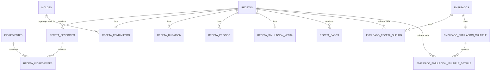

# Guía de Arquitectura — App de Gestión de Repostería (Android nativo)

**Plataforma:** Android nativo · Kotlin · Jetpack Compose · Room (SQLite) · WorkManager · Google Drive API
**Desarrollo:** Android Studio en Linux
**Objetivo:** reemplazar Trello/Excel para gestionar ingredientes, moldes, recetas (costeo, rendimiento, duración, precios, pasos) y empleados (cálculo de sueldos por venta), con respaldo dual en Google Drive. Entregable final: un **APK instalable** en tu celular.

---

## 0. Qué cambió respecto a la versión Pydroid3

El modelo de datos, las fórmulas y el plan de fases que ya construimos **no se pierden** — son independientes del lenguaje. Lo que cambia es la implementación:

| Antes (Pydroid3) | Ahora (Android nativo) |
|---|---|
| Tkinter | Jetpack Compose |
| sqlite3 + clases repositorio a mano | Room (genera el acceso a datos desde anotaciones) |
| OAuth "device flow" (workaround) | Google Sign-In real + Drive API con scope `drive.file` |
| Reintentos de sync manuales | WorkManager (reintentos y reglas de red nativas de Android) |
| Un script corriendo dentro de otra app | APK instalable, con ícono propio, notificaciones posibles a futuro |
| Pensado para verse bien en PC y celular a la vez | Pensado para celular (Android). Versión de escritorio quedaría para más adelante vía Compose Multiplatform, si algún día se quiere |

Esta versión del documento es la vigente y reciente: por eso el alcance quedó limitado a celular y la estructura original (Python/Pydroid3) fue reemplazada por completo. Confirmado como decisión final, no un supuesto.

---

## 1. Decisiones confirmadas

| # | Tema | Decisión final |
|---|---|---|
| 1 | **Stack** | Kotlin + Jetpack Compose + Room + WorkManager. Android Studio en Linux. |
| 2 | **Autenticación Google Drive** | Google Sign-In nativo (`GoogleSignInClient`), scope `drive.file` (solo archivos creados por la app — evita el proceso de verificación de scopes sensibles de Google). |
| 3 | **Precio de ingrediente en recetas antiguas** | Se recalcula siempre con el precio actual del ingrediente. |
| 4 | **Selección de precio para cálculos automáticos** | Siempre se usa el precio/promo guardado que entregue la **menor ganancia por trozo** (el peor caso, "con lo que se juega"). Los demás precios guardados quedan visibles en la receta solo como referencia visual, no participan del cálculo automático. |
| 5 | **Semanas por mes** | `SEMANAS_POR_MES = 4.33` (52 ÷ 12). |
| 6 | **Sueldo de empleado: base de cálculo** | Ingreso bruto del producto completo, derivado del precio de menor ganancia de la receta. |
| 7 | **Múltiples dispositivos** | Poco probable; advertencia best-effort si detecta apertura simultánea (sección 13.4). |
| 8 | **Alcance de plataforma** | Solo Android (celular/tablet). No se busca paridad con PC en esta etapa. |
| 9 | **Borrado de ingredientes** | Permitido solo tras advertencia si el ingrediente está en uso: se listan las recetas afectadas y se pide confirmación explícita. Al confirmar, se quita de esas recetas y el costo se reajusta solo (el costo total siempre se calcula en vivo). |
| 10 | **Borrado de recetas** | En cascada: se eliminan también las asignaciones de sueldo (`EmpleadoRecetaSueldo`) de cualquier empleado que tuviera esa receta asignada. Las simulaciones de esos empleados se recalculan solas al ya no incluir esa receta. |
| 11 | **Reescalado por molde** | Dos modos posibles: **Altura** (conserva el grosor/estructura, exige altura del molde nuevo ≥ altura del original) y **Capacidad** (conserva la proporción de volumen, sin esa restricción). Ver sección 8.3 y 9. |
| 12 | **Catálogo de Moldes** | Nuevo módulo independiente. El reescalado de una receta puede usar un molde guardado del catálogo o dimensiones ingresadas al vuelo sin guardarlas ("modo prueba", útil para reescalar una receta ajena). |
| 13 | **Notificaciones de cambios** | Botón global en la barra superior (aparte del buscador) que despliega un historial color-coded: azul = creación, verde = edición, rojo = eliminación (con el detalle de qué otras entidades resultaron afectadas, cuando aplica). |

---

## 2. Contexto técnico y restricciones

- **Lenguaje:** Kotlin (muy cercano a Java, que ya conoces).
- **UI:** Jetpack Compose — declarativa, similar en espíritu a pensar en "frames" de Tkinter, pero con recomposición automática en vez de actualizar widgets a mano.
- **Base de datos:** Room, capa sobre SQLite. Define las tablas como clases Kotlin (`@Entity`) y las consultas como interfaces (`@Dao`); genera el SQL por ti, pero sigue siendo SQLite real por debajo.
- **Concurrencia:** Kotlin Coroutines (todo acceso a Room y a la red es asíncrono por defecto en Android).
- **Inyección de dependencias:** manual, vía un `AppContainer` simple en la clase `Application` — evita sumar una librería nueva (Hilt) mientras el proyecto es de un solo desarrollador. Se puede migrar a Hilt después si el proyecto crece.
- **Sincronización en segundo plano:** WorkManager — reintentos automáticos, respeta si hay o no conexión, sobrevive a que cierres la app o se reinicie el celular.
- **Min SDK recomendado:** Android 8.0 (API 26) en adelante, cubre prácticamente cualquier celular Android usable hoy y da acceso a las APIs modernas de Compose/WorkManager sin librerías de compatibilidad extra.
- **Google Cloud Console:** hay que registrar un proyecto y un cliente OAuth tipo "Android", con el SHA-1 de tu firma de app. Con el scope `drive.file` (no sensible), no necesitas pasar por el proceso de verificación de Google para uso personal — basta con dejar la app en modo "Testing" y agregarte a ti mismo como *test user*.

---

## 3. Arquitectura general (capas — patrón MVVM)

```
┌───────────────────────────────────────────┐
│  UI (Jetpack Compose)                      │
│  Pantallas (Composables) · Navegación      │
└───────────────────┬─────────────────────────┘
                    │ observa estado / envía eventos
┌───────────────────▼─────────────────────────┐
│  ViewModel                                  │
│  Un ViewModel por pantalla o flujo           │
│  (IngredientesViewModel, RecetaViewModel...) │
└───────────────────┬─────────────────────────┘
                    │ llama a
┌───────────────────▼─────────────────────────┐
│  Lógica de negocio (logica/)                │
│  Formato · Rendimiento · Moldes · Precios   │
│  Simulaciones — Kotlin puro, sin Android    │
└───────────────────┬─────────────────────────┘
                    │ usa
┌───────────────────▼─────────────────────────┐
│  Repositorios (data/repositorio/)           │
│  Combinan DAOs de Room + reglas simples     │
└───────────────────┬─────────────────────────┘
                    │ lee/escribe
┌───────────────────▼─────────────────────────┐
│  Room (SQLite)                              │
└───────────────────┬─────────────────────────┘
                    │ dispara tras cada guardado
┌───────────────────▼─────────────────────────┐
│  WorkManager → SyncWorker → Drive API       │
│  Cuenta 1 (obligatoria) + Cuenta 2 (opc.)   │
└───────────────────────────────────────────┘
```

Igual que en la versión anterior: la UI nunca toca Room ni Drive directamente. Todo pasa por ViewModel → lógica → repositorio. La carpeta `logica/` es Kotlin puro (sin imports de Android), así que se puede probar con JUnit sin emulador ni celular — muy útil dado lo intrincado de las fórmulas de sueldos, moldes y promociones.

---

## 4. Estructura del proyecto

```
app/
├── build.gradle.kts
├── src/main/
│   ├── AndroidManifest.xml
│   ├── java/com/tuusuario/reposteria/
│   │   ├── ReposteriaApp.kt              # Application, arma el AppContainer
│   │   ├── data/
│   │   │   ├── db/
│   │   │   │   ├── AppDatabase.kt         # Room database, versión, migraciones
│   │   │   │   ├── entidades/             # una clase @Entity por tabla (sección 5)
│   │   │   │   │   └── DimensionesMolde.kt   # value class @Embedded, reutilizada por Molde y RecetaRendimiento
│   │   │   │   └── dao/
│   │   │   │       ├── IngredienteDao.kt
│   │   │   │       ├── RecetaDao.kt
│   │   │   │       ├── MoldeDao.kt
│   │   │   │       ├── EmpleadoDao.kt
│   │   │   │       └── HistorialDao.kt
│   │   │   └── repositorio/
│   │   │       ├── IngredienteRepositorio.kt
│   │   │       ├── RecetaRepositorio.kt
│   │   │       ├── MoldeRepositorio.kt
│   │   │       ├── EmpleadoRepositorio.kt
│   │   │       └── HistorialRepositorio.kt
│   │   ├── logica/                        # Kotlin puro, sin Android
│   │   │   ├── Formato.kt
│   │   │   ├── Rendimiento.kt
│   │   │   ├── Moldes.kt                  # factorEscala, DimensionesMolde.areaCm2/volumenCm3
│   │   │   ├── Precios.kt
│   │   │   ├── Simulacion.kt
│   │   │   └── Sueldos.kt
│   │   ├── sync/
│   │   │   ├── DriveClient.kt
│   │   │   ├── SyncWorker.kt              # Worker de WorkManager
│   │   │   └── SesionLock.kt
│   │   └── ui/
│   │       ├── MainActivity.kt
│   │       ├── navegacion/NavGraph.kt
│   │       ├── ingredientes/
│   │       │   ├── IngredientesViewModel.kt
│   │       │   ├── ListaIngredientesScreen.kt
│   │       │   └── ComboBuscable.kt
│   │       ├── recetas/
│   │       │   ├── RecetaViewModel.kt
│   │       │   ├── ListaRecetasScreen.kt
│   │       │   ├── wizard/                # un archivo por paso del wizard
│   │       │   └── DetalleRecetaScreen.kt
│   │       ├── moldes/
│   │       │   ├── MoldeViewModel.kt
│   │       │   ├── ListaMoldesScreen.kt
│   │       │   └── SelectorReescaladoMolde.kt   # elegir molde guardado o dimensiones "al vuelo"
│   │       ├── empleados/
│   │       │   ├── EmpleadosViewModel.kt
│   │       │   ├── ListaEmpleadosScreen.kt
│   │       │   └── SimulacionMultipleScreen.kt
│   │       └── componentes/
│   │           ├── SeccionColapsable.kt
│   │           ├── BarraBusqueda.kt
│   │           ├── InfoTooltip.kt          # ícono "?" con texto explicativo (usado en Modo Altura/Capacidad)
│   │           └── HistorialCambiosPanel.kt # botón campana + lista color-coded de EventoCambio
│   └── res/                                # temas, colores, strings.xml
```

---

## 5. Modelo de datos (Room)



### 5.1 Ejemplos de entidades

```kotlin
@Entity(tableName = "ingredientes")
data class Ingrediente(
    @PrimaryKey(autoGenerate = true) val id: Long = 0,
    val nombre: String,
    val valorPorGramo: Double = 0.0,
    val creadoEn: Long = System.currentTimeMillis(),
    val actualizadoEn: Long = System.currentTimeMillis()
)
// Nota: no tiene FK saliente hacia RecetaIngrediente que impida borrarlo — el borrado
// se controla a nivel de lógica de negocio (ver 7.1), no con un ON DELETE RESTRICT.

@Entity(tableName = "recetas")
data class Receta(
    @PrimaryKey(autoGenerate = true) val id: Long = 0,
    val titulo: String,
    val pasoPrevio: String = "No necesita",
    val creadoEn: Long = System.currentTimeMillis(),
    val actualizadoEn: Long = System.currentTimeMillis()
)

@Entity(
    tableName = "receta_precios",
    foreignKeys = [ForeignKey(
        entity = Receta::class, parentColumns = ["id"], childColumns = ["recetaId"],
        onDelete = ForeignKey.CASCADE
    )],
    indices = [Index("recetaId")]
)
data class RecetaPrecio(
    @PrimaryKey(autoGenerate = true) val id: Long = 0,
    val recetaId: Long,
    val modo: String,          // "trozo" | "producto"
    val cantidad: Int = 1,
    val precioTotal: Double,
    val etiqueta: String? = null   // nombre de la promo, ej. "2x1.500"
)
// Ya no existe un campo "activo": el precio que alimenta los cálculos automáticos
// se resuelve en vivo como el de menor ganancia (ver 8.6). Todos los guardados
// quedan visibles en la UI para referencia.
```

### 5.2 Entidad Molde y su reutilización en Receta (nuevo)

`DimensionesMolde` es un `data class` compartido (no es una entidad Room por sí sola, se usa vía `@Embedded`) para no duplicar los campos de geometría entre el catálogo de moldes y el snapshot que guarda cada receta:

```kotlin
enum class TipoFormaMolde { RECTANGULO, CIRCULO, CUADRADO, TRIANGULO, EXOTICO }

data class DimensionesMolde(
    val tipoForma: TipoFormaMolde,
    val largoCm: Double? = null,           // rectángulo
    val anchoCm: Double? = null,           // rectángulo
    val ladoCm: Double? = null,            // cuadrado
    val diametroCm: Double? = null,        // círculo
    val baseTrianguloCm: Double? = null,   // triángulo (base, para el área)
    val alturaTrianguloCm: Double? = null, // triángulo (altura de la base, para el área — NO confundir con alturaMoldeCm)
    val volumenExoticoCm3: Double? = null, // exótico, medido llenando el molde con agua
    val alturaMoldeCm: Double              // profundidad/alto real del molde — obligatorio siempre, en las 5 formas
) {
    val areaCm2: Double get() = when (tipoForma) {
        TipoFormaMolde.RECTANGULO -> largoCm!! * anchoCm!!
        TipoFormaMolde.CUADRADO -> ladoCm!! * ladoCm!!
        TipoFormaMolde.CIRCULO -> Math.PI * (diametroCm!! / 2).let { it * it }
        TipoFormaMolde.TRIANGULO -> (baseTrianguloCm!! * alturaTrianguloCm!!) / 2
        TipoFormaMolde.EXOTICO -> volumenExoticoCm3!! / alturaMoldeCm   // área despejada del volumen medido
    }
    val volumenCm3: Double get() =
        if (tipoForma == TipoFormaMolde.EXOTICO) volumenExoticoCm3!! else areaCm2 * alturaMoldeCm
}

@Entity(tableName = "moldes")
data class Molde(
    @PrimaryKey(autoGenerate = true) val id: Long = 0,
    val nombre: String,
    @Embedded val dimensiones: DimensionesMolde,
    val creadoEn: Long = System.currentTimeMillis()
)

@Entity(
    tableName = "receta_rendimiento",
    foreignKeys = [
        ForeignKey(entity = Receta::class, parentColumns = ["id"], childColumns = ["recetaId"], onDelete = ForeignKey.CASCADE),
        ForeignKey(entity = Molde::class, parentColumns = ["id"], childColumns = ["moldeOrigenId"], onDelete = ForeignKey.SET_NULL)
    ],
    indices = [Index("moldeOrigenId")]
)
data class RecetaRendimiento(
    @PrimaryKey val recetaId: Long,
    val usaMolde: Boolean,
    val moldeOrigenId: Long? = null,                          // referencia vigente al molde del catálogo, o null (nunca vinculado / molde borrado)
    @Embedded(prefix = "molde_") val dimensiones: DimensionesMolde? = null, // null si usaMolde = false
    val pesoFinalG: Double? = null,                           // peso real del producto, manual; opcional si usaMolde=true, obligatorio si usaMolde=false
    val trozos: Int
)
```

`dimensiones` es siempre "el molde base vigente para el próximo reescalado" de esa receta — no es un snapshot fijo desde el momento de la creación. Su comportamiento depende de `moldeOrigenId`:

- **Mientras `moldeOrigenId` apunta a un molde que existe** (vínculo vivo): `dimensiones` se mantiene sincronizada con ese `Molde` del catálogo. Si editas el molde en 9.2 (ej. corriges un diámetro mal medido), la corrección se propaga a `dimensiones` de todas las recetas que lo referencian — **sin** tocar las cantidades de ingredientes ya guardadas, porque es una corrección del dato de referencia, no un reescalado real (8.3.1).
- **Si el molde se borra del catálogo** (`moldeOrigenId` pasa a `null` vía `SET_NULL`): `dimensiones` deja de sincronizarse y queda congelada con el último valor conocido — la receta no se rompe, solo pierde el vínculo. Si más adelante quieres volver a vincularla a una referencia viva, se hace manualmente eligiendo (o creando) un molde nuevo en el paso de reescalado (9.3).
- **Si nunca se vinculó a un molde guardado** (reescalado en "modo prueba", 9.3): mismo caso que el anterior, `dimensiones` es y sigue siendo un valor fijo propio de la receta.

```kotlin
suspend fun actualizarMolde(moldeId: Long, nuevasDimensiones: DimensionesMolde) {
    val nombreMolde = moldeRepo.obtener(moldeId).nombre // se obtiene ANTES de actualizar, para el historial
    moldeRepo.actualizarDimensiones(moldeId, nuevasDimensiones)
    val recetasVinculadas = recetaRepo.obtenerRecetasConMoldeOrigen(moldeId)
    recetasVinculadas.forEach { receta ->
        recetaRepo.actualizarDimensionesMolde(receta.id, nuevasDimensiones) // solo el punto de referencia, no reescala
    }
    historialRepo.registrar(
        tipo = TipoEvento.EDICION,
        entidad = "Molde",
        descripcion = "Se editó el molde '$nombreMolde'",
        detalleAdicional = if (recetasVinculadas.isEmpty()) null
            else "Actualizó el molde base de: ${recetasVinculadas.joinToString { it.titulo }}"
    )
}
```

### 5.3 Historial de cambios (nuevo)

```kotlin
enum class TipoEvento { CREACION, EDICION, ELIMINACION }
// color en la UI: CREACION = azul · EDICION = verde · ELIMINACION = rojo

@Entity(tableName = "eventos_cambio")
data class EventoCambio(
    @PrimaryKey(autoGenerate = true) val id: Long = 0,
    val tipo: TipoEvento,
    val entidad: String,               // "Ingrediente" | "Receta" | "Empleado" | "Molde"
    val descripcion: String,           // ej. "Se eliminó el ingrediente 'Harina'"
    val detalleAdicional: String? = null, // ej. "Afectó a: Bizcocho de vainilla, Torta de manjar"
    val creadoEn: Long = System.currentTimeMillis()
)
```

Cada repositorio (`IngredienteRepositorio`, `RecetaRepositorio`, `MoldeRepositorio`, `EmpleadoRepositorio`) escribe una fila en `HistorialRepositorio` en cada create/update/delete relevante — no requiere que el usuario haga nada aparte.

**Regla obligatoria:** `descripcion` siempre incluye el nombre/título de la entidad afectada (ej. `"Se eliminó el ingrediente 'Harina'"`), nunca un texto genérico como `"Se eliminó un ingrediente"` — de lo contrario el historial no sirve para saber *qué* cambió. Esto implica obtener el nombre **antes** de borrar la fila (no después).

### 5.4 Resto de entidades (mismo patrón)

**Regla explícita:** toda FK que apunte a `Receta` usa `onDelete = ForeignKey.CASCADE`, sin excepción. Room no asume cascada por defecto (el default real es `NO_ACTION`, que **bloquearía** el borrado de una receta con hijos pendientes) — así que cada entidad de esta tabla debe declararlo a mano, igual que ya se muestra explícito para `RecetaPrecio` (5.1), `RecetaRendimiento` (5.2) y `EmpleadoRecetaSueldo` (5.4, más abajo). Esto es lo que hace posible el flujo de borrado de receta descrito en 8.9 y la decisión #10.

| Entidad Kotlin | Campos clave | Relación |
|---|---|---|
| `RecetaSeccion` | `id, recetaId, nombreSeccion, orden` | FK a `Receta` (**CASCADE**) |
| `RecetaIngrediente` | `id, seccionId, ingredienteId, cantidadG, orden` | FK a `RecetaSeccion` (**CASCADE** — al borrar una sección se borran sus ingredientes) e `Ingrediente` (sin FK formal, ver 5.1 y 7.1) |
| `RecetaDuracion` | `recetaId, tipo (ambiente/refrigerada/congelada), apto, cantidad, unidad` | PK compuesta (`recetaId`, `tipo`), FK a `Receta` (**CASCADE**) |
| `RecetaSimulacionVenta` | `recetaId (PK), diasPorSemana, unidadesPorDia` | 1:1 con `Receta`, FK (**CASCADE**) |
| `RecetaPaso` | `id, recetaId, orden, contenido` | FK a `Receta` (**CASCADE**) |
| `Empleado` | `id, nombre, esGenerico, creadoEn` | — |
| `EmpleadoRecetaSueldo` | `id, empleadoId, recetaId, gananciaEmpleado, diasPorSemana, unidadesPorDia` | FK a `Empleado` (CASCADE) y a `Receta` (**CASCADE** — ver decisión #10) |
| `EmpleadoSimulacionMultiple` | `empleadoId (PK), diasPorSemana` | 1:1 con `Empleado`, FK (**CASCADE**) |
| `EmpleadoSimulacionMultipleDetalle` | `id, empleadoId, recetaId, unidadesPorDia` | FK a `EmpleadoSimulacionMultiple` (**CASCADE**) y a `Receta` (**CASCADE** — misma razón que `EmpleadoRecetaSueldo`: si la receta desaparece, su fila de detalle en la simulación múltiple también) |

```kotlin
@Entity(
    tableName = "empleado_receta_sueldo",
    foreignKeys = [
        ForeignKey(entity = Empleado::class, parentColumns = ["id"], childColumns = ["empleadoId"], onDelete = ForeignKey.CASCADE),
        ForeignKey(entity = Receta::class, parentColumns = ["id"], childColumns = ["recetaId"], onDelete = ForeignKey.CASCADE)
    ],
    indices = [Index("empleadoId"), Index("recetaId")]
)
data class EmpleadoRecetaSueldo(
    @PrimaryKey(autoGenerate = true) val id: Long = 0,
    val empleadoId: Long,
    val recetaId: Long,
    val gananciaEmpleado: Double,
    val diasPorSemana: Int,
    val unidadesPorDia: Int
)
```

Al borrar una `Receta`, Room elimina en cascada su fila en `EmpleadoRecetaSueldo` para todos los empleados que la tenían asignada — esos empleados simplemente dejan de listar esa receta, y sus simulaciones (10.3) se recalculan solas al ya no sumarla.

`AppDatabase.kt` declara la versión del esquema y las migraciones cuando algo cambie — a diferencia de un `schema.sql` suelto, Room **obliga** a documentar cada cambio de estructura, lo cual es una salvaguarda útil una vez que tengas datos reales guardados en el celular.

---

## 6. Reglas transversales

### 6.1 Formato numérico

Punto para miles, coma para decimales, redondeo a 2 decimales, se omite la coma si el decimal es ",00":

```kotlin
fun formatearNumero(valor: Double): String {
    val redondeado = Math.round(valor * 100) / 100.0
    val entero = redondeado.toInt()
    val decimal = Math.round(Math.abs(redondeado - entero) * 100).toInt()
    val enteroFmt = "%,d".format(entero).replace(",", ".")
    return if (decimal == 0) enteroFmt else "$enteroFmt,${decimal.toString().padStart(2, '0')}"
}
// formatearNumero(1000.0) -> "1.000"
// formatearNumero(1.55)   -> "1,55"
// formatearNumero(250.0)  -> "250"
```

Vive en `logica/Formato.kt`, sin dependencias de Android — se puede probar con JUnit puro.

### 6.2 Validaciones comunes

- Ingrediente: nombre único, `valorPorGramo >= 0`.
- Ingrediente (borrado): si `recetaRepo.obtenerRecetasQueUsan(ingredienteId)` no está vacío, la UI **debe** mostrar la advertencia con esa lista y pedir confirmación explícita antes de llamar a `confirmarEliminacionIngrediente` (7.1). Si está vacío, se borra directo (igual queda el evento en el historial).
- Rendimiento: `trozos >= 1` siempre; si `usaMolde = false`, `pesoFinalG` es obligatorio.
- Molde: `alturaMoldeCm > 0` siempre; el resto de los campos de `DimensionesMolde` obligatorios según `tipoForma` (para `EXOTICO`, solo `volumenExoticoCm3` y `alturaMoldeCm`).
- Reescalado Modo Altura: `nuevo.alturaMoldeCm >= original.alturaMoldeCm` — si no se cumple, error de validación antes de calcular el factor (8.3.1).
- Duración: si `apto = false`, se ignoran cantidad/unidad.
- Precio/promoción (`RecetaPrecio`): `precioTotal > 0` y `cantidad >= 1` siempre — sin esto, un precio en $0 o una promo con `cantidad = 0` produce división por cero en `trozoGanador` (8.5).
- Sueldo empleado: `gananciaEmpleado` entre `0` y `gananciaTotal` de la receta (el tope real es "no bajar de `costoTotal` para mí" — matemáticamente equivalente, ver nota en 10.1).
- `diasPorSemana` en `RecetaSimulacionVenta`, `EmpleadoRecetaSueldo` y `EmpleadoSimulacionMultiple`: entre `1` y `7` siempre — una semana no tiene más de 7 días.

Estas validaciones viven en `logica/`, no solo en la UI, para que sean consistentes sin importar desde qué pantalla se invoquen.

---

## 7. Módulo Ingredientes

- CRUD (nombre + valor por gramo) vía `IngredienteRepositorio` + `IngredientesViewModel`.
- `ComboBuscable.kt`: Composable reutilizable — campo de texto que filtra la lista en tiempo real (coincidencia en cualquier parte del nombre) y un botón "+ nuevo ingrediente" que abre un `AlertDialog`/`ModalBottomSheet` para dar de alta uno sin salir de la receta. Se reutiliza en el paso "Cantidades y precios" de Recetas.
- Al lado de cada ingrediente en una receta se muestra `cantidad × valorPorGramo`, siempre pasado por `formatearNumero`.

### 7.1 Política de borrado (nuevo)

Un ingrediente solo se elimina de verdad tras pasar por este flujo:

```kotlin
// 1. La UI pide la lista de recetas afectadas antes de mostrar cualquier botón de borrado definitivo
suspend fun recetasQueUsan(ingredienteId: Long): List<Receta> =
    recetaRepo.obtenerRecetasQueUsan(ingredienteId)

// 2. Si la lista no está vacía, se muestra la advertencia con esos títulos + botón "Confirmar eliminación".
//    Si está vacía, se puede saltar directo al paso 3.

// 3. Confirmado (o si no había recetas afectadas):
suspend fun confirmarEliminacionIngrediente(ingredienteId: Long) {
    val nombreIngrediente = ingredienteRepo.obtener(ingredienteId).nombre // ANTES de borrar, para el historial
    val afectadas = recetaRepo.obtenerRecetasQueUsan(ingredienteId)
    recetaRepo.quitarIngredienteDeTodasLasSecciones(ingredienteId) // borra las filas RecetaIngrediente que lo referencian
    ingredienteRepo.eliminar(ingredienteId)
    historialRepo.registrar(
        tipo = TipoEvento.ELIMINACION,
        entidad = "Ingrediente",
        descripcion = "Se eliminó el ingrediente '$nombreIngrediente'",
        detalleAdicional = if (afectadas.isEmpty()) null
            else "Afectó a: ${afectadas.joinToString { it.titulo }}"
    )
}
```

`costoTotalReceta()` (8.2) ya se calcula en vivo sumando los ingredientes vigentes de cada receta — al desaparecer la fila `RecetaIngrediente`, el costo total de cada receta afectada se reajusta solo, sin ningún paso adicional.

---

## 8. Módulo Recetas

### 8.1 Flujo general

Un `RecetaViewModel` con estado compartido entre los pasos del wizard (`wizard/`), y navegación entre pasos vía Navigation Compose. Al finalizar, se abre `DetalleRecetaScreen.kt` con cada paso como sección tipo acordeón (`SeccionColapsable`), editable en cualquier momento — no hay estado "bloqueado" tras terminar.

### 8.2 Paso 1 — Cantidades y precios

```kotlin
suspend fun costoTotalReceta(recetaId: Long): Double {
    var total = 0.0
    recetaRepo.obtenerSecciones(recetaId).forEach { seccion ->
        recetaRepo.obtenerIngredientes(seccion.id).forEach { item ->
            total += item.cantidadG * ingredienteRepo.obtener(item.ingredienteId).valorPorGramo
        }
    }
    return total
}
```

Una o más `RecetaSeccion` (recetas de un solo conjunto crean automáticamente una sección "General" invisible para el usuario). Costo total = suma de todos los ingredientes de todas las secciones, siempre con el precio **actual** del ingrediente.

### 8.3 Paso 2 — Rendimiento (con moldes)

| Caso | Molde | Peso final (del producto) |
|---|---|---|
| Con molde | Obligatorio (se define con el módulo Moldes — 9) | Opcional → si vacío, "No especificado" |
| Sin molde (ej. salsa) | Fijo: "No utiliza molde" | Obligatorio |

```kotlin
fun pesoPorTrozo(pesoFinalG: Double?, trozos: Int): String =
    if (pesoFinalG == null) "No especificado" else formatearNumero(pesoFinalG / trozos)
```

`pesoFinalG` es siempre un campo manual — el peso real del producto ya terminado (pesado, no calculado), independiente de las dimensiones del molde: el mismo molde puede dar pesos finales distintos según la receta (una salsa vs. un queque en el mismo molde, por ejemplo). El módulo Moldes (9) solo aporta el área/volumen del molde para el reescalado (8.3.1) — nunca reemplaza ni deriva este campo. Con molde es opcional ("No especificado" si se deja vacío); sin molde es obligatorio, igual que antes.

**Reescalado — dos rutas separadas:**

- **Con molde:** ver 8.3.1 (Modo Altura / Modo Capacidad, con el módulo Moldes).
- **Sin molde (salsas, etc.):** se mantiene el reescalado directo por peso, igual que en la versión anterior:

```kotlin
suspend fun reescalarRecetaPorPeso(recetaId: Long, nuevoPesoReferencia: Double) {
    val pesoActual = recetaRepo.obtenerPesoFinal(recetaId)
        ?: recetaRepo.sumaGramosIngredientes(recetaId)
    val factor = nuevoPesoReferencia / pesoActual
    recetaRepo.obtenerTodosLosIngredientes(recetaId).forEach {
        recetaRepo.actualizarCantidad(it.id, Math.round(it.cantidadG * factor * 100) / 100.0)
    }
}
```

En ambos casos, `trozos` no cambia automáticamente al reescalar; se ajusta aparte si se quiere, igual que cualquier otro campo editable. También se mantiene la opción de editar molde/peso final **sin** reescalar (edición normal de un campo, como cualquier otro).

#### 8.3.1 Reescalado por molde — Modo Altura vs. Modo Capacidad (nuevo)

Todo reescalado por molde sigue 2 pasos: primero medir el molde nuevo (9.1), después elegir qué preservar.

```kotlin
enum class ModoReescalado { ALTURA, CAPACIDAD }

fun factorEscala(original: DimensionesMolde, nuevo: DimensionesMolde, modo: ModoReescalado): Double {
    if (modo == ModoReescalado.ALTURA) {
        require(nuevo.alturaMoldeCm >= original.alturaMoldeCm) {
            "En Modo Altura el molde nuevo no puede ser más bajo que el original"
        }
        return nuevo.areaCm2 / original.areaCm2
    }
    return nuevo.volumenCm3 / original.volumenCm3
}

suspend fun reescalarRecetaPorMolde(
    recetaId: Long,
    nuevo: DimensionesMolde,
    modo: ModoReescalado,
    nuevoMoldeOrigenId: Long? // id del molde elegido del catálogo (9.3, opción 1), o null si fue "modo prueba"
) {
    val original = recetaRepo.obtenerDimensionesMolde(recetaId)
        ?: error("Esta receta no usa molde; usar reescalarRecetaPorPeso()")
    val factor = factorEscala(original, nuevo, modo)
    recetaRepo.obtenerTodosLosIngredientes(recetaId).forEach {
        recetaRepo.actualizarCantidad(it.id, Math.round(it.cantidadG * factor * 100) / 100.0)
    }
    // A diferencia de actualizarDimensionesMolde() (5.2, solo dimensiones -- usada por la
    // sincronización cuando se edita un molde ya enlazado), este reescalado también decide
    // el vínculo: si se reescaló contra un molde guardado, la receta queda enlazada a él
    // (activa la sincronización de 5.2 a futuro); si fue modo prueba, se desvincula de
    // cualquier molde anterior aunque hubiese estado enlazada antes de este reescalado.
    recetaRepo.actualizarDimensionesYVinculoMolde(recetaId, nuevo, nuevoMoldeOrigenId)
}
```

- **Modo Altura (Modo Estructura):** `factor = áreaNueva / áreaOriginal`. Úsalo cuando la receta te gustó como quedó y quieres que se vea/sienta igual — mismo grosor de tajada, misma proporción de capas (queques, bizcochos, milhojas). Exige conocer la altura de ambos moldes, y **no permite** elegir un molde nuevo más bajo que el original.
- **Modo Capacidad (Modo Volumen):** `factor = volumenNuevo / volumenOriginal`. Úsalo para rellenos o masas densas sin estructura de aire crítica, o cuando quieres que la receta rinda más/sea más grande aceptando que la altura cambie como parte de ese crecimiento. No tiene restricción de altura.
- En ambos casos: `ingredienteNuevo = ingredienteOriginal × factor`.
- La UI muestra un ícono "?" (`InfoTooltip.kt`) junto al selector de modo, con el texto de arriba, para no tener que memorizar cuál usar.
- Al elegir el molde nuevo: se puede seleccionar uno guardado del catálogo (9) o ingresar dimensiones sueltas sin guardarlas ("modo prueba" — útil para reescalar una receta ajena sin ensuciar el catálogo de moldes propios).

### 8.4 Paso 3 — Duración (opcional)

Banner fijo: *"Las duraciones son estimaciones no precisas"*. Tres bloques (ambiente / refrigerada / congelada) con `cantidad + unidad`, o el switch "No apto" que anula los otros dos campos de ese bloque.

### 8.5 Paso 4 — Gastos y Ganancias

El valor que ingresas aquí (modo "trozo" o "producto" + un número) crea la primera fila de `RecetaPrecio` (`cantidad = 1`) — tu precio base. Todo lo automático de este paso se recalcula según el **precio de menor ganancia** entre todos los guardados (base + promos, decisión #4):

```kotlin
suspend fun gananciaPorTrozoDe(precio: RecetaPrecio, recetaId: Long): Double {
    val trozos = recetaRepo.obtenerTrozos(recetaId)
    val trozosCubiertos = if (precio.modo == "trozo") precio.cantidad else precio.cantidad * trozos
    val precioPorTrozo = precio.precioTotal / trozosCubiertos
    val costoPorTrozo = recetaRepo.costoTotal(recetaId) / trozos
    return precioPorTrozo - costoPorTrozo
}

suspend fun precioDeMenorGanancia(recetaId: Long): RecetaPrecio {
    val precios = recetaRepo.obtenerPrecios(recetaId)
    // OJO: minBy espera un selector (T) -> R, no suspend (T) -> R -- no acepta directamente
    // una lambda que llame a gananciaPorTrozoDe(). Se calculan las ganancias aparte primero.
    val conGanancia = precios.map { it to gananciaPorTrozoDe(it, recetaId) }
    return conGanancia.minByOrNull { it.second }?.first
        ?: error("La receta no tiene ningún precio guardado todavía (falta el paso Gastos y Ganancias)")
}

suspend fun precioEfectivoPorTrozo(recetaId: Long): Double {
    val minimo = precioDeMenorGanancia(recetaId)
    val trozos = recetaRepo.obtenerTrozos(recetaId)
    val trozosCubiertos = if (minimo.modo == "trozo") minimo.cantidad else minimo.cantidad * trozos
    return minimo.precioTotal / trozosCubiertos
}

fun trozoGanador(costoTotal: Double, precioTrozo: Double): Pair<Int, Double> {
    val n = (costoTotal / precioTrozo).toInt() + 1
    val ganancia = n * precioTrozo - costoTotal
    return n to ganancia
}
// sin promo: costoTotal=1400, precioTrozo=500  -> n=3, ganancia=100
// con promo "2 trozos por $1.500": precioTrozo=750 -> n=2, ganancia=100
```

`costoPorTrozo`, `gananciaPorTrozo`, `gananciaFinal` e `ingresoBruto` se derivan de la misma forma que en el diseño original, todos de solo lectura, siempre alimentados por `precioDeMenorGanancia`.

### 8.6 Precios y promociones

Filas de `RecetaPrecio`. Cada una = "vender `cantidad` trozos (o `cantidad` productos completos, según `modo`) por `precioTotal`", con una `etiqueta` opcional (ej. "2x1.500"). No existe un toggle manual de "activo": **todas** las filas guardadas se ven en una lista dentro de la receta, cada una con su ganancia calculada, para que puedas comparar tus precios a gusto — pero los campos automáticos de 8.5 y 8.7 siempre se recalculan con la fila de menor ganancia, sin que tengas que elegir nada.

### 8.7 Paso 5 — Ganancias simuladas

```kotlin
const val SEMANAS_POR_MES = 4.33

fun simulacion(ingresoBase: Double, costoBase: Double, dias: Int, unidades: Int): SimulacionResultado {
    val ingresoSemanal = ingresoBase * dias * unidades
    val costoSemanal = costoBase * dias * unidades
    val gananciaSemanal = ingresoSemanal - costoSemanal
    return SimulacionResultado(
        ingresoSemanal, costoSemanal, gananciaSemanal,
        ingresoMensual = ingresoSemanal * SEMANAS_POR_MES,
        costoMensual = costoSemanal * SEMANAS_POR_MES,
        gananciaMensual = gananciaSemanal * SEMANAS_POR_MES
    )
}
```

`ingresoBase`/`costoBase` se derivan siempre del precio de menor ganancia (8.5). `diasPorSemana` / `unidadesPorDia` quedan visibles y editables al final; cualquier cambio recalcula todo en el mismo momento.

### 8.8 Paso 6 — Pasos

- "Paso previo" (opcional, default "No necesita") + pasos numerados en un `TextField` multilínea.
- Autocompletado de ingredientes: se observa el texto con `onValueChange`, se detecta cuando el usuario termina de escribir `ingredientes:`, y se muestra un `Popup`/`DropdownMenu` acotado (no pantalla completa) junto al cursor, listando solo los ingredientes usados en esa receta con su gramaje. Se cierra si seleccionas uno, si borras la palabra clave, o si sigues escribiendo sin elegir.

### 8.9 Vista final y lista de recetas

- `DetalleRecetaScreen.kt`: cada paso como sección `SeccionColapsable`, con acceso a edición inline por sección.
- `ListaRecetasScreen.kt`: botón "+ Nueva receta" fijo arriba (fuera del scroll, vía `Scaffold` + contenido fijo sobre un `LazyColumn`), `BarraBusqueda` arriba (coincidencia parcial en título), lista debajo.
- Al eliminar una receta: se dispara la cascada de la sección 5.4 (borra sus `EmpleadoRecetaSueldo`), se registra un evento rojo en el historial (11) mencionando qué empleados quedaron sin esa receta si corresponde, y las simulaciones de esos empleados se recalculan solas.

---

## 9. Módulo Moldes (nuevo)

### 9.1 Medir el molde (paso 1 de cualquier reescalado)

- **Formas regulares** (`RECTANGULO`, `CIRCULO`, `CUADRADO`, `TRIANGULO`): se piden las medidas necesarias para el área según la forma, más `alturaMoldeCm` (siempre obligatoria) para llegar al volumen.
  - Rectángulo: `área = largo × ancho`
  - Cuadrado: `área = lado²`
  - Círculo: `área = π × (diámetro / 2)²`
  - Triángulo: `área = (base × alturaTriángulo) / 2` — el "alturaTriángulo" es propio de la fórmula del área, no confundir con `alturaMoldeCm` (la profundidad real del molde).
  - `volumen = área × alturaMoldeCm`
- **Exótico** (formas irregulares — estrella, corazón, etc.): se mide llenando el molde con agua y midiéndola en una jarra medidora; se ingresa `volumenExoticoCm3` directamente, más `alturaMoldeCm` por separado — igual de obligatoria que en las otras 4 formas (6.2), aunque para un molde exótico solo se "aprovecha" si más adelante se usa Modo Altura, para poder despejar `área = volumen / alturaMoldeCm`.

### 9.2 Catálogo de Moldes (CRUD)

- `ListaMoldesScreen.kt`: botón "+ Crear molde" fijo primero (mismo patrón que Ingredientes/Recetas), moldes creados debajo.
- Al crear uno, se completa `nombre` + los campos de `DimensionesMolde` que correspondan según `tipoForma` elegido (el formulario solo muestra los campos relevantes a esa forma).
- Cada molde en la lista muestra: nombre, tipo de forma, área calculada, volumen calculado y altura — todo derivado de `DimensionesMolde` (5.2), no hay que guardar área/volumen a mano.
- Buscador arriba, mismo componente `BarraBusqueda.kt` reutilizado (coincidencia parcial por nombre).
- Eliminar un molde del catálogo no rompe las recetas que ya lo usaron como origen: `moldeOrigenId` pasa a `null` (`SET_NULL`) y el campo `dimensiones` de cada receta vinculada simplemente deja de sincronizarse, congelado en su último valor conocido (5.2). Solo se pierde el vínculo, nunca los datos.
- Editar un molde existente (corregir una medida) **sí** se propaga a toda receta cuyo `moldeOrigenId` siga apuntando a él (5.2, `actualizarMolde`) — pensado para corregir errores de medición, no para reescalar; las cantidades de ingredientes de esas recetas no cambian solas.

### 9.3 Uso en el reescalado de recetas

En el paso "Rendimiento" de una receta (8.3.1), al reescalar se elige el molde nuevo de dos formas:

1. **Molde guardado:** selector tipo `ComboBuscable` sobre el catálogo de moldes (9.2). Deja la receta **enlazada** a ese molde (`moldeOrigenId` apunta a él), activando la sincronización de 5.2: si más adelante corriges una medida de ese molde en el catálogo, se propaga solo a esta receta.
2. **Modo prueba:** se ingresan las dimensiones directamente en el mismo formulario de 9.2, sin persistirlas como `Molde` — pensado para cuando reescalas una receta ajena y no necesariamente quieres guardar ese molde en tu catálogo. Deja la receta **sin vínculo** (`moldeOrigenId = null`), incluso si antes estaba enlazada a otro molde — sus dimensiones quedan fijas hasta el próximo reescalado.

Con el molde nuevo (guardado o de prueba) ya definido, se elige el modo (Altura o Capacidad, 8.3.1) y se aplica `factorEscala()`. Este mismo selector (guardado vs. prueba) es el que se usa también al definir el molde por primera vez en el paso Rendimiento (8.3) para una receta nueva — no es exclusivo del reescalado.

---

## 10. Módulo Empleados

### 10.1 Cálculo de sueldo por receta

```kotlin
suspend fun ingresoBrutoProducto(recetaId: Long): Double =
    precioEfectivoPorTrozo(recetaId) * recetaRepo.obtenerTrozos(recetaId)

data class Sueldo(val ingresoBruto: Double, val yoMeLlevo: Double, val gananciaEmpleado: Double)

suspend fun calcularSueldo(recetaId: Long, gananciaEmpleado: Double): Sueldo {
    val ingresoBruto = ingresoBrutoProducto(recetaId)
    val costoTotal = recetaRepo.costoTotal(recetaId)
    val gananciaTotal = ingresoBruto - costoTotal
    require(gananciaEmpleado in 0.0..gananciaTotal) { "Excede la ganancia total de la receta" }
    val yoMeLlevo = costoTotal + (gananciaTotal - gananciaEmpleado)
    return Sueldo(ingresoBruto, yoMeLlevo, gananciaEmpleado)
}
// ejemplo: ingresoBruto=10.000, costoTotal=3.000, gananciaTotal=7.000
// gananciaEmpleado=3.000 -> yoMeLlevo = 3.000 + 4.000 = 7.000
```

El tope real de `gananciaEmpleado` (`0..gananciaTotal`, 6.2) es la traducción matemática de "el empleado puede llevarse toda la ganancia, pero yo nunca bajo del costo total": `yoMeLlevo = costoTotal + (gananciaTotal - gananciaEmpleado) ≥ costoTotal` se cumple exactamente cuando `gananciaEmpleado ≤ gananciaTotal`. Son la misma regla, solo que la validación se expresa en términos de `gananciaEmpleado` en vez de `yoMeLlevo`.

Simulación día/semana/mes idéntica a 8.7, usando `diasPorSemana`/`unidadesPorDia` propios de cada combinación empleado-receta — un **`diasPorSemana` independiente por cada receta asignada**, no compartido entre recetas. Si la receta se elimina, la fila `EmpleadoRecetaSueldo` correspondiente desaparece en cascada (5.4) y esta simulación deja de incluirla automáticamente.

### 10.2 Empleado genérico vs. específicos

- Registro `esGenerico = true` sembrado una sola vez (en la migración inicial de Room), fijo en segundo lugar de la lista (después del botón "+ nuevo empleado", fijo primero).
- Empleados específicos: título editable, se agregan libremente.
- Desplegable de recetas por empleado para ir asignando `gananciaEmpleado`. Solo lista recetas que aún existen (las eliminadas ya no aparecen, por la cascada de 5.4).

### 10.3 Simulación múltiple

```kotlin
suspend fun simulacionMultiple(empleadoId: Long): SimulacionMultipleResultado {
    val dias = empleadoRepo.obtenerDiasCompartidos(empleadoId)
    var totalIngreso = 0.0; var totalYoMeLlevo = 0.0; var totalEmpleado = 0.0
    empleadoRepo.obtenerDetalle(empleadoId).forEach { detalle ->
        val sueldo = empleadoRepo.obtenerSueldo(empleadoId, detalle.recetaId)
        val factor = dias * detalle.unidadesPorDia
        totalIngreso += ingresoBrutoProducto(detalle.recetaId) * factor
        totalYoMeLlevo += calcularSueldo(detalle.recetaId, sueldo.gananciaEmpleado).yoMeLlevo * factor
        totalEmpleado += sueldo.gananciaEmpleado * factor
    }
    return SimulacionMultipleResultado(totalIngreso, totalYoMeLlevo, totalEmpleado) // + versión mensual ×4,33
}
```

No se reasigna sueldo aquí — solo se lee lo ya configurado en 10.1, agregado por día/semana/mes.

**Ojo, son dos "días" independientes:** el `diasPorSemana` de `EmpleadoRecetaSueldo` (10.1) es propio de cada receta individual y no tiene relación con `EmpleadoSimulacionMultiple.diasPorSemana` (`obtenerDiasCompartidos`) usado acá — este último es **uno solo, compartido entre todas las recetas** de ese empleado, tal como en el ejemplo original ("venderé 4 días, y esos 4 días serán 2 bizcochos, 1 torta, 5 chocolates por día"). Cambiar uno no afecta al otro.

---

## 11. Historial de cambios / notificaciones globales (nuevo)

- Botón campana en la barra superior, junto a `BarraBusqueda` pero independiente de ella — no reemplaza al buscador, convive con él.
- Al tocarlo, `HistorialCambiosPanel.kt` despliega la lista de `EventoCambio` (5.3) ordenada por fecha descendente, cada fila con una franja de color según `tipo`: azul (creación), verde (edición), rojo (eliminación).
- Cuando una eliminación tuvo efectos en cascada (ingrediente que afectó recetas, receta que afectó empleados), el `detalleAdicional` del evento lo deja explícito como comentario, sin que el usuario tenga que ir a buscarlo por su cuenta.
- Se alimenta solo: cada repositorio llama a `HistorialRepositorio.registrar(...)` en sus operaciones de create/update/delete, no es algo que el usuario configure.

### 11.1 Qué cuenta como "edición" (campos importantes)

Las creaciones y eliminaciones siempre generan evento. Para ediciones, solo estos campos por entidad — tocar cualquier otro (reordenar pasos, ajustar `orden`, etc.) no genera ruido en el historial:

| Entidad | Campos que generan evento verde |
|---|---|
| Ingrediente | `nombre`, `valorPorGramo` |
| Receta | `titulo`; crear/editar/eliminar una fila de `RecetaPrecio` (precio base o promo); `dimensiones`/`pesoFinalG`/reescalado del Rendimiento; `trozos` |
| Molde | `nombre`; cualquier campo de `DimensionesMolde` (siempre relevante — dispara además la propagación de 5.2) |
| Empleado | `nombre`; `gananciaEmpleado` asignada por receta |

**Deliberadamente fuera de esta tabla:** `RecetaDuracion` (ya lleva su propio banner de "estimación no precisa" — no es un dato financiero ni estructural) y `RecetaPaso`/`pasoPrevio` (texto instructivo, no algo que valga la pena notificar). Editarlos no genera evento.

---

## 12. Navegación y UI transversal

### 12.1 Navegación

`NavGraph.kt` con Navigation Compose y un `ModalNavigationDrawer` para el menú de 3 líneas, ahora con **4 secciones**: Ingredientes / Recetas / Moldes / Empleados. Se abre/cierra con el mismo botón, patrón estándar de Compose — no hay que construirlo a mano como en Tkinter.

### 12.2 Buscador

`BarraBusqueda.kt`, un solo Composable reutilizado en las 4 secciones. Filtro por coincidencia parcial, insensible a mayúsculas:

```kotlin
fun coincide(textoBusqueda: String, campo: String) =
    campo.contains(textoBusqueda, ignoreCase = true)
```

### 12.3 Responsividad

Compose maneja la mayor parte de la adaptación de forma nativa (a diferencia de Tkinter, no hay que calcular factores de escala a mano):

- `LazyColumn`/`LazyVerticalGrid` con `Modifier.fillMaxWidth()` en vez de tamaños fijos en `dp` para contenedores.
- Tipografía definida en `Theme.kt` con `sp` (escala con la configuración de accesibilidad del sistema, no con píxeles fijos).
- Si en el futuro se agrega soporte para tablets, `WindowSizeClass` permite adaptar el layout (una o dos columnas) sin rehacer las pantallas.

### 12.4 Secciones colapsables

`SeccionColapsable.kt`: Composable con un `remember { mutableStateOf(false) }` para expandido/colapsado, header con título + ícono de flecha (`AnimatedVisibility` para la animación de apertura/cierre). Reutilizado en recetas (8.9) y empleados.

### 12.5 Ícono de información ("?")

`InfoTooltip.kt`: Composable pequeño y reutilizable — un ícono "?" que al presionarlo despliega un `Popup`/`AlertDialog` acotado con texto explicativo. Usado en el selector de Modo Altura/Capacidad (8.3.1), reutilizable a futuro donde haga falta aclarar una opción sin saturar la pantalla.

---

## 13. Sincronización con la nube (Google Drive ×2)

### 13.1 Autenticación

Google Sign-In nativo (`GoogleSignInClient`), scope `Drive.SCOPE_FILE` (`drive.file` — la app solo ve/edita los archivos que ella misma crea, no todo tu Drive). Esto evita el proceso de verificación de scopes sensibles de Google: para uso personal, basta con dejar el proyecto en Google Cloud Console en modo "Testing" y agregar tu(s) propio(s) correo(s) como *test users*.

- **Cuenta 1 (obligatoria):** se autoriza la primera vez que abres la app, con el flujo estándar de selección de cuenta de Android.
- **Cuenta 2 (opcional):** un botón "+ Agregar respaldo secundario" dispara el mismo flujo de `GoogleSignInClient`, pero pidiendo elegir una cuenta distinta a la 1. Android permite tener varias cuentas Google en el mismo dispositivo, así que esto es soporte nativo, no un truco.
- Los tokens de cada cuenta los administra el SDK de Google Sign-In (se refrescan solos); no hay que guardarlos a mano.

### 13.2 Subida/descarga

Cliente Drive vía `com.google.api.services.drive.Drive` (con `GoogleAccountCredential`), o alternativamente llamadas REST directas con Retrofit si se prefiere una app más liviana — a evaluar en la Fase 0 según cuál sea más simple de integrar en la práctica.

### 13.3 Flujo de respaldo — `SyncWorker` (WorkManager)

```
al guardar cualquier cambio (Room):
  1. encolar un WorkManager OneTimeWorkRequest con restricción NetworkType.CONNECTED
  2. SyncWorker: snapshot del archivo .db (Room expone el archivo físico de SQLite)
  3. subir/actualizar en Drive cuenta 1 (usar el fileId guardado, no crear duplicados)
  4. si cuenta 2 está activa -> repetir con cuenta 2
  5. si falla -> WorkManager reintenta solo con backoff exponencial, sin código adicional
```

✅ Confirmado: se asume un solo dispositivo en uso normal. Drive es respaldo/restauración, no edición simultánea — última escritura gana, sin resolución de conflictos.

Restauración: si Room detecta que no hay base de datos local, la app ofrece "Restaurar desde la nube", trayendo el archivo desde la cuenta 1 (o la 2 si la 1 falla).

### 13.4 Detección de uso simultáneo (best-effort)

- `deviceId`: UUID generado una sola vez, guardado en `SharedPreferences` (no en Room, para que no viaje al restaurar en otro dispositivo).
- Cada `SyncWorker` exitoso también sube `sesion.json` con `{deviceId, actualizadoEn}` a la cuenta 1.
- Al iniciar la app, se descarga `sesion.json`: si el `deviceId` no es el propio y `actualizadoEn` es reciente (últimos ~15 min), se muestra un aviso no bloqueante: *"El programa parece estar abierto en otro dispositivo"*. Si el timestamp ya es antiguo, se asume que se cerró sin limpiar y no se avisa.

---

## 14. Manejo de errores y modo offline

- Toda escritura relevante en Room dentro de una transacción (`@Transaction` en el DAO), para que una app cerrada a la fuerza no deje datos a medias.
- Sin conexión: la app funciona 100% local; WorkManager mantiene el trabajo de sync encolado y lo ejecuta solo apenas vuelve la red — no hay que programar el reintento a mano.
- Errores de Drive (token expirado, cuota, etc.) se capturan en `SyncWorker.doWork()` devolviendo `Result.retry()`, que WorkManager reintenta automáticamente.
- Validaciones (sección 6.2) en `logica/`, no solo en Compose, para que sean iguales sin importar la pantalla.

---

## 15. Plan de implementación por fases

16 fases (0 a 15), cada una con algo concreto y probable al final. Se prueba en Android Studio, emulador y celular real; la Fase 15 termina en un **APK firmado**.

### Fase 0 — Validar Google Sign-In + Drive API en un proyecto vacío

- **Construyes:** un proyecto Android nuevo y mínimo, con un botón de inicio de sesión de Google y una llamada a la Drive API para subir/bajar un archivo de prueba.
- **Hecho cuando:** logras subir y descargar un archivo desde tu celular real, con al menos 1 de las 2 cuentas, usando el scope `drive.file`.
- **Cómo probarlo:** correrlo en tu celular (no solo el emulador, ya que el flujo de cuentas Google se prueba mejor con cuentas reales) y confirmar que el archivo aparece en Drive.

### Fase 1 — Cimientos de datos

- **Construyes:** `AppDatabase`, todas las entidades `@Entity` (incluye `Molde` y `EventoCambio`), los DAOs, y los repositorios.
- **Hecho cuando:** un test JUnit (con Room en modo in-memory) inserta un ingrediente y una receta con 2 secciones, y los recupera correctamente.

### Fase 2 — Ingredientes (módulo completo)

- **Construyes:** `Formato.kt`, CRUD con Compose, `ComboBuscable` con alta rápida, y la política de borrado con advertencia (7.1).
- **Hecho cuando:** desde el celular agregas/editas/eliminas ingredientes, los buscas por coincidencia parcial, los montos respetan tu formato exacto, y borrar uno en uso muestra la advertencia con las recetas afectadas antes de confirmar.

### Fase 3 — Receta: Cantidades y precios

- **Construyes:** wizard de nueva receta (primer paso), secciones múltiples, `costoTotalReceta`.
- **Hecho cuando:** creas una receta de un conjunto y otra con 2+ secciones, y el costo total de cada una coincide con tu cálculo a mano.

### Fase 4 — Módulo Moldes

- **Construyes:** `DimensionesMolde`, entidad `Molde`, `ListaMoldesScreen`, formularios condicionales según `tipoForma`, cálculo de área/volumen.
- **Hecho cuando:** creas un molde de cada una de las 5 formas y el área/volumen/altura mostrados coinciden con tu cálculo a mano (incluido el caso exótico, con volumen medido con agua).

### Fase 5 — Receta: Rendimiento y reescalado

- **Construyes:** paso "Rendimiento" (con/sin molde), `reescalarRecetaPorPeso` (sin molde) y `reescalarRecetaPorMolde` + Modo Altura/Capacidad (con molde), selector de molde guardado o "modo prueba", `InfoTooltip`, y la sincronización `actualizarMolde` (5.2) que propaga ediciones del catálogo a las recetas vinculadas sin reescalar ingredientes.
- **Hecho cuando:** las reglas de obligatoriedad funcionan, Modo Altura rechaza un molde nuevo más bajo, Modo Capacidad no tiene esa restricción, reescalar con cada modo produce el factor esperado sobre un caso de prueba a mano, y editar un molde vinculado actualiza el `dimensiones` de la receta sin tocar sus ingredientes (mientras que borrarlo la deja congelada en el último valor).

### Fase 6 — Receta: Duración

- **Construyes:** los 3 bloques, el switch "no apto", el banner de advertencia.
- **Hecho cuando:** el paso completo puede quedar vacío, o con solo 1–2 bloques rellenos, respetando "no apto".

### Fase 7 — Receta: Gastos y Ganancias + Precios/Promociones

- **Construyes:** precio base (primera fila de `RecetaPrecio`, sin campo `activo`), `precioDeMenorGanancia`, `precioEfectivoPorTrozo`, `trozoGanador`, lista visual de todos los precios guardados.
- **Hecho cuando:** el ejemplo base (costo 1.400, precio 500 → trozo 3, ganancia 100) y el ejemplo con promo (2×1.500 → trozo 2, ganancia 100) dan esos resultados exactos, y agregar una segunda promo con más ganancia no cambia los campos automáticos (siguen usando la de menor ganancia).

### Fase 8 — Receta: Ganancias simuladas

- **Construyes:** `diasPorSemana`/`unidadesPorDia`, cálculo semanal/mensual con `SEMANAS_POR_MES = 4.33`.
- **Hecho cuando:** el ejemplo (5.000 × 4 × 2 = 40.000 semanal) funciona, y editar los valores después de guardado recalcula todo.

### Fase 9 — Receta: Pasos + autocompletado

- **Construyes:** paso previo, pasos numerados, detector de `ingredientes:`.
- **Hecho cuando:** el popup aparece/desaparece según tus reglas (selección, borrado de la palabra clave, continuar escribiendo).

### Fase 10 — Vista final de receta + lista

- **Construyes:** `DetalleRecetaScreen` (acordeón editable) + `ListaRecetasScreen` (botón fijo, buscador, listado), borrado de receta con cascada a empleados.
- **Hecho cuando:** cualquier receta de fases 3–9 se ve y edita sección por sección sin perder datos, aparece bien en la lista con buscador funcional, y borrar una receta con sueldos de empleado asignados los quita sin dejar datos huérfanos.

### Fase 11 — Módulo Empleados completo

- **Construyes:** genérico + específicos, `calcularSueldo`, simulación individual y múltiple.
- **Hecho cuando:** el ejemplo de sueldo (10.000/3.000/7.000/3.000 → 7.000) funciona, el tope se respeta, y la simulación múltiple con 3+ recetas suma bien.

### Fase 12 — Historial de cambios / notificaciones

- **Construyes:** `EventoCambio`, `HistorialRepositorio`, `HistorialCambiosPanel` (botón campana + lista color-coded).
- **Hecho cuando:** crear, editar o eliminar cualquier ingrediente/receta/molde/empleado deja su rastro en el historial con el color correcto, y una eliminación con efectos en cascada muestra el detalle de qué se vio afectado.

### Fase 13 — Navegación general y pulido de UI

- **Construyes:** drawer de navegación con las 4 secciones, buscador global, ajustes de Compose para verse bien en distintos tamaños de celular.
- **Hecho cuando:** la app completa se usa cómodamente en tu celular real, sin elementos cortados ni ilegibles.

### Fase 14 — Sincronización real con Google Drive

- **Construyes:** `DriveClient`, `SyncWorker`, integración con Room, respaldo dual, restauración, `SesionLock` (13.4).
- **Hecho cuando:** guardar cualquier cambio sube el respaldo a ambas cuentas configuradas, poner el celular en modo avión no bloquea el uso (y sincroniza solo al volver la red), restaurar en una instalación limpia trae todo de vuelta, y probar con dos `deviceId` distintos dispara la advertencia.

### Fase 15 — QA final y APK firmado (última fase)

- **Construyes:** nada nuevo — checklist completo contra tu especificación original, prueba de estrés (recetas grandes), revisión de formatos numéricos, manejo de errores en cada formulario, y la generación de un **APK de release firmado** (`./gradlew assembleRelease` con tu keystore).
- **Hecho cuando:** instalas el APK directo en tu celular (sin Android Studio conectado), usas la app de principio a fin — ingredientes, moldes, receta completa con sus 6 pasos, sueldos de empleados, historial de cambios — y todo respalda solo en Drive. Este es el ejecutable final.

---

## 16. Riesgos y mitigaciones

| Riesgo | Mitigación |
|---|---|
| Curva de aprendizaje de Compose | Menor de lo que parece viniendo de Java/Kotlin — es un cambio de paradigma (declarativo) pero no de lenguaje. La Fase 0 y 1 ya sirven como rodaje antes de tocar pantallas complejas |
| Verificación de OAuth de Google | Se evita usando el scope no sensible `drive.file` + modo "Testing" con tu correo como test user — no se necesita publicar en Play Store para uso personal |
| Gradle/Android Studio | Linux es el sistema más fluido para esto (mejor rendimiento del emulador con KVM); en la práctica menos fricción que compilar Kivy con Buildozer en Windows |
| Migraciones de Room | A diferencia de un `schema.sql` suelto, Room obliga a declarar migraciones cuando cambia el esquema — más disciplina inicial, pero evita perder datos reales una vez que la app esté en uso diario |
| Tamaño del APK con librerías de Google | Evaluar en Fase 0 si conviene el cliente oficial de Drive o llamadas REST directas más livianas |
| Geometría de moldes triangulares/exóticos mal medida | El formulario de Moldes (9.2) muestra área/volumen calculados al instante para que el error de medición se note antes de guardar, no después de reescalar una receta completa |

---

## 17. Glosario

- **Precio de menor ganancia**: entre todos los precios/promos guardados de una receta, el que da la menor ganancia por trozo. Es el que alimenta todos los cálculos automáticos (decisión #4); los demás son solo referencia visual.
- **Trozo ganador**: primer trozo cuya venta acumulada, al precio de menor ganancia, supera el costo total de la receta.
- **Rendimiento**: sección que define molde/peso final y cantidad de trozos.
- **Molde**: objeto reutilizable del catálogo (9) con forma, dimensiones, área y volumen calculados. Una receta puede usar uno guardado o dimensiones sueltas sin guardar ("modo prueba").
- **Modo Altura (Modo Estructura)**: reescalado que conserva el grosor/proporción de capas, comparando áreas; exige que el molde nuevo no sea más bajo que el original.
- **Modo Capacidad (Modo Volumen)**: reescalado que conserva la proporción de volumen, comparando volúmenes; sin restricción de altura.
- **Reescalar**: ajustar cantidades de ingredientes proporcionalmente a un nuevo molde (Modo Altura/Capacidad) o a un nuevo peso de referencia (recetas sin molde).
- **Evento de cambio**: registro en el historial global (11) de una creación, edición o eliminación relevante, con color asociado (azul/verde/rojo) y detalle de efectos en cascada si los hubo.
- **Empleado genérico**: perfil de sueldo estándar, siempre presente.
- **Room**: capa de Android sobre SQLite; genera acceso a datos desde clases Kotlin anotadas.
- **WorkManager**: sistema de Android para trabajo diferido y confiable en segundo plano (usado aquí para el respaldo a Drive).
- **Scope `drive.file`**: permiso de Google Drive limitado a los archivos creados por la propia app, sin acceso al resto del Drive del usuario.
